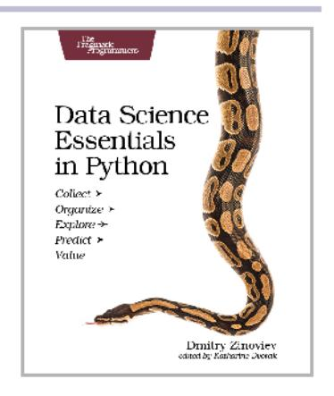
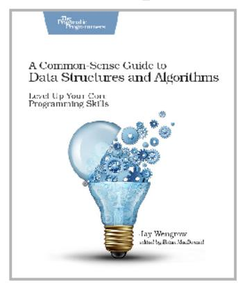
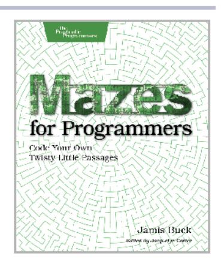
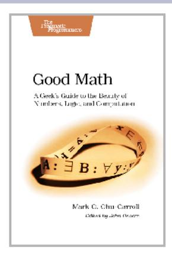
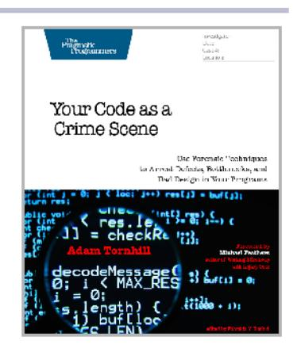
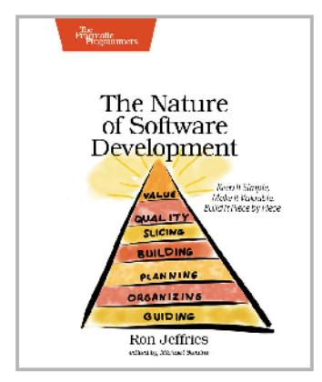

# Index

advantages, 4

| DIGITS                                                                                                                                                                                                       | explicit context, 306–                                                                                                                                                                                                                   | advantages, 4                                                                                                                                                                                                                                                       |
|--------------------------------------------------------------------------------------------------------------------------------------------------------------------------------------------------------------|------------------------------------------------------------------------------------------------------------------------------------------------------------------------------------------------------------------------------------------|---------------------------------------------------------------------------------------------------------------------------------------------------------------------------------------------------------------------------------------------------------------------|
| DIGITS  12-factor app, 150–151  202 response code, back pressure, 122  403 Authentication Required response code, information leakage, 224  5 a.m. problem, 38–43  503 Service Unavailable response code     | information architecture, 313–323 loose clustering, 305 messages, events, and commands, 314–316 painless releases, 295 platform team, 292–294 process and organization, 290–301                                  | advantages, 4 change and, 289 decision loops, 291 airline case study, 9–21, 27– 30, 98 Akamai, 179 Akka, 108 aliases, service discovery with DNS, 173 Alvaro, Peter, 334                                                                                            |
| back pressure, 122 handshaking, 111 load shedding, 120, 184                                                                                                                                            | service extinction, 296– 298 system architecture, 301– 313                                                                                                                                                                      | Amazon Machine Images (AMIs), packaging, 245 Amazon Web Services (AWS) Code Pipeline, 243                                                                                                                                                                  |
| A                                                                                                                                                                                                            | team-scale autonomy, 298                                                                                                                                                                                                              | concerns about dependen-                                                                                                                                                                                                                                            |
| abstraction debugging integration point failures, 36, 40, 43, 46\nivory tower architecture, 5 networks as, 36 sessions as, 58 sockets as, 36, 40 actors back pressure, 121 let it crash pattern, 108– 111    | thrashing, 292 URL dualism, 318–321 administration 12-factor app checklist, 151 GUI interfaces, 131, 211 least privilege principle, 231 live control API, 210 security misconfiguration, 225 specific network for administrative access, | cy on, 301\nin foundation layer, 152 Key Management Service (KMS), 226, 233 S3 service outage, 195– 197 American Registry for Internet Numbers (ARIN), 60, 285 AMIs (Amazon Machine Images), packaging, 245 Andera, Craig, 79 anti-CSRF token, 228 Antifragile, 328 |
| adaptation, 289–324 concept leakage, 322 control of service identifiers, 316–318 convex returns, 290 create options, 307–313 decision cycle, 290–292\nefficiency cautions, 300\nembracing plurality, 321–322 | splitting interfaces for security, 225 adoption teams, 294 advanced persistent threat, 60 agile development, see also adaptation adoption teams, 294                                                                                     | antipatterns, stability, see stability antipatterns Apache httpd, 179 Apache Kafka, 315 API gateways, 227 APIs agreements, 264 API gateways, 227                                                                                               |

explicit context, 306-

| live control API, 210 security, 230 timeouts, 92\nunbounded result sets, 88 vendor API libraries and integration point failures, 44 versioning breaking | automation chaos engineering, 334 data collection for prob- lems, 12 deployment, 242–246\nefficiency cautions, 301 force multiplier antipat- tern, 80–84, 123, 194 governor pattern, 123– | Black Friday case study, 129–139, 163 Black Monday example, 86–89 blacklists, 227 blocked threads, see threads, blocked blocking, scrapers and spiders, 60, 285 |
|---------------------------------------------------------------------------------------------------------------------------------------------------------|-------------------------------------------------------------------------------------------------------------------------------------------------------------------------------------------|-----------------------------------------------------------------------------------------------------------------------------------------------------------------|
| changes, 265, 268–270 versioning nonbreaking                                                                                                         | 125, 194 HTTP APIs, 210                                                                                                                                                                | blue/green deployments, 295                                                                                                                                     |
| changes, 263-268                                                                                                                                        | lack of judgment, 197                                                                                                                                                                     | bogons, 55, 185                                                                                                                                                 |
| APM, 200                                                                                                                                                | mapping, 246 speed of failure, 196                                                                                                                                                     | bonding interfaces, 144                                                                                                                                         |
| AppDynamics, 200                                                                                                                                        | autonomy, team-scale, 298                                                                                                                                                                 | Bonnie 64, 147                                                                                                                                                  |
| application performance management, 201                                                                                                                 | autoscaling, see also scaling                                                                                                                                                             | broadcasts, 73                                                                                                                                                  |
| application-layer firewalls,                                                                                                                            | chain reactions, 49 costs, 52, 77, 202                                                                                                                                                 | broken access control, 222- 224                                                                                                                              |
| application-specific custom headers, 269                                                                                                                | force multiplier antipat- tern, 81, 123, 196                                                                                                                                           | buffers, queue backups, 183 Building Evolutionary Architec-                                                                                                     |
| architecture                                                                                                                                            | let it crash pattern, 110 pre-autoscaling, 71                                                                                                                                          | tures, 302 builds                                                                                                                                            |
| adaptation and informa- tion architecture, 313– 323                                                                                               | self-denial attacks, 71 unbalanced capacities, 77                                                                                                                                   | 12-factor app checklist, 151                                                                                                                                 |
| adaptation and system architecture, 301–313 component-based, 302                                                                                  | virtual machines in the cloud, 153                                                                                                                                                        | build pipeline as continu- ous integration server, 243                                                                                                    |
| event-based, 304 evolutionary, 296, 302- 313                                                                                                      | AWS, see Amazon Web Services (AWS)                                                                                                                                                        | container security, 232 deployment and build pipeline, 243–247, 261                                                                                       |
| layered, 302-303                                                                                                                                        | B back pressure                                                                                                                                                                        | manual checks for deploy- ment, 247                                                                                                                          |
| pragmatic vs. ivory tower, 5                                                                                                                         | with load shedding, 120,                                                                                                                                                                  | package repository, 208                                                                                                                                         |
| service-oriented, 101                                                                                                                                   | stability pattern, 120-123                                                                                                                                                                | security, 157, 208 bulkheads                                                                                                                                 |
| shared-nothing, 70, 74  ARIN (American Registry for                                                                                                     | unbalanced capacities, 76                                                                                                                                                              | API security, 230 physical redundancy as,                                                                                                                       |
| Internet Numbers), 60, 285 assets, deployment, 255                                                                                                   | backoff algorithms, 80                                                                                                                                                                    | 98                                                                                                                                                              |
| assignment, 244                                                                                                                                         | backups 12-factor app checklist,                                                                                                                                                          | process binding, 100 splitting chain reactions,                                                                                                                 |
| ATG-based infrastructure page request handling, 133                                                                                               | partitioning traffic, 145 serialization and session                                                                                                                                       | 47, 49 stability pattern, 98–101 unbalanced capacities,                                                                                                   |
| self-denial attacks, 70 attack surface, 225                                                                                                          | failover in ecommerce case study, 287                                                                                                                                                  | 76 butterfly integration points                                                                                                                                 |
| augmenting modular opera-                                                                                                                               | Baldwin, Carliss Y., 308-313                                                                                                                                                              | diagram, 33                                                                                                                                                     |
| tor, 310 authentication                                                                                                                              | bastion servers, 153                                                                                                                                                                      | <u>C</u>                                                                                                                                                        |
| containers, 150                                                                                                                                         | bell-curve distribution, 88 bidirectional certificates, 230                                                                                                                            | C#, method synchronization, 65                                                                                                                                  |
| first-party, 221 number of attempts al-                                                                                                              | Big-IP, 180                                                                                                                                                                               | cache busting, 255                                                                                                                                              |
| lowed, 220                                                                                                                                              | binding                                                                                                                                                                                   | caching                                                                                                                                                         |
| security, 218–222                                                                                                                                       | ports, 151 process binding, 100                                                                                                                                                        | blocked threads example, 64–66                                                                                                                               |
| session fixation, 218 session prediction attack, 219                                                                                              | black box technology, 165– 169                                                                                                                                                         | cache busting, 255 cautions, 67                                                                                                                              |
| third-party, 221                                                                                                                                        |                                                                                                                                                                                           | flushes, 105, 164, 210                                                                                                                                          |

| invalidation strategy, 67,                   | 318                            | integration point failures,            |
|----------------------------------------------|--------------------------------|----------------------------------------|
| least recently used (LRU)                    |                                | 45-46, 98 let it crash pattern, 111 |
| algorithms, 105                              | certificate revocation list    | live control, 210                      |
| live control, 210                            | (CRL), 227                     | logging, 97                            |
| memory leaks, 105                            | certificates                   | scope, 97                              |
| memory limits, 67, 105                       | API security, 230              | slow responses, 98                     |
| metrics, 206                                 | bidirectional, 230             | stability pattern, 95–98               |
| monitoring hit rates, 67                     | certificate revocation list    | thresholds, 96                         |
| proxies, 66                                  | (CRL), 227                     | with timeouts, 94, 98                  |
| service discovery, 188                       | problems with, 219             | unbalanced capacities,                 |
| sessions, 58                                 | CERTs, 234                     | 76, 98                                 |
| shared resources scaling                     | chain of custody, 157          | Clark, Kim B., 308-313                 |
| effects, 75                                  | chain reactions                | classes, power-law distribu-           |
| stability problems, 105                      | blocked threads, 48, 68        | tion, 304                              |
| weak references, 67                          | cascading failures, 48         | cleanup phase of deployment,           |
| working-set algorithms,                      | splitting, 47, 49              | 259                                    |
| 105                                          | stability antipattern, 46-     |                                        |
| calendars, 129                               | 49                             | clocks and virtual machines,           |
| canary deployments, 209,                     | channel partners and self-de-  |                                        |
| 257, 295                                     | nial attacks, 70               | eloud                                  |
| CAP theorem, 188                             | channels, back pressure, 121   | 12-factor app. 151                     |
| capacity                                     | Chaos Automation Platform      | bulkheads, 99                          |
| crushed ecommerce site                       | (ChAP), 334                    | certificate management, 220         |
| case study, 284–288                          | chaos engineering, 325-336     | containers in, 153                     |
| defined, 52                                  | automation and repeti-         | networking and founda-                 |
| demand control, 182-186                      | tion, 334                      | tion layer, 142–146                    |
| drift and, 327                               | cautions, 332, 334             | virtual machines in, 152               |
| judging load capacity by                     | defined, 325                   |                                        |
| concurrent users, 281                        | designing the experiment,      | CloudFoundry, 212                      |
| judging load capacity by                     | 331                            | clustering                             |
| sessions, 281                                | disaster simulations, 335      | cluster managers and                   |
| modeling, 77                                 | environments, 325              | virtual machines, 148                  |
| unbalanced capacities                        | injecting chaos, 331–332       | loose, 305 migratory virtual IP ad- |
| stability antipattern,                       | precursors, 326–328            | dresses and cluster                    |
| 75–78, 112                                   | prerequisites, 330             | servers, 189                           |
| user stability antipat-                      | Simian Army, 328-335           | Simian Army, 328–335                   |
| terns, 51–55                                 | targeting chaos, 333           | code, see also partitioning            |
| cascading failures                           | test harnesses, 116            | guidelines for, 157–160                |
| blocked threads, 50, 68                      | Chaos Monkey, 328-335          | native, 87                             |
| chain reactions, 48                          | ChAP (Chaos Automation         | separating out log files,              |
| circuit breakers, 50, 98                     | Platform), 334                 | 166                                    |
| fail fast pattern, 107 slow responses, 85 | Chiles, James R., 26, 32       | command objects, 64                    |
| stability antipattern, 49-                   | Chrome, SameSite attribute,    | command queue, 211                     |
| 51                                           | 228                            |                                        |
| timeouts, 50, 94, 107                        | CI, see continuous integration | command-query responsibili-            |
|                                              | circuit breakers               | ty segregation (CQRS), 64,             |
| about, xiv                                   | blocking scrapers and          | 315                                    |
| airline, 9–21, 27–30, 98                     | spiders, 60                    | commands                               |
| Black Friday, 129–139,                       | cascading failures, 50, 98     | in information architec-               |
| 163                                          | chain reactions, 49            | ture, 314–316                          |
| crushed ecommerce site,                      | distributed denial-of-ser-     | live control, 210                      |
| 277–288                                      | vice (DDoS) attacks, 61        | Common Weakness Enumer-                |
| deployment army, 237-                        | fail fast pattern, 106         | ation 22, 224                          |
| 239                                          | generic gateways, 93           | communication                          |
| using postmortems, 14–                       | handshaking, 112               | Conway's law, 279                      |
| 18                                           |                                | decision cycle, 290–292                |

| efficiency concerns, 301\nembracing plurality, 321–322 point-to-point communication scaling effects, 72–73, 75 self-denial attacks, 71 team-scale autonomy, 298 competitive intelligence, 59–60, 285 compliance requirements, log files, 104 component-based architecture, 302 components components components component-based architecture, 302 with known vulnerabilities, 229                                                                                                                                                                                                                                             | parameters and implicit context, 307 per-environment, 161 security, 161 connections database connection pools and blocked threads, 64, 68 dead connection detection, 42 duration of TCP, 40 live control, 210 metrics, 205 outbound, 146 queue backups, 183 test harnesses, 114–117 consensus, quorum-based, 206 constraints and rollout, 260–261                                                                                                                                                                                                                                                                           | control plane configuration services, 206–207 containers, 149–152 control plane layer, 141, 193–214 costs, 194 defined, 193 development environ- ment, 199 discovery services, 189 force multiplier antipat- tern, 83–84\nin layer diagram, 141 level of, 193 live control, 209–212 platform and ecosystem, 197–199 platform services, 212– 213 shopping list, 213                                                                                                                                                                                                                                                                                    |
|-------------------------------------------------------------------------------------------------------------------------------------------------------------------------------------------------------------------------------------------------------------------------------------------------------------------------------------------------------------------------------------------------------------------------------------------------------------------------------------------------------------------------------------------------------------------------------------------------------------------------------|-----------------------------------------------------------------------------------------------------------------------------------------------------------------------------------------------------------------------------------------------------------------------------------------------------------------------------------------------------------------------------------------------------------------------------------------------------------------------------------------------------------------------------------------------------------------------------------------------------------------------------|-------------------------------------------------------------------------------------------------------------------------------------------------------------------------------------------------------------------------------------------------------------------------------------------------------------------------------------------------------------------------------------------------------------------------------------------------------------------------------------------------------------------------------------------------------------------------------------------------------------------------------------------------------|
| let it crash pattern, 108– 111 restarting in Recovery- Oriented Computing, 138 concept leakage, 322 concurrency 12-factor app checklist, 151 chaos engineering, 326 Command Query Responsibility Separation, 64 synchronization of methods, 65 configuration 12-factor app checklist, 151 configuration management tools guidelines, 206–207 deployment and configuration management tools, 244 with disposable infrastructure, 161 dogpiles and configuration management tools, 79 files, 160 guidelines for, 160–162\nimmutable infrastructure, 158\ninjection and containers, 150 live control, 210 naming properties, 162 | Consul, 172, 189 containers\nin cloud, 153 credentials, 150 data collection for debugging, 152 discovery services, 188\nelastic scaling and deployment tools, 208\nin foundation layer, 146, 149–153\nimmutable infrastructure, 159 least privilege principle, 231 load balancing, 150 log collectors, 204 log files, 166 packaging, 245 ports, 149 security, 225, 231 software-defined networking, 187 content-based routing, 181 context, implicit, 306 context, explicit, 306–307, 320 Continuous Delivery, 295 continuous deployment, see deployment continuous integration build pipeline, 243 contact tests, 267, 272 | transparency, 200–206 virtual machines in the cloud, 152 controllers, versioning API changes, 270 convergence, 245, 257 conversion rate, 56 convex returns, 290 Conway's law, 278–279 Conway, Melvin, 279 cookies cross-site request forgery (CSRF), 228 development, 58\nexchanging session IDs, 219 gateway page, 286 pairing, 229 scrapers and spiders, 59–60 security, 58, 219 sticky sessions and load balancers, 181\nunwanted user problems, 57–60 coordinated deployments, 299 CORBA, 18 core dumps and password security, 233 core facilities (CF) airline case study, 9–21, 27–30, 98 costs airline case study, 14 autoscaling, 52, 77, 202 |

| control plane, 194                                | CVEs, 229, 234                                 | DDoS (distributed denial-of-                          |
|---------------------------------------------------|------------------------------------------------|-------------------------------------------------------|
| crushed ecommerce site case study, 288            | CWEs, 234                                      | service) attacks, 61 dead connection detection, 42 |
| deployment, 239                                   | D                                              |                                                       |
| designing for production.                         | data, purging, 102, 107                        | deadlocks chain reactions, 49                      |
| 3                                                 | data collection                                | connection pools, 68                                  |
| load testing, 26 platforms, 202                | airline case study, 12,                        | timeouts, 69                                          |
| poor stability, 23                                | 14–20                                          | vendor API libraries, 44                              |
| real-user monitoring                              | automated, 12                                  | debug logs, 167                                       |
| (RUM) services, 201                               | containers, 152 thread dumps, 16–18,        | deceleration zones, 84                                |
| releases, 295                                     | 135                                            | decision cycle, 290–292                               |
| runtimes, 202 security, 215                    | transparency, 163-170                          | decoupling middleware                                 |
| transparency and econom-                          | data encryption keys, 226,                     | integration point failures, 45–46, 117             |
| ic value, 201                                     | 233                                            | self-denial attacks, 70                               |
| unplanned operations,                             | database administrators, role,                 | stability pattern, 117-119                            |
| 202                                               | databases                                      | total decoupling, 119                                 |
| coupling, see also decoupling middleware          | administrator's role, 198                      | Dekker, Sidney, 327                                   |
| airline case study, 28–29                         | cascading failures, 49                         | delivery avoiding thrashing, 292                   |
| avoiding with log files,                          | configuration services,                        | continuous, 295                                       |
| 165                                               | 206 configured passwords,                   | guidelines, 245                                       |
| bulkheads, 99 coordinated deployments,         | 232                                            | demand control, 182-186, see                          |
| 299                                               | connection pools and                           | also capacity                                         |
| designing for transparen-                         | blocked threads, 64, 68                        | Deming/Shewhart cycle, 291                            |
| cy, 164                                           | constraints, 260–261 data purging, 102, 107 | denial attacks                                        |
| failure propagation, 29, 32                    | dead connection detec-                         | distributed denial-of-ser- vice (DDoS) attacks, 61 |
| horizontal, 302                                   | tion, 42                                       | self-denial attacks, 69–                              |
| microservices, 303                                | deployment, 250-255,                           | 71, 76                                                |
| porting and, 312                                  | 259–261 direct object access, 223           | dependencies                                          |
| self-denial attacks, 70 white-box technology , | fail fast pattern, 106                         | 12-factor app checklist,                              |
| 165                                               | implicit context, 307                          | 151 dependency on request,                         |
| CQRS (command-query re-                           | injection vulnerabilities,                     | 148                                                   |
| sponsibility segregation),                        | 216–218 live control, 210                   | health checks, 184                                    |
| 64, 315                                           | metrics, 205                                   | implicit, 306                                         |
| crashes, let it crash stability                   | migrations frameworks,                         | loose clustering, 305 porting, 312                 |
| pattern, 108-111 credentials, see authentica-  | 250, 260                                       | security, 158, 229                                    |
| tion; certificates; passwords                     | migratory virtual IP ad- dresses, 190       | splitting modules, 308                                |
| credit card tokenizer, 226                        | MongoDB hostage attack,                        | team-scale autonomy,                                  |
| CRL (certificate revocation                       | 225                                            | 299 test harnesses, 116                            |
| list), 227                                        | paradigm, 313                                  | URL dualism, 318                                      |
| cron jobs and dogpiles, 79                        | sensitive data exposure, 226                | deployment                                            |
| cross-site request forgery                        | shims, 250, 259                                | assignment, 244                                       |
| (CSRF), 228                                       | translation pipeline, 252                      | automated, 242-246                                    |
| cross-site scripting (XSS),                       | trickle, then batch, 254-                      | avoiding planned down- time, 242                   |
| 219, 221, 228                                     | 255 trissare 250 250                        | blue/green deployments.                               |
| CSRF (cross-site request forgery), 228            | triggers, 250, 259 unbounded result sets,   | 295                                                   |
| cunning malevolent intelli-                       | 86–90, 94                                      | build pipeline and, 243-                              |
| gence, 334                                        | URL dualism, 318-321                           | 247, 261 cache busting, 255                        |
| Curiosity rover, 290                              | URL probing, 223                               | cache bubling, boo                                    |
|                                                   | Datadog, 200                                   |                                                       |

| canary deployments,                         | force multiplier antipat-                   | Elasticsearch, 204                        |
|---------------------------------------------|---------------------------------------------|-------------------------------------------|
| 209, 257, 295                               | tern, 81                                    | Elixir and actors, 108                    |
| case study, 237–239                         | guidelines, 188                             |                                           |
| choices, 241                                | interconnection layer,                      | embracing plurality, 321–322              |
| cleanup phase, 259                          | 172, 188                                    | encryption  Key Management Service        |
| continuous, 246–260                         | open-source, 172                            | Key Management Service (KMS), 226, 233 |
| convergence, 245, 257                       | disposability                               | password vaulting, 232                    |
| coordinated deployments, 299             | 12-factor app checklist,                    | sensitive data, 226                       |
| costs, 239                                  | 151                                         | enterprise application integra-           |
| databases, 250-255,                         | configuration, 161 immutable infrastruc- | tion, see decoupling middle-              |
| 259-261                                     | ture, 158                                   | ware                                      |
| defined, 156                                | distributed denial-of-service               | Enterprise JavaBeans (EJB),               |
| delivery guidelines, 245                    | (DDoS) attacks, 61                          | 18, 27                                    |
| deployment services guidelines, 207      | DNS                                         | enterprise systems, DNS                   |
| designing for, 241–262                      | availability of, 177                        | round-robin load balancing,               |
| diagram, 156                                | global server load balanc-                  | 174                                       |
| drain period, 249                           | ing, 175–177                                | enumeration, machine, 187                 |
| immutable infrastruc-                       | interconnection layer, 173–177           | environments chaos engineering, 325    |
| ture, 245                                   | load balancing, 173–177                     | development environ-                      |
| manual checks, 247 packaging, 245        | resolving hostnames, 143                    | ment, 199, 208                            |
| painless releases, 295                      | round-robin load balanc-                    | per-environment configu-                  |
| phases, 248-260                             | ing, 173–174                                | ration, 161                               |
| placement services, 209                     | service discovery with, 172–173          | quality assurance (QA)                    |
| preparation, 248-257                        | Docker Swarm, 149, 189, 212                 | environment, 199 test, 251             |
| risk cycle, 246 rolling, 248             |                                             | Equifax, 215, 229                         |
| rollout phase, 257–259                      | dogpile antipattern, 78-80, 211          | Erlang and actors, 108                    |
| session affinity, 255                       | domain name, fully qualified,               | errors                                    |
| speed, 246, 248, 257                        | 143                                         | defined, 28                               |
| time-frame, 248–250                         | domain objects                              | logging, 166                              |
| trickle, then batch, 254– 255            | avoiding bad layering,                      | etcd, 161, 188, 206                       |
| versioning, 255                             | 303                                         | Ethereal, see Wireshark                   |
| in waves, 295                               | immutable, 64                               | Ethernet and NICs, 143                    |
| web assets, 255                             | synchronizing methods on, 64–66          | Etsy, 239                                 |
| Design Rules, 308                           | downtime, fallacy of planned,               | event bus, persistent, 315                |
| destination unreachable re-                 | 242                                         | event journal, 315                        |
| sponse, 187                                 | drain period, 249                           | event notification, 314                   |
| development environment                     | drift, 327                                  | event ordering, 148                       |
| quality of, 199                             | Drift into Failure, 327                     | event sourcing, 315                       |
| security, 208                               | dynamic generation problems                 | event-based architecture, 304             |
| DevOps, fallacy of, 294                     | in ecommerce case study,                    | event-carried state transfer,             |
| The DevOps Handbook, 300                    | 287                                         | 314                                       |
| direct object access, 223                   | E                                           | events                                    |
| directory traversal attacks,                | <u>E</u>                                    | event-based architecture,                 |
| 224                                         | EC2, 161                                    | 304                                       |
| disaster recovery disaster simulations, 335 | Edge, SameSite attribute, 228               | in information architec-                  |
| global server load balanc-                  | efficiency, cautions, 300                   | ture, 314–316 ordering, 148            |
| ing, 180                                    | EIA-232C, 111                               | as term, 314                              |
| hardware load balancing,                    | EJB (Enterprise JavaBeans),                 | The Evolution of Useful                   |
| 180                                         | 18, 27                                      | Things, 301                               |
| discovery services                          | elastic scaling, deployment tools, 208      | evolutionary architecture,                |
| DNS, 172-173                                |                                             | 296, 302–313                              |
|                                             |                                             |                                           |

| exceptions, logging, 166\nexcluding modular operator, 310 | duration of connections, 41 software-defined network- | JOREDOZEMH, Poloc Retack H threads example, 64–66 The Goal, 300 |
|-----------------------------------------------------------|-------------------------------------------------------|-----------------------------------------------------------------------|
| executables, defined, 156                                 | ing, 187                                              | GoCD, 243                                                             |
| explicit context, 306-307, 320                            | FIT (failure injection testing),                      | Goetz, Brian, 62                                                      |
| extinction, service, 296–298                              | 332 FIT tests, see contract tests                     | governor stability pattern,                                           |
| F                                                         | force multiplier antipattern.                         | 123–125, 194, 296 Gregorian calendar, 129                          |
| Facebook, number of users, 31                             | 80-84, 123, 194 Ford, Neal, 302                    | GSLB, see global server load                                          |
| fail fast                                                 | form follows failure, 301                             | balancing                                                             |
| latency problems, 94                                      | foundation layer, 141-154                             | GUI interfaces, 131, 211 Gunther, Neil, 184                        |
| slow responses, 86, 107 stability pattern, 106–108     | in layer diagram, 141 networking, 142–146          |                                                                       |
| failure, see also cascading                               | physical hosts, virtual                               | H                                                                     |
| failures chain of failure, 28–30                       | machines, and contain- ers, 146-153                | handshaking integration point failures, 46                      |
| defined, 29                                               | Fowler, Martin, 314                                   | stability pattern, 111-113                                            |
| isolation and splitting modules, 309                   | FQDN (fully qualified domain name), 143               | TCP, 36, 111, 183 unbalanced capacities,                           |
| modes, 26–28 modes and size, 32                        | framing, request, 264, 269                            | 76, 112                                                               |
| stopping crack propaga-                                   | fully qualified domain name                           | HAProxy, 179                                                          |
| tion, 27–29                                               | (FQDN), 143                                           | headers, versioning with,                                             |
| failure injection testing (FIT),                          | functional testing, test har-                         | 264, 269                                                              |
| 332                                                       | nesses, 45, 116                                       | health checks chain reaction example,                                 |
| failures, cascading, see cas- cading failures          | <u>G</u>                                              | 48                                                                    |
| Family Values: A Behavioral                               | gaps                                                  | with Consul, 189                                                      |
| Notion of Subtyping, 65                                   | generative testing for, 266                        | global server load balanc- ing, 175                                |
| Farley, Dave, 295                                         | testing gap in ecommerce                              | guidelines, 169, 180                                                  |
| fault density, 97                                         | case study, 285                                       | handshaking, 112                                                      |
| faults                                                    | garbage collector                                     | instances, 169, 180                                                   |
| defined, 28 fault density, 97                          | caching without memory limits, 67                  | load shedding, 184 report criteria, 258                            |
| fault isolation with time-                                | weak references, 53-54,                               | rollouts, 258                                                         |
| outs, 92                                                  | 67                                                    | VIP pool information, 178                                             |
| feature toggles, 210, 260                                 | gateways                                              | heap memory, traffic prob- lems, 52-54                             |
| feedback                                                  | API gateways, 227 default, 186                     | Heroku                                                                |
| avoiding thrashing with, 292                           | ecommerce case study,                                 | 12-factor app, 151                                                    |
| painless releases, 295                                    | 286                                                   | environment variables,                                                |
| Fight Club bugs, 71                                       | enabling cookies, 286                                 | 161                                                                   |
| filenames and directory                                   | generic, 93                                           | Hickey, Rich, 265                                                     |
| traversal attacks, 224                                    | General Principles of Systems Design, 327             | hijacking, session, 218–222                                           |
| Firefox, SameSite attribute, 228                          | generative testing, for gaps,                         | horizontal coupling, 302 horizontal scaling, see scaling           |
| firewalls                                                 | generic gateways, 93                                  | hostnames                                                             |
| application-layer, 227 blocking scrapers and           | global server load balancing                          | defined, 143                                                          |
| spiders, 60                                               | disaster recovery, 180                                | machine identity, 143– 146, 152                                    |
| breaches and administra-                                  | with DNS, 175–177                                     | virtual machines in the                                               |
| tive access-only net- works, 145                       | global state and implicit con- text, 307           | cloud, 152                                                            |

defined, 40

| hosts                                                                                                                                                                                                                                                                                                                                                                                                                                                                                                                                                                                     | instances                                                                                                                                                                                                                                                                                                                                                                                                                                                                                                                                            | migratory virtual IP ad-                                                                                                                                                                                                                                                                                                                                                                                                                                                                             |
|-------------------------------------------------------------------------------------------------------------------------------------------------------------------------------------------------------------------------------------------------------------------------------------------------------------------------------------------------------------------------------------------------------------------------------------------------------------------------------------------------------------------------------------------------------------------------------------------|------------------------------------------------------------------------------------------------------------------------------------------------------------------------------------------------------------------------------------------------------------------------------------------------------------------------------------------------------------------------------------------------------------------------------------------------------------------------------------------------------------------------------------------------------|------------------------------------------------------------------------------------------------------------------------------------------------------------------------------------------------------------------------------------------------------------------------------------------------------------------------------------------------------------------------------------------------------------------------------------------------------------------------------------------------------|
| configuration mapping, 244  DNS servers, 177\nelastic scaling and deployment tools, 208\nin foundation layer, 146 virtual machines in the cloud, 152  HTTP about, 58 API agreements, 264 handshaking problems, 111  HTTP Strict Transport Security, 226\nintegration point failures,                                                                                                                                                                                                                                                                                                      | Chaos Monkey, 331 code guidelines, 157–160 configuration guidelines, 160–162 defined, 155 health checks, 169, 180\ninstances layer, 141, 155–170\ninterconnection layer, 171–191\nin layer diagram, 141 let it crash pattern, 109 live control and speed, 209 load balancing, 173–182 loose clustering, 305                                                                                                                                                                                                                                          | dresses, 189 network routing, 186–188 service discovery with DNS, 172–173 service discovery with discovery services, 188\ninterfaces bonding, 144\nenumeration problems, 187 machine identity, 143– 146, 153 Internet Explorer, SameSite attribute, 228 Internet of Things, security, 61                                                                                                                                                                                                             |
| 43 live control APIs, 210 specification, 264                                                                                                                                                                                                                                                                                                                                                                                                                                                                                                                                              | metrics, 169 porting modules, 312 transparency guidelines,                                                                                                                                                                                                                                                                                                                                                                                                                                                                                     | intrusion detection software, 232                                                                                                                                                                                                                                                                                                                                                                                                                                                                    |
| versioning with, 264, 269 httpd, 179                                                                                                                                                                                                                                                                                                                                                                                                                                                                                                                                                   | 162–170, 200–206 insufficient attack prevention, 227                                                                                                                                                                                                                                                                                                                                                                                                                                                                                           | invalidating, cache, 67, 105 inversion modular operator, 311                                                                                                                                                                                                                                                                                                                                                                                                                                   |
| Humble, Jez, 295 hysteresis, 84, s <i>ee also</i> gover- nor stability pattern                                                                                                                                                                                                                                                                                                                                                                                                                                                                                                      | integration points cascading failures, 50 circuit breakers, 45–46,                                                                                                                                                                                                                                                                                                                                                                                                                                                                             | investigations, see post- mortems Inviting Disaster, 26, 32                                                                                                                                                                                                                                                                                                                                                                                                                                    |
| I                                                                                                                                                                                                                                                                                                                                                                                                                                                                                                                                                                                         | 98                                                                                                                                                                                                                                                                                                                                                                                                                                                                                                                                                   | IP addresses, see also virtual                                                                                                                                                                                                                                                                                                                                                                                                                                                                       |
| IaaS (infrastructure-as-a-service), 246\nidentifiers, services, 316–318\nignorance, principle of, 305\nimmutable infrastructure     code guidelines, 158     deployment, 245     domain objects, 64     packaging, 245     rollout example, 258     steady state pattern, 101\nimplicit context, 306\nimpulse, defined, 24\ninbound testing, 266\nindexing, log, 204\ninformation architecture and adaptation, 313–323\ninformation leakage, 224\ninfrastructure, see immutable infrastructure\ninfrastructure-as-a-service (IaaS), 246\ninjection vulnerabilities, 216–218\ninstallation | decoupling middleware, 45–46, 117\nexpensive users, 56 fail fast pattern, 106 HTTP protocols, 43 live control, 210 metrics, 205 retailer example, 35 socket-based protocols, 35–43 stability antipatterns, 33– 46, 94 strategies for, 45–46 vendor API libraries, 44\nintegration testing\nexplicit context, 307 overspecification, 272 test harnesses, 45, 113– 117\nintelligence, cunning malevolent, 334\ninterconnection demand control, 182–186 different solutions for different scales, 172 DNS, 173–177\ninterconnection layer, 141, 171–191 | IP addresses blocking specific, 285, 287 bonding interfaces, 144 containers, 149–150 default gateways, 186 load balancing with DNS, 173–177 outbound connections, 146 resolving hostnames, 143, 145 virtual LANS (VLANS), 149–150, 187 virtual extensible LANS (VXLANS), 150 virtual machines in the cloud, 152\nisolation containers, 231 failure isolation and splitting modules, 309 fault isolation with timeouts, 92 let it crash pattern, 108 test harnesses, 114\nivory tower architecture, 5 |
| defined, 156 deployment and, 245                                                                                                                                                                                                                                                                                                                                                                                                                                                                                                                                                       | in layer diagram, 141, 171 load balancing, 173–182                                                                                                                                                                                                                                                                                                                                                                                                                                                                                             | J Java actors, 108                                                                                                                                                                                                                                                                                                                                                                                                                                                                             |

| DNS round-robin load                                    | lean development and deci-                         | handshaking, 112                                     |
|---------------------------------------------------------|----------------------------------------------------|------------------------------------------------------|
| balancing, 174 Java Encoder Project,                 | sion loops, 291                                    | hardware, 180 partitioning request                |
| 222                                                     | Lean Enterprise, 300 Lean Software Development, | types, 181                                           |
| method synchronization,                                 | 300                                                | round-robin load balane-                             |
| 65 thread dumps, 16–18                               | least privilege principle, 231                     | ing, 173–174 self-denial attacks, 70              |
| Java Concurrency in Practice,                           | least recently used (LRU) algo-                    | service discovery, 188                               |
| 62                                                      | rithms, 105                                        | software, 178                                        |
| Java Encoder Project, 222                               | legal conditions, 60, 287                          | virtual IP addresses,                                |
| MDYDXWLObanocRtholde@id                                 | let it crash stability pattern,                    | 178, 189 virtual LANs (VLANs), 150                |
| dumps, 17                                               | 108-111                                            | virtual machines in the                              |
| JDBC driver                                             | Let's Encrypt, 220                                 | cloud, 153                                           |
| airline case study, 20                                  | libraries blocked threads from,                 | load shedding, 119-120, 122,                         |
| migratory virtual IP ad- dresses, 190                | 67, 69                                             | 184                                                  |
| 64/([FHSW,L2470Q                                        | timeouts, 92                                       | load testing costs, 26                            |
| unbounded result sets,                                  | vendor libraries and blocked threads, 67, 69    | crushed ecommerce site,                              |
| 87                                                      | vendor libraries and inte-                         | 281-284                                              |
| Jenkins, 243                                            | gration point failures,                            | loan service example of                              |
| Jones, Nora, 332 Julian calendar, 129                | 44                                                 | breaking API changes, 268-                           |
| jumphost servers, 153                                   | wrapping, 68                                       | 271                                                  |
| JVM, warm-up period, 209                                | Lilius, Aloysius, 129 Linux                     | lock managers self-denial attacks, 70             |
| - <del>-</del> -                                        | network interface names,                           | virtual machines, 148                                |
| K                                                       | 144                                                | locking                                              |
| Kafka, 315                                              | 7,0(B\$,7185                                       | optimistic, 70                                       |
| Kerberos, 220–221                                       | Liskov substitution principle,                     | pessimistic, 70                                      |
| key encryption keys, 226, 233                           | 65, 265                                            | log collectors, 204–206, 227                         |
| Key Management Service (KMS), 226, 233               | listen queues, 37, 75, 119, 183–184                | log indexing, 204 Log4j, 17                       |
| Kibana, 204                                             | Little Bobby Tables attack,                        | logging and log files                                |
| NI, Java thread dumps, 16                               | 216                                                | 12-factor app checklist,                             |
| KMS (Key Management Ser-                                | Little's law, 120, 183                             | 151                                                  |
| vice), 226, 233                                         | load, see also load balancers                      | advantages, 165                                      |
| Kua, Patrick, 302                                       | deployment speed, 249                              | bad requests, 227 circuit breakers, 97            |
| Kubernetes, 149, 212                                    | judging load capacity by concurrent users, 281  | compliance requirements,                             |
| L                                                       | judging load capacity by                           | 104                                                  |
| landing zones, self-denial at-                          | sessions, 281                                      | debug logs, 167 indexing logs, 204                |
| tacks, 71                                               | live control, 210 load shedding, 119–120,       | levels of logging, 166                               |
| last responsible moment, 119                            | 122, 184                                           | log collectors, 204-206,                             |
| latency                                                 | load testing, 26, 281–284                          | 227                                                  |
| data purging, 102                                       | load balancers, see al-                            | log file locations, 166 logging servers, 104–105  |
| fail fast, 94 as lagging indicator, 134                 | so health checks; load about, 46                | for postmortems, 16–18                               |
| Latency Monkey, 331                                     | blue/green deployments,                            | readability, 167                                     |
| test harnesses, 116                                     | 295                                                | rotating log files, 103–104 software load balancing, |
| timeouts, 94                                            | bulkheads, 100                                     | 179                                                  |
| Latency Monkey, 331                                     | canary deployments, 257 chain reactions, 46–49  | system-wide transparen-                              |
| layer 7 firewalls, 227 layered architecture, 302–303 | containers, 150                                    | cy, 204–206                                          |
| leader election, 206, 305                               | with DNS, 173-177                                  |                                                      |
| Leaky Bucket pattern, 97                                | fail fast pattern, 106                             |                                                      |
| Duction Puttering Of                                    | guidelines, 177–182                                |                                                      |

| test harness requests, 116 transparency, 165-169, | messaging decoupling middleware, 117                            | monitoring back pressure, 123 blocked threads, 63 |
|---------------------------------------------------------|-----------------------------------------------------------------------|---------------------------------------------------------|
| 204–206                                                 | in information architec-                                              | cache hit rates, 67                                     |
| ORBWD10044                                              | ture, 314–316 logging messages, 169                                | chaos engineering, 330 containers, 149               |
| Logstash, 105, 204                                      | point-to-point communi-                                               | coupling and transparen-                                |
| longevity, 25                                           | cation scaling effects,                                               | cy, 164                                                 |
| loose clustering, 305                                   | 73                                                                    | human pattern matching,                                 |
| LRU (least recently used) algo- rithms, 105          | publish/subscribe mes- saging, 73, 117 system to system messag- | 131 load levels, 184 load shedding, 120, 184      |
| M                                                       | ing, 117                                                              | open-source services, 172                               |
| MAC addresses, virtual IP addresses, 189                | methods remote method invocation                                   | real-user monitoring, 200–201                        |
| machine identity                                        | (RMI), 18, 27                                                         | resource contention, 184                                |
| enumeration, 187                                        | synchronizing, 64–66                                                  | role in platform, 197                                   |
| networks, 143-146, 152                                  | metric collectors, 204–206                                            | slow responses, 85 supplementing with exter-         |
| virtual machines in the cloud, 152                      | metrics aggregating, 204                                           | nal, 63                                                 |
| Majors, Charity, 330                                    | blocked threads, 63                                                   | multicasts, 73, 264                                     |
| malicious users, instability                            | circuit breakers, 97                                                  | multihoming, 143–146                                    |
| patterns, 60-62                                         | guidelines, 204                                                       | multiplier effect, 73, see al-                          |
| manual assignment, 244                                  | instance, 169 metric collectors, 204–                              | so force multiplier antipat- tern                    |
| mapping                                                 | 206                                                                   | multithreading, see al-                                 |
| role, 244, 246                                          | system-wide transparen-                                               | so threads, blocked                                     |
| session-specific, 223                                   | cy, 204–206                                                           | circuit breakers, 97                                    |
| Mars rover, 290                                         | thresholds, 206                                                       | stability and, 62–69                                    |
| mechanical advantage, 194                               | microkernels, 303                                                     | mutexes, timeouts, 92                                   |
| Memcached, 54                                           | microservices                                                         | N                                                       |
| memory cache limits, 67, 105                         | bulkheads, 101 cautions, 304                                       | Nakama, Heather, 329                                    |
| expunging passwords                                     | evolutionary architecture,                                            | names                                                   |
| and keys, 233                                           | 303                                                                   | configuration properties,                               |
| heap, 52-54                                             | let it crash pattern, 109                                             | 162                                                     |
| in-memory caching stabil- ity problems, 105          | middleware, defined, 117, see also decoupling middleware           | filenames and directory traversal attacks, 224          |
| leaks and chain reac- tions, 49                      | migrations frameworks, 250, 260                                       | fully qualified domain name (FQDN), 143              |
| leaks and improper caching, 105                         | migratory virtual IP address- es, 189                              | machine identity, 143- 146, 152                      |
| leaks and slow responses,                               | mixed workload, defined, 24                                           | service discovery with                                  |
| 85 loss during rollout, 259                          | mock objects, 114                                                     | DNS, 173                                                |
| migratory virtual IP ad-                                | modeling tools for schema                                             | NAS, 147                                                |
| dresses, 190                                            | changes, 260                                                          | NASA, 290                                               |
| off-heap, 54 off-host, 54                            | modular operators, 308-313                                            | National Health Service, 215                            |
| serialization and session                               | modules                                                               | native code, defined, 87                                |
| failover in ecommerce                                   | augmenting, 310                                                       | navel-gazing, 62                                        |
| case study, 287                                         | excluding, 310                                                        | Netflix Chaos Automation Plat-                       |
| traffic problems, 52–54                                 | inverting, 311 porting, 312                                        | form (ChAP), 334                                        |
| weak references, 53-54, 67                           | splitting, 308                                                        | failure injection testing                               |
| Mesos, 149, 212                                         | substituting, 310                                                     | (FIT), 332                                              |
|                                                         | MongoDB hostage attack, 225                                           | metrics, 169                                            |

| Simian Army, 328–335 Spinnaker, 243 Netscape, cookie develop- | in Decomposing Systems",                                       | tion, 227 security misconfigura-                 |
|---------------------------------------------------------------------|----------------------------------------------------------------|--------------------------------------------------|
| ment, 58 network interface controllers,                             | OODA (observe, orient, decide, act) loop, 291                  | tion, 225 sensitive data exposure,            |
| see NICs                                                            | Open Web Application Securi-                                   | 226                                              |
| networks                                                            | ty Project, see OWASP Top                                      | session hijacking, 218– 222                   |
| as abstraction, 36                                                  | 10                                                             | D.                                               |
| administrative access- only, 145                                 | OpenJDK, warm-up period, 209                                | <u>P</u>                                         |
| container challenges, 149                                           | Opera, SameSite attribute,                                     | PaaS assignment, 244                          |
| enumeration problems, 187                                        | 228                                                            | certificate management,                          |
| foundation layer, 142– 146                                       | operations fallacy of DevOps, 294                           | discovery services, 189                          |
| integration points stabili- ty antipatterns, 33–46               | in layer diagram, 141 separation from develop-              | immutable infrastructure and, 246             |
| interface names, 143-146                                            | ment in past, 292                                              | let it crash pattern, 110 open-source tools, 172 |
| machine identity, 143-                                              | operators, modular, 308–313                                    | packaging                                        |
| 146, 152 outbound connections,                                      | optimistic locking, 70 Oracle, <i>see also J</i> DBC driver | deployment, 245                                  |
| 146                                                                 | dead connection detec-                                         | package repository, 208                          |
| overlay networks, 149                                               | tion, 42                                                       | packets                                          |
| routing guidelines, 186– 188                                     | ODBC driver, 190                                               | back pressure, 121 packet capture, 38, 40     |
| slow responses from, 85                                             | orchestration, 206                                             | SYN/ACK packets, 37                              |
| software-defined network-                                           | organization adaptation and, 290–301                        | pagination, unbounded result                     |
| ing, 187 TCP basics, 36–38                                       | efficiency cautions, 300                                       | sets, 89                                         |
| test harnesses, 114-117                                             | platform roles, 197–199 team, 4, 197–199, 292–              | parameters checking and fail fast             |
| VPNs, 186                                                           | 294, 299                                                       | pattern, 107                                     |
| New Relic, 200                                                      | team-scale autonomy,                                           | implicit context, 307                            |
| nginx, 179                                                          | 298                                                            | Parnas, David, 310                               |
| NICs                                                                | ORMs, unbounded result                                         | parsing                                          |
| default gateways, 186 loopback, 143                              | sets, 88                                                       | API security, 230 injection vulnerabilities,     |
| machine identity, 143-                                              | OSHA (Occupational Safety and Health Administration),          | 216–218                                          |
| 146, 153                                                            | 83                                                             | Parsons, Rebecca, 302                            |
| queue backups, 183                                                  | outbound connections, 146                                      | partitioning                                     |
| nonlinear effect, 183 NTLM, 221                                  | outbound integration, live                                     | airline case study, 27                           |
| nut theft crisis, 215                                               | control, 210                                                   | backup traffic, 145 with bulkheads, 47, 49,   |
| _                                                                   | overlay network, 149                                           | 98-101                                           |
| 0                                                                   | overrides, ecommerce case study, 281                        | discovery services, 188                          |
| OAuth, 221                                                          | OWASP Top 10, 216–231                                          | request types with load balancers, 181        |
| observe, orient, decide, act (OODA) loop, 291                    | APIs, 230                                                      | splitting modular opera-                         |
| Occupational Safety and                                             | broken access control,                                         | tor, 308                                         |
| Health Administration (OS-                                          | 222–224 components with known                               | threads inside a single                          |
| HA), 83                                                             | vulnerabilities, 229                                           | process, 100 passwords                        |
| ODBC driver, migratory virtu- al IP addresses, 190               | cross-site request forgery (CSRF), 228                         | configuration files, 161                         |
| off-heap memory, 54                                                 | cross-site scripting (XSS),                                    | configured passwords,                            |
| off-host memory, 54                                                 | 219, 221, 228                                                  | 232 default, 225                              |
|                                                                     | injection, 216–218                                             | resources, 226                                   |
|                                                                     |                                                                | salt 220 226                                     |

| security guidelines, 220, 232                              | ports 12-factor app checklist,                | partitioning threads inside, 100                   |
|---------------------------------------------------------------|--------------------------------------------------|----------------------------------------------------|
| storing, 226                                                  | 151                                              | runtime diagram, 156                               |
| vaulting, 150, 232                                            | binding, 151                                     | transparency guidelines,                           |
| patch management tools and                                    | containers, 149                                  | 162-170                                            |
| containers, 231                                               | test harnesses and port                          | production, designing for, see                     |
| pattern detection, 167                                        | numbers, 116                                     | also deployment; stability                         |
| Pattern Languages of Program Design 2, 66, 97                 | POST, versioning API changes, 269, 271        | control plane layer, 141, 193–214               |
| patterns, see stability antipat- terns; stability patterns | Postel's Robustness Principle, 263, 265       | costs, 3 foundation layer, 141– 154          |
| Patterns of Enterprise Applica- tion Architecture, 92      | Postel, John, 263 postmortems                 | instances layer, 141, 155–170                   |
| PDQ analyzer toolkit, 184                                     | airline case study, 14–20                        | interconnection layer,                             |
| performance                                                   | Amazon Web Services S3                           | 141, 171–191                                       |
| queue depth as indicator,                                     | service outage, 195– 197                      | layer diagram, 141, 171 need for, 1–6              |
| virtual machines, 147                                         | Black Friday case study,                         | priorities, 141                                    |
| pessimistic locking, 70                                       | 135                                              | security layer, 215-234                            |
| Petroski, Henry, 301                                          | logging state transitions, 169                | properties                                         |
| photography example of fail                                   | for successful changes,                          | listing changes for ecom-                          |
| fast. 107                                                     | 196                                              | merce case study, 280                              |
|                                                               | tasks, 195                                       | naming configuration,                              |
| pie crust defense, 220, 226, 234                           | power-law distribution, 88,                      | 162                                                |
| pilot-induced oscillation, 292                                | 304                                              | provisioning services, guide-                      |
| -                                                             | pragmatic architecture, 5                        | lines, 207                                         |
| placement services, 209                                       | pre-autoscaling, 71                              | pseudorandom number gener- ator (PRNG), 219     |
| platform                                                      | pressure, see back pressure                      |                                                    |
| control plane, 197–199 costs, 202                          | price checkers, see competi-                     | publish/subscribe messaging, 73, 117               |
| goals, 293–294                                                | tive intelligence                                |                                                    |
| platform services and                                         | primitives                                       | pull mode deployment tools, 208                 |
| need for own platform                                         | checking for hangs, 64,                          | log collectors, 204                                |
| team, 294                                                     | 69                                               | pulse and dogpiles, 80                             |
| platform services guide-                                      | safe, 64, 69                                     |                                                    |
| lines, 212–213                                                | timeouts, 92                                     | push mode deployment tools, 208                 |
| roles, 197–199, 292–294, 299                               | principle of ignorance, 305                      | log collectors, 204                                |
| team-scale autonomy,                                          | Principles of Product Develop- ment Flow, 300 | PUT, versioning API changes, 269                |
| 299                                                           | privilege principle, least, 231                  | 209                                                |
| platform-as-a-service, see PaaS                            | PRNG (pseudorandom num-                          | Q                                                  |
|                                                               | ber generator), 219                              | quality assurance (QA)                             |
| plugins                                                       | process binding, 100                             | crushed ecommerce site                             |
| evolutionary architecture, 303                             | processes                                        | case study, 278-281                                |
| security, 158, 208, 229                                       | 12-factor app checklist,                         | overfocus on, 1                                    |
| plurality, embracing, 321–322                                 | 151                                              | quality of environment,                            |
| point-to-point communication                                  | binding, 100                                     | 199                                                |
| scaling effects, 72–73, 75                                    | circuit breaker scope, 97                        | unbounded result sets, 88                       |
| policy proxy, 317                                             | code guidelines, 157–160                         |                                                    |
|                                                               | configuration guidelines,                        | query objects, 92                                  |
| porpoising, 292                                               | 160-162                                          | queues                                             |
| porting modular operator, 312                                 | defined, 156 deployment diagram, 156          | back pressure, 120–123 backups and system fail- |
| 512                                                           | instances layer, 155–170                         | ures, 182                                          |
|                                                               | let it crash pattern, 109                        | command queue, 211                                 |

| depth as indicator of performance, 202 listen queue purge, 185 listen queues, 37, 75, 119, 183–184 load shedding, 120 point-to-point communication scaling effects, 73 retries, 94 TCP networking, 37 virtual machines in the cloud, 153 quorum-based consensus, 206                                                                                                  | resilience engineering, 326 resources authorizing access to, 223 blocked threads, 64, 68 cascading failures, 50 data purging, 102, 107 fail fast pattern, 106 load shedding, 119, 184 metrics, 205 scaling effects of shared resources, 73 shared-nothing architecture, 70, 74 slow responses, 86 steady state pattern,                                                                   | RMI (remote method invocation), 27 robots, OSHA guidelines, 83, see also shopbots URERWVINGLADO Robustness Principle, Postel's, 263, 265 ROC (Recovery-Oriented Computing), 138 role mapping, 244, 246 rolling deployments, speed, 248 rollout, deployment phase, 257–259                |
|-----------------------------------------------------------------------------------------------------------------------------------------------------------------------------------------------------------------------------------------------------------------------------------------------------------------------------------------------------------------------|-------------------------------------------------------------------------------------------------------------------------------------------------------------------------------------------------------------------------------------------------------------------------------------------------------------------------------------------------------------------------------------------|------------------------------------------------------------------------------------------------------------------------------------------------------------------------------------------------------------------------------------------------------------------------------------------|
| <u>R</u>                                                                                                                                                                                                                                                                                                                                                              | 102–106                                                                                                                                                                                                                                                                                                                                                                                   | root certificate authority files,                                                                                                                                                                                                                                                        |
| race conditions cascading failures, 50 Latency Monkey, 331 load balancers and chain reactions, 46-49 ransomware, 215 real-user monitoring (RUM), 200-201 recovery chaos engineering, 330 comparing treatment options, 137 disaster, 180, 335 hardware load balancing, 180 Recovery-Oriented Computing, 138 restoring service as priority, 12 targets, 12 timeouts, 94 | timeouts, 92 virtual machines, 147 resources for this book book web page, xiv cross-site request forgery (CSRF), 229 cross-site scripting (XSS), 222 directory traversal attacks, 224 general security, 234\ninjection, 217 passwords, 226 responses, slow, see slow responses retailer examples Black Friday case study, 129–139, 163 chain reaction example, 48 crushed ecommerce site, | root privileges, 231 round-robin load balancing, 173–174 routing content-based, 181 guidelines, 186–188 software-defined networking, 187 static route definitions, 187 RS-232, 111 RUM (real-user monitoring), 200–201 runtime costs, 202 diagram, 156 Rx frameworks, back pressure, 121 |
| Recovery-Oriented Computing                                                                                                                                                                                                                                                                                                                                           | 277–288                                                                                                                                                                                                                                                                                                                                                                                   | salt, 220, 226                                                                                                                                                                                                                                                                           |
| (ROC), 138                                                                                                                                                                                                                                                                                                                                                            | Etsy deployment, 239 integration point failure                                                                                                                                                                                                                                                                                                                                         | SameSite attribute, 228                                                                                                                                                                                                                                                                  |
| Reddit.com outage example, 80–83, 123, 194, 196                                                                                                                                                                                                                                                                                                                    | example, 35                                                                                                                                                                                                                                                                                                                                                                               | sample applications and secu- rity, 225                                                                                                                                                                                                                                               |
| Redis, 54                                                                                                                                                                                                                                                                                                                                                             | retries cascading failures, 50                                                                                                                                                                                                                                                                                                                                                            | SAN, 147                                                                                                                                                                                                                                                                                 |
| redundancy, 98                                                                                                                                                                                                                                                                                                                                                        | dogpiles, 80                                                                                                                                                                                                                                                                                                                                                                              | Sarbanes-Oxley Act of 2002,                                                                                                                                                                                                                                                              |
| references, weak, 53-54, 67                                                                                                                                                                                                                                                                                                                                           | listen queue purge, 185                                                                                                                                                                                                                                                                                                                                                                   | 104                                                                                                                                                                                                                                                                                      |
| relational databases deployment, 250–252, 260\nimplicit context, 307 paradigm, 313 remote method invocation (RMI), 18, 27 reputation and poor stability, 24 request framing, 264, 269 residence time, 184                                                                                                                                                             | migratory virtual IP addresses, 190 queuing, 94 timeouts, 93 revenue and transparency, 202 reverse proxy servers, software load balancing, 178 risk cycle, 246 RMI (remote method invocation, 18                                                                                                                                                                                          | Scala and actors, 108 scaling, see also autoscaling chain reactions, 46\nelastic scaling and deploy- ment tools, 208 horizontal scaling, de- fined, 46 multiplier effect, 73 need for load balancing, 177                                                                                |

| point-to-point communication scaling effects, 75 scaling effects and shared resources, 73 scaling effects and transparency, 164 scaling effects in point-to-point communication, 72–73 scaling effects stability antipattern, 71–75 self-denial attacks, 70\nunbalanced capacities, 77 vertical, 46 schemaless databases, deployment, 252–255, 260 scope, circuit breakers, 97 scrapers session bloat from, 285, 287 stability problems, 59–60 script kiddies, 61 scripts, startup scripts and thread dumps, 17 search engines, session bloat from, 284 security administration, 225, 231 advanced persistent threat, 60 APIs, 230 attack surfaces, 225 authentication, 218–222 blacklists, 227 broken access control, 222–224 builds, 157, 208 bulkheads, 230 certificate revocation list (CRL), 227 certificates, 219, 227, 230 chain of custody, 157 components with known vulnerabilities, 229 configuration, 161, 225 configured passwords, 232 containers, 225, 231 cookies, 58, 219 costs, 215 cross-site request forgery (CSRF), 228 cross-site scripting (XSS), 219, 221, 228 | dependencies, 158, 229 direct object access, 223 directory traversal attacks, 224 distributed denial-of-service (DDoS) attacks, 61 HTTP Strict Transport Security, 226\ninformation leakage, 224\ninjection, 216–218\ninsufficient attack prevention, 227 Internet of Things, 61\nintrusion detection software, 232 least privilege principle, 231 logging bad requests, 227 malicious users, 60–62 misconfiguration, 225 as ongoing process, 233 OWASP Top 10, 216–231 pie crust defense, 220, 226, 234 plugins, 158, 208, 229 ransomware, 215 resources on, 222, 224, 226, 229, 234 sample applications, 225 script kiddies, 61 security layer, 215–234 sensitive data exposure, 226 session fixation, 218 session hijacking, 218–222 session prediction attack, 219 URL dualism, 321 self-contained systems, 303 self-denial attacks, 69–71, 76 sensitive data exposure, 226 serialization and session failover in ecommerce case study, 287 service discovery, see discovery services service extinction, 296–298 service-oriented architecture and bulkheads, 101 services control of identifiers, 316–318 defined, 155 | service extinction, 296- 298 service-oriented architec- ture, 101 session IDs cross-site scripting (XSS), 219, 221, 228 generating, 219 self-denial attacks, 71 session hijacking, 218- 222 session prediction attack, 219 session affinity, 255 session failover\necommerce case study and serialization, 287 shared-nothing architecture, 74 session fixation, 218 session prediction attack, 219 sessions, see also cookies as abstraction, 58 bloat from scrapers and spiders, 285, 287 caching, 58 cross-site scripting (XSS), 219, 221, 228 deployment time-frame, 249 distributed denial-of-service (DDoS) attacks, 61 heap memory, 52-54 judging load capacity by counting, 281 memory loss during rollout, 259 off-heap memory, 54 replication in crushed\necommerce site case study, 284-288 session affinity, 255 session fixation, 218 session hijacking, 218- 222 session prediction attack, 219 session-sensitive URLs, 223 session-sensitive URLs, 223 session-specific mapping, 223 shared-nothing architecture, 74 stickiness, 181, 258 throttling, 286\nunwanted user problems, 57-60 |
|----------------------------------------------------------------------------------------------------------------------------------------------------------------------------------------------------------------------------------------------------------------------------------------------------------------------------------------------------------------------------------------------------------------------------------------------------------------------------------------------------------------------------------------------------------------------------------------------------------------------------------------------------------------------------------------------------------------------------------------------------------------------------------------------------------------------------------------------------------------------------------------------------------------------------------------------------------------------------------------------------------------------------------------------------------------------------------------|------------------------------------------------------------------------------------------------------------------------------------------------------------------------------------------------------------------------------------------------------------------------------------------------------------------------------------------------------------------------------------------------------------------------------------------------------------------------------------------------------------------------------------------------------------------------------------------------------------------------------------------------------------------------------------------------------------------------------------------------------------------------------------------------------------------------------------------------------------------------------------------------------------------------------------------------------------------------------------------------------------------------------------------------------------------------------------------------------------------------------|---------------------------------------------------------------------------------------------------------------------------------------------------------------------------------------------------------------------------------------------------------------------------------------------------------------------------------------------------------------------------------------------------------------------------------------------------------------------------------------------------------------------------------------------------------------------------------------------------------------------------------------------------------------------------------------------------------------------------------------------------------------------------------------------------------------------------------------------------------------------------------------------------------------------------------------------------------------------------------------------------------------------------------------------------------------------------------------------------------|
|----------------------------------------------------------------------------------------------------------------------------------------------------------------------------------------------------------------------------------------------------------------------------------------------------------------------------------------------------------------------------------------------------------------------------------------------------------------------------------------------------------------------------------------------------------------------------------------------------------------------------------------------------------------------------------------------------------------------------------------------------------------------------------------------------------------------------------------------------------------------------------------------------------------------------------------------------------------------------------------------------------------------------------------------------------------------------------------|------------------------------------------------------------------------------------------------------------------------------------------------------------------------------------------------------------------------------------------------------------------------------------------------------------------------------------------------------------------------------------------------------------------------------------------------------------------------------------------------------------------------------------------------------------------------------------------------------------------------------------------------------------------------------------------------------------------------------------------------------------------------------------------------------------------------------------------------------------------------------------------------------------------------------------------------------------------------------------------------------------------------------------------------------------------------------------------------------------------------------|---------------------------------------------------------------------------------------------------------------------------------------------------------------------------------------------------------------------------------------------------------------------------------------------------------------------------------------------------------------------------------------------------------------------------------------------------------------------------------------------------------------------------------------------------------------------------------------------------------------------------------------------------------------------------------------------------------------------------------------------------------------------------------------------------------------------------------------------------------------------------------------------------------------------------------------------------------------------------------------------------------------------------------------------------------------------------------------------------------|

| SHA-1, 226                                      | splitting modular operator,                            | handshaking, 46, 76,                                  |
|-------------------------------------------------|--------------------------------------------------------|-------------------------------------------------------|
| shared-nothing architecture,                    | 308                                                    | 111-113                                               |
| 70, 74                                          | Splunk, 204                                            | let it crash, 108–111 load shedding, 119–120,      |
| shed load stability pattern,                    | SQL injection, 216                                     | 122, 184                                              |
| 119-120, 122, 184 Shermer, Michael, 167      | 64/([FHSWLRQ airline case study, 20, 27             | steady state, 89, 101-106                             |
| shims, 250, 259                                 | JDBC driver, 20                                        | test harnesses, 45, 77, 113-117                    |
| shopbots, 59-61, 285, 287                       | square-cube law, 71                                    | state                                                 |
| signal for confirmation, 84                     | Squid, 179                                             | global state and implicit                             |
| Simian Army, 328–335                            | SSH ports, virtual machines                            | context, 307                                          |
| Single System of Record, 321                    | in the cloud, 153                                      | immutable infrastruc-                                 |
| slow responses                                  | stability, see also stability                          | ture, 158                                             |
| circuit breakers, 98                            | antipatterns; stability pat-                           | logging transitions, 169 steady state pattern, 89, |
| fail fast pattern, 107                          | terns chain of failure, 28–30                       | 101–106                                               |
| handshaking, 112                                | costs of poor stability, 23                            | static assets, deployment                             |
| as indistinguishable from crashes, 63–64, 84 | defined, 24                                            | preparation, 256                                      |
| load shedding, 120                              | failure modes, 26–28                                   | static routes, 187                                    |
| stability antipattern, 84,                      | global growth in users, 31                          | steady state                                          |
| 89                                              | growth in complexity, 32                               | stability pattern, 101-106 unbounded result sets,     |
| test harnesses, 116 timeouts, 94             | importance of, xiii, 23                                | 89                                                    |
| unbounded result sets,                          | longevity tests, 25                                    | strain, defined, 25                                   |
| 89                                              | stopping crack propaga- tion, 27–29                 | stress                                                |
| social media, growth in users,                  | stability antipatterns, 31–90,                         | defined, 24                                           |
| 31, 88                                          | see also slow responses;                               | expensive transactions,                               |
| sockets as abstraction, 36, 40               | threads, blocked                                       | 56 fail fast pattern, 107                          |
| back pressure, 121                              | cascading failures, 48-                                | stress testing                                        |
| closed, 55                                      | 51, 85, 94, 98, 107 chain reactions, 46–49,         | unbalanced capacities,                                |
| integration point failures,                     | 68                                                     | 78                                                    |
| 35–43 number of connectors, 54               | dogpile, 78–80, 211                                    | user instability problems,                            |
| test harnesses, 116                             | force multiplier, 80–84,                               | 62 vendor libraries, 68                            |
| traffic failures, 54                            | 123, 194 integration points, 33–                       | Struts 2, 229                                         |
| soft references, see weak ref-                  | 46, 94                                                 | subnets, software-defined                             |
| erences                                         | scaling effects, 71-75                                 | networking, 187                                       |
| software crisis, 31                             | self-denial attacks, 69-                               | subscribe/publish messaging,                          |
| software-defined networking,                    | 71, 76 unbalanced capacities,                       | 73, 117                                               |
| 187                                             | 75–78, 98, 112                                         | substitution modular opera-                           |
| Solaris, network interface names, 144           | unbounded result sets,                                 | tor, 310                                              |
| speculative retries, cascading                  | 86-90, 94                                              | substitution principle, Liskov, 65, 265            |
| failures, 50                                    | users, 51–62                                           | supervision tree, 109                                 |
| spider integration points dia-                  | stability patterns, 91–125, see also circuit breakers; | supervisors, let it crash pat-                        |
| gram, 33                                        | timeouts                                               | tern, 109                                             |
| spiders                                         | back pressure, 76, 120-                                | Swagger UI, 210                                       |
| session bloat from, 285, 287                 | 123 bulkheads, 47, 49, 76,                          | Sydney Opera House, 307                               |
| stability problems, 59–60                       | 98–101                                                 | symlinks, 166                                         |
| Spinnaker, 243                                  | decoupling middleware,                                 | SYN/ACK packet, 37                                    |
| Spirit rover, 290                               | 45-46, 70, 117-119                                     | synchronizing                                         |
| splitting, see partitioning                     | fail fast, 86, 94, 106-108                             | methods on domain ob-                                 |
|                                                 | governor, 123–125, 194, 296                         | jects, 64–66 timeouts, 92                          |
|                                                 |                                                        |                                                       |

| syslog, 204                                                                                                                                                   | test harnesses                                                                                                                                                             | slow processes vs. crash-                                                                                                                                             |
|---------------------------------------------------------------------------------------------------------------------------------------------------------------|----------------------------------------------------------------------------------------------------------------------------------------------------------------------------|-----------------------------------------------------------------------------------------------------------------------------------------------------------------------|
| system adaptation and system architecture, 301–313 defined, 24 loose clustering, 305 self-contained systems, 303 system to system messag-\ning and decoupling | compared to mock objects, 114\nexplicit context, 307 framework, 116\nintegration point failures, 45 stability pattern, 113–117\nunbalanced capacities, 77                  | es, 63–64 stability antipattern, 62–69 synchronizing methods on domain objects, 64–66 timeouts, 92, 94 vendor libraries, 44, 67,                       |
| middleware, 117 system-level transparen- cy, 163, 200–206                                                                                               | testing, see also integration testing; test harnesses Black Friday diagnostic                                                                                        | throttling sessions, 286                                                                                                                                              |
| system failures cascading failures, 49–51 queue backups, 182 slow processes vs. crash- es, 63–64                                                  | tests, 135 contract tests, 267, 272 database changes, 251, 254 developing for, 279\nenvironment, 251\nexpensive transactions,                                              | timeouts airline case study, 27 blocked threads, 68–69, 92, 94 cascading failures, 50, 94, 107 with circuit breakers, 94, 98                                          |
| Taleb, Nassim, 328                                                                                                                                            | 56                                                                                                                                                                         | complexity, 93                                                                                                                                                        |
| TCP 5 a.m. problem, 38–43 back pressure, 121 connection duration, 40 handshaking, 36, 111, 183 HTTP protocols and integration point failures, 43              | explicit context, 307 failure injection testing (FIT), 332 functional, 45, 116 gap in ecommerce case study, 285 generative, 266\ninbound, 266\nintegration point failures, | HTTP protocols, 43\nintegration point failures, 46, 94 latency problems, 94 live control, 210 stability pattern, 91–95 TCP sockets, 37, 41\nunbounded result sets, 94 |
| integration point failures,                                                                                                                                   | 45                                                                                                                                                                         | vendor libraries, 68                                                                                                                                                  |
| 35-43                                                                                                                                                         | load, 26, 281–284                                                                                                                                                          | TLS certificates, 219, 230                                                                                                                                            |
| load shedding, 119                                                                                                                                            | longevity tests, 25 overfocus on, 1                                                                                                                                     | toggles, feature, 210, 260                                                                                                                                            |
| multicasts, 73 networking basics, 36–38 number of socket connec-                                                                                        | stress, 62, 68, 78 unbalanced capacities,                                                                                                                                  | traffic, user stability antipat- terns, 51-55                                                                                                                      |
| tors, 54 queue failures, 182\nunbounded result sets, 88 virtual IP addresses, 55                                                                              | unit testing with mock objects, 114 third-party authentication, 221                                                                                               | transactions defined, 24\nexpensive transactions and stability problems, 56                                                                                           |
| The TCP/IP Guide, 39                                                                                                                                          | thrashing, 292                                                                                                                                                             | testing expensive transac-                                                                                                                                            |
| TCP/IP Illustrated, 39                                                                                                                                        | thread dumps                                                                                                                                                               | tions, 56                                                                                                                                                             |
| WFSGX88, 40                                                                                                                                                   | Black Friday case study,                                                                                                                                                   | transformation teams, 294                                                                                                                                             |
| teaming interfaces, 144                                                                                                                                       | 135 for postmortems, 16–18                                                                                                                                              | translation pipeline, 252                                                                                                                                             |
| teams                                                                                                                                                         | threads, blocked                                                                                                                                                           | Transmission Control Proto- col, see TCP                                                                                                                           |
| adoption teams, 294 assignments, 4 autonomy, 298 goals, 294 platform roles, 197–199, 292–294, 299 transformation teams, 294                                   | airline case study, 27 back pressure, 121 cascading failures, 50, 68 chain reactions, 48, 68 metrics, 63 monitoring, 63 partitioning threads inside a single process,      | transparency data collection, 163–170 designing for, 164\neconomic value, 200–201\ninstance-level, 162–170 logs and stats, 165–169, 204–206                           |
| technology frontier, 32                                                                                                                                       | 100                                                                                                                                                                        | real-user monitoring, 200–201                                                                                                                                      |
| terms of use, 60, 287                                                                                                                                         | reasons for, 63 slow network failures, 37                                                                                                                                  | 200 201                                                                                                                                                               |

| risk of fragmentation,                       | stability antipatterns, 51-                         | in cloud, 152                                |
|----------------------------------------------|-----------------------------------------------------|----------------------------------------------|
| 203 system-level, 163, 200–               | 62 traffic problems, 51–55                       | configuration mapping, 244                |
| 206                                          | unwanted, 57-60                                     | elastic scaling and deploy-                  |
| traversal attacks, directory,                | V                                                   | ment tools, 208 in foundation layer, 146– |
| trickle, then batch migra-                   | validations                                         | 147, 152                                     |
| tions, 254–255                               | cache invalidation, 67,                             | packaging, 245                               |
| triggers, database, 250, 259                 | 105 fail fast pattern, 106                       | separating out log files, 166             |
| Tripwire, 232                                | Vault, 226, 233                                     | software-defined network-                    |
| trust stores, 219                            | vaulting, 150, 232                                  | ing, 187                                     |
| U                                            | vendors                                             | VLANs, see virtual LANs                      |
| UDP broadcasts, 73                           | blocked threads from li-                            | VLANs (virtual LANs), 149-                   |
| UDP multicasts, 73                           | braries, 44, 67, 69                                 | 150, 187                                     |
| unbalanced capacities                        | distributed denial-of-ser- vice (DDoS) products, | Volkswagen microbus para- dox, 328        |
| circuit breakers, 98 handshaking, 76, 112 | 61                                                  | voodoo operations, 167                       |
| stability antipattern, 75-                   | integration point failures, 44                      | VPNs, 186                                    |
| 78                                           | version control, 158, 161                           | VXLANs (virtual extensible                   |
| unbounded result sets, 86-                   | VersionEye, 229                                     | LANs), 150                                   |
| 90, 94                                       | versioning, 263–273                                 | W                                            |
| unit testing and mock objects, 114           | deployment, 255                                     | WannaCry ransomware, 215                     |
| UNIX                                         | events, 315 handling others' versions,           | weak references, 53-54, 67                   |
| Java thread dumps, 16                        | 270–273                                             | web assets, deployment, 255                  |
| log file accumulation, 103                   | handling own versions,                              | Weinberg, Gerald, 327                        |
| network interface names, 144              | 263-270                                             | "What Do You Mean by Event-Driven'?", 314    |
| symlinks for log files, 166                  | with headers, 264, 269 supplying both old and    | white-box technology, 164                    |
| uploads and directory traver-                | new versions, 269                                   | whitelists, 227                              |
| sal attacks, 224                             | using numbers for debug-                            | Why People Believe Weird                     |
| URLs                                         | ging, 268 version discriminator,                 | Things, 167                                  |
| authorizing access to objects, 223           | 269                                                 | Wi-Fi and NICs, 143                          |
| broken access control,                       | web assets, 256                                     | Winchester "Mystery" House,                  |
| 222-224                                      | vertical scaling, 46, see al-                       | 307 Windows                               |
| dualism, 318–321 probing, 223             | so scaling VIPs, see virtual IP addresses        | Java thread dumps, 16                        |
| session-sensitive, 223                       | virtual IP addresses                                | memory dumps and secu-                       |
| version discriminator,                       | global server load balanc-                          | rity, 233 network interface names,        |
| 269                                          | ing, 175                                            | 144                                          |
| users blacklists and whitelists.             | load balancers, 178, 189 migratory, 189          | rotating log files, 104                      |
| 227                                          | sockets and traffic prob-                           | Wireshark, 38, 40                            |
| expensive transactions,                      | lems, 55                                            | working-set algorithms, 105                  |
| 56 growth in social media,                | software-defined network-                           | X                                            |
| 31, 88                                       | ing, 187 virtual LANs (VLANs), 149–              | Xbox 360, 69                                 |
| judging load capacity by                     | 150, 187                                            | XML external entity (XXE) in-                |
| concurrent, 281 malicious, 60–62          | virtual extensible LANs                             | jection, 217                                 |
| metrics, 205                                 | (VXLANs), 150                                       | XML injection attacks, 217                   |
| real-user monitoring and                     | virtual machines                                    |                                              |
| transparency, 200-201                        | bulkheads, 98 clocks, 148                        |                                              |

| XSS (cross-site scripting),                    | Z                                          |
|------------------------------------------------|--------------------------------------------|
| 219, 221, 228 XXE (XML external entity) in- | zombie apocalypse simula- tion, 335     |
| jection, 217                                   | ZooKeeper                                  |
| Y                                              | about, 161, 188, 206                       |
| Yahoo! security breach, 215                    | Reddit.com outage example, 80–83, 123, 196 |

## Level Up

From daily programming to architecture and design, level up your skills starting today.

## Exercises for Programmers

When you write software, you need to be at the top of your game. Great programmers practice to keep their skills sharp. Get sharp and stay sharp with more than fifty practice exercises rooted in real-world scenarios. If you're a new programmer, these challenges will help you learn what you need to break into the field, and if you're a seasoned pro, you can use these exercises to learn that hot new language for your next gig.

Brian P. Hogan

(118 pages) ISBN: 9781680501223. \$24 KWWSV SUDJSURJ FRP ERRN EKZE

## Design It!

Don't engineer by coincidence—design it like you mean it! Grounded by fundamentals and filled with practical design methods, this is the perfect introduction to software architecture for programmers who are ready to grow their design skills. Ask the right stakeholders the right questions, explore design options, share your design decisions, and facilitate collaborative workshops that are fast, effective, and fun. Become a better programmer, leader, and designer. Use your new skills to lead your team in implementing software with the right capabilities—and develop awesome software!

Michael Keeling

(358 pages) ISBN: 9781680502091, \$41.95 KWWSV SUDJSURJ FRP ERRN PNGVD

## More on Python and Data Structures

More on data science and basic science, as well as Data Structures for everyone.

## Data Science Essentials in Python

Go from messy, unstructured artifacts stored in SQL and NoSQL databases to a neat, well-organized dataset with this quick reference for the busy data scientist. Understand text mining, machine learning, and network analysis; process numeric data with the NumPy and Pandas modules; describe and analyze data using statistical and network-theoretical methods; and see actual examples of data analysis at work. This onestop solution covers the essential data science you need in Python.

Dmitry Zinoviev

(224 pages) ISBN: 9781680501841. \$29 KWWSV SUDJSURJ FRP ERRN GJS\GV

## A Common-Sense Guide to Data Structures and Algorithms

If you last saw algorithms in a university course or at a job interview, you're missing out on what they can do for your code. Learn different sorting and searching techniques, and when to use each. Find out how to use recursion effectively. Discover structures for specialized applications, such as trees and graphs. Use Big O notation to decide which algorithms are best for your production environment. Beginners will learn how to use these techniques from the start, and experienced developers will rediscover approaches they may have forgotten.

Jay Wengrow

(218 pages) ISBN: 9781680502442. \$45.95 KWWSV SUDJSURJ FRP ERRN MZGVDO

## The Modern Web

Get up to speed on the latest HTML, CSS, and JavaScript techniques, and secure your Node applications.

## HTML5 and CSS3 (2nd edition)

HTML5 and CSS3 are more than just buzzwords – they're the foundation for today's web applications. This book gets you up to speed on the HTML5 elements and CSS3 features you can use right now in your current projects, with backwards compatible solutions that ensure that you don't leave users of older browsers behind. This new edition covers even more new features, including CSS animations, IndexedDB, and client-side validations.

### Brian P. Hogan

(314 pages) ISBN: 9781937785598. \$38 KWWSV SUDJSURJ FRP ERRN EKK H

## Secure Your Node.js Web Application

Cyber-criminals have your web applications in their crosshairs. They search for and exploit common security mistakes in your web application to steal user data. Learn how you can secure your Node.js applications, database and web server to avoid these security holes. Discover the primary attack vectors against web applications, and implement security best practices and effective countermeasures. Coding securely will make you a stronger web developer and analyst, and you'll protect your users.

Karl Düüna

(230 pages) ISBN: 9781680500851. \$36

KWWSV SUDJSURJ FRP ERRN NGQRGHVHF

## The Joy of Mazes and Math

Rediscover the joy and fascinating weirdness of mazes and pure mathematics.

## Mazes for Programmers

A book on mazes? Seriously?

Yes!

Not because you spend your day creating mazes, or because you particularly like solving mazes.

But because it's fun. Remember when programming used to be fun? This book takes you back to those days when you were starting to program, and you wanted to make your code do things, draw things, and solve puzzles. It's fun because it lets you explore and grow your code, and reminds you how it feels to just think.

Sometimes it feels like you live your life in a maze of twisty little passages, all alike. Now you can code your way out.

Jamis Buck

(286 pages) ISBN: 9781680500554. \$38 KWWSV SUDJSURJ FRP ERRN MEPDIH

## Good Math

Mathematics is beautiful—and it can be fun and exciting as well as practical. *Good Math* is your guide to some of the most intriguing topics from two thousand years of mathematics: from Egyptian fractions to Turing machines; from the real meaning of numbers to proof trees, group symmetry, and mechanical computation. If you've ever wondered what lay beyond the proofs you struggled to complete in high school geometry, or what limits the capabilities of the computer on your desk, this is the book for you.

Mark C. Chu-Carroll

(282 pages) ISBN: 9781937785338. \$34

## Pragmatic Programming

We'll show you how to be more pragmatic and effective, for new code and old.

## Your Code as a Crime Scene

Jack the Ripper and legacy codebases have more in common than you'd think. Inspired by forensic psychology methods, this book teaches you strategies to predict the future of your codebase, assess refactoring direction, and understand how your team influences the design. With its unique blend of forensic psychology and code analysis, this book arms you with the strategies you need, no matter what programming language you use.

Adam Tornhill

(218 pages) ISBN: 9781680500387. \$36

KWWSV SUDJSURJ FRP ERRN DWFULPH

## The Nature of Software Development

You need to get value from your software project. You need it "free, now, and perfect." We can't get you there, but we can help you get to "cheaper, sooner, and better." This book leads you from the desire for value down to the specific activities that help good Agile projects deliver better software sooner, and at a lower cost. Using simple sketches and a few words, the author invites you to follow his path of learning and understanding from a half century of software development and from his engagement with Agile methods from their very beginning.

Ron Jeffries

(176 pages) ISBN: 9781941222379. \$24 KWWSV SUDJSURJ FRP ERRN UMQVG

## The Pragmatic Bookshelf

The Pragmatic Bookshelf features books written by developers for developers. The titles continue the well-known Pragmatic Programmer style and continue to garner awards and rave reviews. As development gets more and more difficult, the Pragmatic Programmers will be there with more titles and products to help you stay on top of your game.

## Visit Us Online

### This Book's Home Page

KWWSV SUDJSURJ FRP ERRN PQHH

Source code from this book, errata, and other resources. Come give us feedback, too!

### Register for Updates

KWWSV SUDJSURJ FRP XSGDWHV

Be notified when updates and new books become available.

### Join the Community

KWWSV SUDJSURJ FRP FRPPXQLW\

Read our weblogs, join our online discussions, participate in our mailing list, interact with our wiki, and benefit from the experience of other Pragmatic Programmers.

### New and Noteworthy

KWWSV SUDJSURJ FRP QHZV

Check out the latest pragmatic developments, new titles and other offerings.

## Buy the Book

If you liked this eBook, perhaps you'd like to have a paper copy of the book. It's available for purchase at our store: KWWSV SUDJSURJ FRP ERRN PQHH

## Contact Us

Online Orders: KWWSV SUDJSURJ FRP FDWDORJ

Customer Service: VXSSRUW#SUDJSURJ FRP

International Rights: WUDQVODWLRQV#SUDJSURJ FRP

Academic Use: DFDGHPLF#SUDJSURJ FRP

Write for Us: KWWS ZUKWBUBUSURJERP

Or Call: +1 800-699-7764
