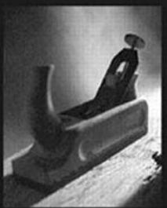

Prepared exclusively for Zach

# **What others in the trenches say about** *The Pragmatic Programmer*...

"The cool thing about this book is that it's great for keeping the programming process fresh. *[The book]* helps you to continue to grow and clearly comes from people who have been there."

Kent Beck, author of *Extreme Programming Explained: Embrace Change*

"I found this book to be a great mix of solid advice and wonderful analogies!"

Martin Fowler, author of *Refactoring* and *UML Distilled*

"I would buy a copy, read it twice, then tell all my colleagues to run out and grab a copy. This is a book I would never loan because I would worry about it being lost."

Kevin Ruland, Management Science, MSG-Logistics

"The wisdom and practical experience of the authors is obvious. The topics presented are relevant and useful. . . . By far its greatest strength for me has been the outstanding analogies—tracer bullets, broken windows, and the fabulous helicopter-based explanation of the need for orthogonality, especially in a crisis situation. I have little doubt that this book will eventually become an excellent source of useful information for journeymen programmers and expert mentors alike."

John Lakos, author of *Large-Scale C++ Software Design*

"This is the sort of book I will buy a dozen copies of when it comes out so I can give it to my clients."

Eric Vought, Software Engineer

"Most modern books on software development fail to cover the basics of what makes a great software developer, instead spending their time on syntax or technology where in reality the greatest leverage possible for any software team is in having talented developers who really know their craft well. An excellent book."

Pete McBreen, Independent Consultant

"Since reading this book, I have implemented many of the practical suggestions and tips it contains. Across the board, they have saved my company time and money while helping me get my job done quicker! This should be a desktop reference for everyone who works with code for a living."

Jared Richardson, Senior Software Developer, iRenaissance, Inc.

"I would like to see this issued to every new employee at my company. . . ."

Chris Cleeland, Senior Software Engineer, Object Computing, Inc.

## The Pragmatic Programmer


## The Pragmatic Programmer

## From Journeyman to Master

Andrew Hunt David Thomas


### ADDISON–WESLEY

**An imprint of Addison Wesley Longman, Inc.**

Reading, Massachusetts Harlow, England Menlo Park, California Berkeley, California Don Mills, Ontario Sydney Bonn Amsterdam Tokyo Mexico City Many of the designations used by manufacturers and sellers to distinguish their products are claimed as trademarks. Where those designations appear in this book, and Addison– Wesley was aware of a trademark claim, the designations have been printed in initial capital letters or in all capitals.

Lyrics from the song "The Boxer" on page 157 are Copyright c 1968 Paul Simon. Used by permission of the Publisher: Paul Simon Music. Lyrics from the song "Alice's Restaurant" on page 220 are by Arlo Guthrie, c 1966, 1967 (renewed) by APPLESEED MUSIC INC. All Rights Reserved. Used by Permission.

The authors and publisher have taken care in the preparation of this book, but make no express or implied warranty of any kind and assume no responsibility for errors or omissions. No liability is assumed for incidental or consequential damages in connection with or arising out of the use of the information or programs contained herein.

The publisher offers discounts on this book when ordered in quantity for special sales. For more information, please contact:

AWL Direct Sales Addison Wesley Longman, Inc. One Jacob Way Reading, Massachusetts 01867 (781) 944-3700

Visit AWL on the Web: www.awl.com/cseng

*Library of Congress Cataloging-in-Publication Data*

```
Hunt, Andrew, 1964 –
 The Pragmatic Programmer / Andrew Hunt, David Thomas.
    p. cm.
 Includes bibliographical references.
 ISBN 0-201-61622-X
 1. Computer programming. I. Thomas, David, 1956– .
II. Title.
QA76.6.H857 1999
005.1--dc21 99–43581
                                               CIP
```

Copyright c 2000 by Addison Wesley Longman, Inc.

All rights reserved. No part of this publication may be reproduced, stored in a retrieval system, or transmitted, in any form or by any means, electronic, mechanical, photocopying, recording, or otherwise, without the prior written permission of the publisher. Printed in the United States of America. Published simultaneously in Canada.

#### ISBN 0-201-61622-X

Text printed in the United States on recycled paper at Courier Stoughton in Stoughton, Massachusetts.

25th February 2010 Printing

For Ellie and Juliet, Elizabeth and Zachary, Stuart and Henry


