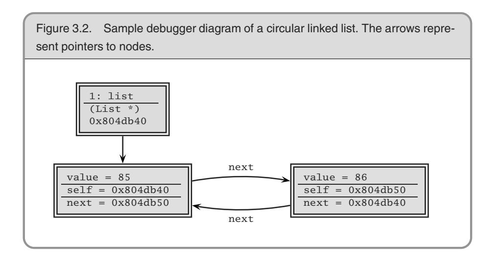
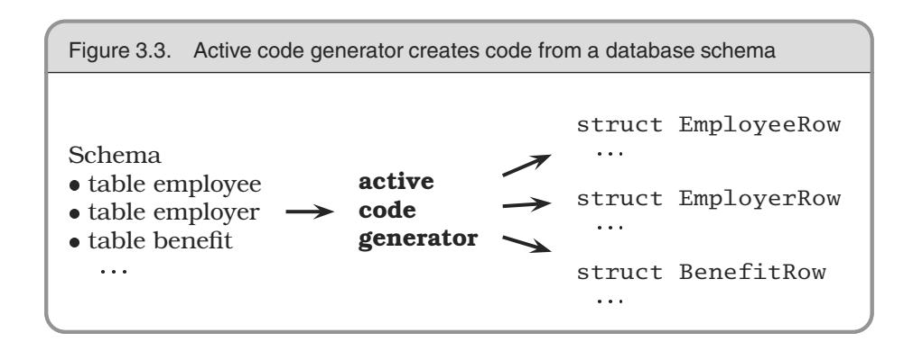

# Chapter 3: The Basic Tools


Every craftsman starts his or her journey with a basic set of goodquality tools. A woodworker might need rules, gauges, a couple of saws, some good planes, fine chisels, drills and braces, mallets, and clamps. These tools will be lovingly chosen, will be built to last, will perform specific jobs with little overlap with other tools, and, perhaps most importantly, will feel right in the budding woodworker's hands.

Then begins a process of learning and adaptation. Each tool will have its own personality and quirks, and will need its own special handling. Each must be sharpened in a unique way, or held just so. Over time, each will wear according to use, until the grip looks like a mold of the woodworker's hands and the cutting surface aligns perfectly with the angle at which the tool is held. At this point, the tools become conduits from the craftsman's brain to the finished product—they have become extensions of his or her hands. Over time, the woodworker will add new tools, such as biscuit cutters, laser-guided miter saws, dovetail jigs all wonderful pieces of technology. But you can bet that he or she will be happiest with one of those original tools in hand, feeling the plane sing as it slides through the wood.

Tools amplify your talent. The better your tools, and the better you know how to use them, the more productive you can be. Start with a basic set of generally applicable tools. As you gain experience, and as you come across special requirements, you'll add to this basic set. Like the craftsman, expect to add to your toolbox regularly. Always be on the lookout for better ways of doing things. If you come across a situation where you feel your current tools can't cut it, make a note to look for something different or more powerful that would have helped. Let need drive your acquisitions.

Many new programmers make the mistake of adopting a single power tool, such as a particular integrated development environment (IDE), and never leave its cozy interface. This really is a mistake. We need to be comfortable beyond the limits imposed by an IDE. The only way to do this is to keep the basic tool set sharp and ready to use.

In this chapter we'll talk about investing in your own basic toolbox. As with any good discussion on tools, we'll start (in *The Power of Plain Text*) by looking at your raw materials, the stuff you'll be shaping. From there we'll move to the workbench, or in our case the computer. How can you use your computer to get the most out of the tools you use? We'll discuss this in *Shell Games*. Now that we have material and a bench to work on, we'll turn to the tool you'll probably use more than any other, your editor. In *Power Editing*, we'll suggest ways of making you more efficient.

To ensure that we never lose any of our precious work, we should always use a *Source Code Control* system—even for things such as our personal address book! And, since Mr. Murphy was really an optimist after all, you can't be a great programmer until you become highly skilled at *Debugging*.

You'll need some glue to bind much of the magic together. We discuss some possibilities, such as awk, Perl, and Python, in *Text Manipulation*.

Just as woodworkers sometimes build jigs to guide the construction of complex pieces, programmers can write code that itself writes code. We discuss this in *Code Generators*.

Spend time learning to use these tools, and at some point you'll be surprised to discover your fingers moving over the keyboard, manipulating text without conscious thought. The tools will have become extensions of your hands.

## **<sup>14</sup>** The Power of Plain Text

As Pragmatic Programmers, our base material isn't wood or iron, it's knowledge. We gather requirements as knowledge, and then express that knowledge in our designs, implementations, tests, and documents. And we believe that the best format for storing knowledge persistently is *plain text*. With plain text, we give ourselves the ability to manipulate knowledge, both manually and programmatically, using virtually every tool at our disposal.

### What Is Plain Text?

*Plain text* is made up of printable characters in a form that can be read and understood directly by people. For example, although the following snippet is made up of printable characters, it is meaningless.

Field19=467abe

The reader has no idea what the significance of 467abe may be. A better choice would be to make it *understandable* to humans.

DrawingType=UMLActivityDrawing

Plain text doesn't mean that the text is unstructured; XML, SGML, and HTML are great examples of plain text that has a well-defined structure. You can do everything with plain text that you could do with some binary format, including versioning.

Plain text tends to be at a higher level than a straight binary encoding, which is usually derived directly from the implementation. Suppose you wanted to store a property called uses\_menus that can be either TRUE or FALSE. Using text, you might write this as

myprop.uses\_menus=FALSE

Contrast this with 0010010101110101.

The problem with most binary formats is that the context necessary to understand the data is separate from the data itself. You are artificially divorcing the data from its meaning. The data may as well be encrypted; it is absolutely meaningless without the application logic to parse it. With plain text, however, you can achieve a self-describing data stream that is independent of the application that created it.

**TIP 20** Keep Knowledge in Plain Text

### Drawbacks

There are two major drawbacks to using plain text: (1) It may take more space to store than a compressed binary format, and (2) it may be computationally more expensive to interpret and process a plain text file.

Depending on your application, either or both of these situations may be unacceptable—for example, when storing satellite telemetry data, or as the internal format of a relational database.

But even in these situations, it may be acceptable to store *metadata* about the raw data in plain text (see *Metaprogramming*, page 144).

Some developers may worry that by putting metadata in plain text, they're exposing it to the system's users. This fear is misplaced. Binary data may be more obscure than plain text, but it is no more secure. If you worry about users seeing passwords, encrypt them. If you don't want them changing configuration parameters, include a *secure hash*<sup>1</sup> of all the parameter values in the file as a checksum.

### The Power of Text

Since *larger* and *slower* aren't the most frequently requested features from users, why bother with plain text? What *are* the benefits?

- Insurance against obsolescence
- Leverage
- Easier testing

#### Insurance Against Obsolescence

Human-readable forms of data, and self-describing data, will outlive all other forms of data and the applications that created them. Period.

<sup>1.</sup> MD5 is often used for this purpose. For an excellent introduction to the wonderful world of cryptography, see [Sch95].

As long as the data survives, you will have a chance to be able to use it—potentially long after the original application that wrote it is defunct.

You can parse such a file with only partial knowledge of its format; with most binary files, you must know all the details of the entire format in order to parse it successfully.

Consider a data file from some legacy system2 that you are given. You know little about the original application; all that's important to you is that it maintained a list of clients' Social Security numbers, which you need to find and extract. Among the data, you see

```
<FIELD10>123-45-6789</FIELD10>
...
<FIELD10>567-89-0123</FIELD10>
...
<FIELD10>901-23-4567</FIELD10>
```

Recognizing the format of a Social Security number, you can quickly write a small program to extract that data—even if you have no information on anything else in the file.

But imagine if the file had been formatted this way instead:

```
AC27123456789B11P
...
XY43567890123QTYL
...
6T2190123456788AM
```

You may not have recognized the significance of the numbers quite as easily. This is the difference between *human readable* and *human understandable*.

While we're at it, FIELD10 doesn't help much either. Something like

```
<SSNO>123-45-6789</SSNO>
```

makes the exercise a no-brainer—and ensures that the data will outlive any project that created it.

### Leverage

Virtually every tool in the computing universe, from source code management systems to compiler environments to editors and stand-alone filters, can operate on plain text.

<sup>2.</sup> All software becomes legacy as soon as it's written.

#### The Unix Philosophy

Unix is famous for being designed around the philosophy of small, sharp tools, each intended to do one thing well. This philosophy is enabled by using a common underlying format—the line-oriented, plain text file. Databases used for system administration (users and passwords, networking configuration, and so on) are all kept as plain text files. (Some systems, such as Solaris, also maintain a binary form of certain databases as a performance optimization. The plain text version is kept as an interface to the binary version.)

When a system crashes, you may be faced with only a minimal environment to restore it (you may not be able to access graphics drivers, for instance). Situations such as this can really make you appreciate the simplicity of plain text.

For instance, suppose you have a production deployment of a large application with a complex site-specific configuration file (sendmail comes to mind). If this file is in plain text, you could place it under a source code control system (see *Source Code Control*, page 86), so that you automatically keep a history of all changes. File comparison tools such as diff and fc allow you to see at a glance what changes have been made, while sum allows you to generate a checksum to monitor the file for accidental (or malicious) modification.

### Easier Testing

If you use plain text to create synthetic data to drive system tests, then it is a simple matter to add, update, or modify the test data *without having to create any special tools to do so.* Similarly, plain text output from regression tests can be trivially analyzed (with diff, for instance) or subjected to more thorough scrutiny with Perl, Python, or some other scripting tool.

### Lowest Common Denominator

Even in the future of XML-based intelligent agents that travel the wild and dangerous Internet autonomously, negotiating data interchange among themselves, the ubiquitous text file will still be there. In fact, in heterogeneous environments the advantages of plain text can outweigh all of the drawbacks. You need to ensure that all parties can communicate using a common standard. Plain text is that standard.

### Related sections include:

- *Source Code Control*, page 86
- *Code Generators*, page 102
- *Metaprogramming*, page 144
- *Blackboards*, page 165
- *Ubiquitous Automation*, page 230
- *It's All Writing*, page 248

### Challenges

- Design a small address book database (name, phone number, and so on) using a straightforward binary representation in your language of choice. Do this before reading the rest of this challenge.
  - 1. Translate that format into a plain text format using XML.
  - 2. For each version, add a new, variable-length field called *directions* in which you might enter directions to each person's house.

What issues come up regarding versioning and extensibility? Which form was easier to modify? What about converting existing data?

## **<sup>15</sup>** Shell Games

Every woodworker needs a good, solid, reliable workbench, somewhere to hold work pieces at a convenient height while he or she works them. The workbench becomes the center of the wood shop, the craftsman returning to it time and time again as a piece takes shape.

For a programmer manipulating files of text, that workbench is the command shell. From the shell prompt, you can invoke your full repertoire of tools, using pipes to combine them in ways never dreamt of by their original developers. From the shell, you can launch applications, debuggers, browsers, editors, and utilities. You can search for files,

query the status of the system, and filter output. And by programming the shell, you can build complex macro commands for activities you perform often.

For programmers raised on GUI interfaces and integrated development environments (IDEs), this might seem an extreme position. After all, can't you do everything equally well by pointing and clicking?

The simple answer is "no." GUI interfaces are wonderful, and they can be faster and more convenient for some simple operations. Moving files, reading MIME-encoded e-mail, and typing letters are all things that you might want to do in a graphical environment. But if you do all your work using GUIs, you are missing out on the full capabilities of your environment. You won't be able to automate common tasks, or use the full power of the tools available to you. And you won't be able to combine your tools to create customized *macro tools*. A benefit of GUIs is WYSIWYG—what you see is what you get. The disadvantage is WYSIAYG—what you see is *all* you get.

GUI environments are normally limited to the capabilities that their designers intended. If you need to go beyond the model the designer provided, you are usually out of luck—and more often than not, you *do* need to go beyond the model. Pragmatic Programmers don't just cut code, or develop object models, or write documentation, or automate the build process—we do *all* of these things. The scope of any one tool is usually limited to the tasks that the tool is expected to perform. For instance, suppose you need to integrate a code preprocessor (to implement design-by-contract, or multi-processing pragmas, or some such) into your IDE. Unless the designer of the IDE explicitly provided hooks for this capability, you can't do it.

You may already be comfortable working from the command prompt, in which case you can safely skip this section. Otherwise, you may need to be convinced that the shell is your friend.

As a Pragmatic Programmer, you will constantly want to perform ad hoc operations—things that the GUI may not support. The command line is better suited when you want to quickly combine a couple of commands to perform a query or some other task. Here are a few examples.

### Find all .c files modified more recently than your Makefile.

Shell . . . find . -name '\*.c' -newer Makefile -print

GUI. . . . . Open the Explorer, navigate to the correct directory, click on the Makefile, and note the modification time. Then bring up Tools/Find, and enter \*.c for the file specification. Select the date tab, and enter the date you noted for the Makefile in the first date field. Then hit OK.

#### Construct <sup>a</sup> zip/tar archive of my source.

Shell . . . zip archive.zip \*.h \*.c *– or –* tar cvf archive.tar \*.h \*.c

GUI. . . . . Bring up a ZIP utility (such as the shareware WinZip [URL 41]), select "Create New Archive," enter its name, select the source directory in the add dialog, set the filter to "\*.c", click "Add," set the filter to "\*.h", click "Add," then close the archive.

#### Which Java files have not been changed in the last week?

Shell . . . find . -name '\*.java' -mtime +7 -print

GUI. . . . . Click and navigate to "Find files," click the "Named" field and type in "\*.java", select the "Date Modified" tab. Then select "Between." Click on the starting date and type in the starting date of the beginning of the project. Click on the ending date and type in the date of a week ago today (be sure to have a calendar handy). Click on "Find Now."

#### Of those files, which use the awt libraries?

Shell . . . find . -name '\*.java' -mtime +7 -print | xargs grep 'java.awt'

GUI. . . . . Load each file in the list from the previous example into an editor and search for the string "java.awt". Write down the name of each file containing a match.

Clearly the list could go on. The shell commands may be obscure or terse, but they are powerful and concise. And, because shell commands can be combined into script files (or command files under Windows systems), you can build sequences of commands to automate things you do often.

```
TIP 21
Use the Power of Command Shells
```

Gain familiarity with the shell, and you'll find your productivity soaring. Need to create a list of all the unique package names explicitly imported by your Java code? The following stores it in a file called "list."

```
grep '^import ' *.java |
  sed -e's/.*import *//' -e's/;.*$//' |
  sort -u >list
```

If you haven't spent much time exploring the capabilities of the command shell on the systems you use, this might appear daunting. However, invest some energy in becoming familiar with your shell and things will soon start falling into place. Play around with your command shell, and you'll be surprised at how much more productive it makes you.

### Shell Utilities and Windows Systems

Although the command shells provided with Windows systems are improving gradually, Windows command-line utilities are still inferior to their Unix counterparts. However, all is not lost.

Cygnus Solutions has a package called Cygwin [URL 31]. As well as providing a Unix compatibility layer for Windows, Cygwin comes with a collection of more than 120 Unix utilities, including such favorites as ls, grep, and find. The utilities and libraries may be downloaded and used for free, but be sure to read their license.<sup>3</sup> The Cygwin distribution comes with the Bash shell.

<sup>3.</sup> The GNU General Public License [URL 57] is a kind of legal virus that Open Source developers use to protect their (and your) rights. You should spend some time reading it. In essence, it says that you can use and modify GPL'd software, but if you distribute any modifications they must be licensed according to the GPL (and marked as such), and you must make source available. That's the virus part—whenever you derive a work from a GPL'd work, your derived work must also be GPL'd. However, it does not limit you in any way when simply using the tools—the ownership and licensing of software developed using the tools are up to you.

#### Using Unix Tools Under Windows

We love the availability of high-quality Unix tools under Windows, and use them daily. However, be aware that there are integration issues. Unlike their MS-DOS counterparts, these utilities are sensitive to the case of filenames, so ls a\*.bat won't find AUTOEXEC.BAT. You may also come across problems with filenames containing spaces, and with differences in path separators. Finally, there are interesting problems when running MS-DOS programs that expect MS-DOS–style arguments under the Unix shells. For example, the Java utilities from JavaSoft use a colon as their CLASSPATH separator under Unix, but use a semicolon under MS-DOS. As a result, a Bash or ksh script that runs on a Unix box will run identically under Windows, but the command line it passes to Java will be interpreted incorrectly.

Alternatively, David Korn (of Korn shell fame) has put together a package called UWIN. This has the same aims as the Cygwin distribution—it is a Unix development environment under Windows. UWIN comes with a version of the Korn shell. Commercial versions are available from Global Technologies, Ltd. [URL 30]. In addition, AT&T allows free downloading of the package for evaluation and academic use. Again, read their license before using.

Finally, Tom Christiansen is (at the time of writing) putting together *Perl Power Tools*, an attempt to implement all the familiar Unix utilities portably, in Perl [URL 32].

#### Related sections include:

*Ubiquitous Automation*, page 230

### Challenges

- Are there things that you're currently doing manually in a GUI? Do you ever pass instructions to colleagues that involve a number of individual "click this button," "select this item" steps? Could these be automated?
- Whenever you move to a new environment, make a point of finding out what shells are available. See if you can bring your current shell with you.
- Investigate alternatives to your current shell. If you come across a problem your shell can't address, see if an alternative shell would cope better.

## **<sup>16</sup>** Power Editing

We've talked before about tools being an extension of your hand. Well, this applies to editors more than to any other software tool. You need to be able to manipulate text as effortlessly as possible, because text is the basic raw material of programming. Let's look at some common features and functions that help you get the most from your editing environment.

### One Editor

We think it is better to know one editor very well, and use it for all editing tasks: code, documentation, memos, system administration, and so on. Without a single editor, you face a potential modern day Babel of confusion. You may have to use the built-in editor in each language's IDE for coding, and an all-in-one office product for documentation, and maybe a different built-in editor for sending e-mail. Even the keystrokes you use to edit command lines in the shell may be different.<sup>4</sup> It is difficult to be proficient in any of these environments if you have a different set of editing conventions and commands in each.

You need to be proficient. Simply typing linearly and using a mouse to cut and paste is not enough. You just can't be as effective that way as you can with a powerful editor under your fingers. Typing or BACKSPACE ten times to move the cursor left to the beginning of a line isn't as efficient as typing a single key such as ^A , Home , or 0 .

**TIP 22** Use a Single Editor Well

Choose an editor, know it thoroughly, and use it for all editing tasks. If you use a single editor (or set of keybindings) across all text editing activities, you don't have to stop and think to accomplish text manipulation: the necessary keystrokes will be a reflex. The editor will be

<sup>4.</sup> Ideally, the shell you use should have keybindings that match the ones used by your editor. Bash, for instance, supports both vi and emacs keybindings.

an extension of your hand; the keys will sing as they slice their way through text and thought. That's our goal.

Make sure that the editor you choose is available on all platforms you use. Emacs, vi, CRiSP, Brief, and others are available across multiple platforms, often in both GUI and non-GUI (text screen) versions.

### Editor Features

Beyond whatever features you find particularly useful and comfortable, here are some basic abilities that we think every decent editor should have. If your editor falls short in any of these areas, then this may be the time to consider moving on to a more advanced one.

- Configurable. All aspects of the editor should be configurable to your preferences, including fonts, colors, window sizes, and keystroke bindings (which keys perform what commands). Using only keystrokes for common editing operations is more efficient than mouse or menu-driven commands, because your hands never leave the keyboard.
- Extensible. An editor shouldn't be obsolete just because a new programming language comes out. It should be able to integrate with whatever compiler environment you are using. You should be able to "teach" it the nuances of any new language or text format (XML, HTML version 9, and so on).
- Programmable. You should be able to program the editor to perform complex, multistep tasks. This can be done with macros or with a built-in scripting programming language (Emacs uses a variant of Lisp, for instance).

In addition, many editors support features that are specific to a particular programming language, such as:

- Syntax highlighting
- Auto-completion
- Auto-indentation
- Initial code or document boilerplate
- Tie-in to help systems
- IDE-like features (compile, debug, and so on)

```
Figure 3.1. Sorting lines in an editor
import java.util.Vector; import java.awt.*;
import java.util.Stack; import java.net.URL;
import java.net.URL; import java.util.Stack;
import java.awt.*; import java.util.Vector;
                   emacs: M-x sort-lines
                     vi: :.,+3!sort
```

A feature such as syntax highlighting may sound like a frivolous extra, but in reality it can be very useful and enhance your productivity. Once you get used to seeing keywords appear in a different color or font, a mistyped keyword that *doesn't* appear that way jumps out at you long before you fire up the compiler.

Having the ability to compile and navigate directly to errors within the editor environment is very handy on big projects. Emacs in particular is adept at this style of interaction.

### Productivity

A surprising number of people we've met use the Windows notepad utility to edit their source code. This is like using a teaspoon as a shovel—simply typing and using basic mouse-based cut and paste is not enough.

What sort of things will you need to do that *can't* be done in this way?

Well, there's cursor movement, to start with. Single keystrokes that move you in units of words, lines, blocks, or functions are far more efficient than repeatedly typing a keystroke that moves you character by character or line by line.

Or suppose you are writing Java code. You like to keep your import statements in alphabetical order, and someone else has checked in a few files that don't adhere to this standard (this may sound extreme, but on a large project it can save you a lot of time scanning through a long list of import statements). You'd like to go quickly through a few files and sort a small section of them. In editors such as vi and Emacs you can do this easily (see Figure 3.1). Try *that* in notepad.

Some editors can help streamline common operations. For instance, when you create a new file in a particular language, the editor can supply a template for you. It might include:

- Name of the class or module filled in (derived from the filename)
- Your name and/or copyright statements
- Skeletons for constructs in that language (constructor and destructor declarations, for example)

Another useful feature is auto-indenting. Rather than having to indent manually (by using space or tab), the editor automatically indents for you at the appropriate time (after typing an open brace, for example). The nice part about this feature is that you can use the editor to provide a consistent indentation style for your project.<sup>5</sup>

### Where to Go from Here

I think you are nuts. Notepad

This sort of advice is particularly hard to write because virtually every reader is at a different level of comfort and expertise with the editor(s) they are currently using. So, to summarize, and to provide some guidance on where to go next, find yourself in the left-hand column of the chart, and look at the right-hand column to see what we think you should do.

**If this sounds like you Then think about**

| features<br>of<br>I<br>only<br>basic<br>use<br>many different editors. | Pick<br>a<br>powerful<br>editor<br>and<br>learn<br>it<br>well.                                   |
|------------------------------------------------------------------------|--------------------------------------------------------------------------------------------------|
| I have a favorite editor,<br>but I<br>don't use all of its features.   | Learn<br>them.<br>Cut<br>down<br>the<br>number<br>of<br>keystrokes<br>you<br>need<br>to<br>type. |
| favorite<br>have<br>editor<br>and<br>I<br>a<br>use it where possible.  | Try<br>to<br>expand<br>and<br>use<br>it<br>for<br>more<br>tasks<br>than<br>you<br>do<br>already. |

is the best editor ever made. tive, go for it! But if you find yourself subject to "editor envy," you may need to reevaluate your position.

As long as you are happy and produc-

<sup>5.</sup> The Linux kernel is developed this way. Here you have geographically dispersed developers, many working on the same pieces of code. There is a published list of settings (in this case, for Emacs) that describes the required indentation style.

### What Editors Are Available?

Having recommended that you master a decent editor, which one do we recommend? Well, we're going to duck that question; your choice of editor is a personal one (some would even say a religious one!). However, in Appendix A, page 266, we list a number of popular editors and where to get them.

#### Challenges

- Some editors use full-blown languages for customization and scripting. Emacs, for example, uses Lisp. As one of the new languages you are going to learn this year, learn the language your editor uses. For anything you find yourself doing repeatedly, develop a set of macros (or equivalent) to handle it.
- Do you know everything your editor is capable of doing? Try to stump your colleagues who use the same editor. Try to accomplish any given editing task in as few keystrokes as possible.


## **<sup>17</sup>** Source Code Control

*Progress, far from consisting in change, depends on retentiveness. Those who cannot remember the past are condemned to repeat it.*

### George Santayana, Life of Reason

One of the important things we look for in a user interface is the UNDO key—a single button that forgives us our mistakes. It's even better if the environment supports multiple levels of undo and redo, so you can go back and recover from something that happened a couple of minutes ago. But what if the mistake happened last week, and you've turned your computer on and off ten times since then? Well, that's one of the many benefits of using a source code control system: it's a giant UNDO key—a project-wide time machine that can return you to those halcyon days of last week, when the code actually compiled and ran.

Source code control systems, or the more widely scoped *configuration management* systems, keep track of every change you make in your source code and documentation. The better ones can keep track of compiler and OS versions as well. With a properly configured source code control system, *you can always go back to a previous version of your software.*

But a source code control system (SCCS6) does far more than undo mistakes. A good SCCS will let you track changes, answering questions such as: Who made changes in this line of code? What's the difference between the current version and last week's? How many lines of code did we change in this release? Which files get changed most often? This kind of information is invaluable for bug-tracking, audit, performance, and quality purposes.

An SCCS will also let you identify releases of your software. Once identified, you will always be able to go back and regenerate the release, independent of changes that may have occurred later.

We often use an SCCS to manage branches in the development tree. For example, once you have released some software, you'll normally want to continue developing for the next release. At the same time, you'll need to deal with bugs in the current release, shipping fixed versions to clients. You'll want these bug fixes rolled into the next release (if appropriate), but you don't want to ship code under development to clients. With an SCCS you can generate branches in the development tree each time you generate a release. You apply bug fixes to code in the branch, and continue developing on the main trunk. Since the bug fixes may be relevant to the main trunk as well, some systems allow you to merge selected changes from the branch back into the main trunk automatically.

Source code control systems may keep the files they maintain in a central repository—a great candidate for archiving.

Finally, some products may allow two or more users to be working concurrently on the same set of files, even making concurrent changes in the same file. The system then manages the merging of these changes when the files are sent back to the repository. Although seemingly risky, such systems work well in practice on projects of all sizes.

<sup>6.</sup> We use the uppercase SCCS to refer to generic source code control systems. There is also a specific system called "sccs," originally released with AT&T System V Unix.

**TIP 23** Always Use Source Code Control

Always. Even if you are a single-person team on a one-week project. Even if it's a "throw-away" prototype. Even if the stuff you're working on isn't source code. Make sure that *everything* is under source code control—documentation, phone number lists, memos to vendors, makefiles, build and release procedures, that little shell script that burns the CD master—everything. We routinely use source code control on just about everything we type (including the text of this book). Even if we're not working on a project, our day-to-day work is secured in a repository.

### Source Code Control and Builds

There is a tremendous hidden benefit in having an entire project under the umbrella of a source code control system: you can have product builds that are *automatic* and *repeatable*.

The project build mechanism can pull the latest source out of the repository automatically. It can run in the middle of the night after everyone's (hopefully) gone home. You can run automatic regression tests to ensure that the day's coding didn't break anything. The automation of the build ensures consistency—there are no manual procedures, and you won't need developers remembering to copy code into some special build area.

The build is repeatable because you can always rebuild the source as it existed on a given date.

### But My Team Isn't Using Source Code Control

Shame on them! Sounds like an opportunity to do some evangelizing! However, while you wait for them to see the light, perhaps you should implement your own private source control. Use one of the freely available tools we list in Appendix A, and make a point of keeping your personal work safely tucked into a repository (as well as doing whatever your project requires). Although this may seem to be duplication of effort, we can pretty much guarantee it will save you grief (and save your project money) the first time you need to answer questions such as "What did you do to the *xyz* module?" and "What broke the build?" This approach may also help convince your management that source code control really works.

Don't forget that an SCCS is equally applicable to the things you do outside of work.

### Source Code Control Products

Appendix A, page 271, gives URLs for representative source code control systems, some commercial and others freely available. And many more products are available—look for pointers to the configuration management FAQ. For an introduction to the freely-available CVS version control system, see our book *Pragmatic Version Control* [TH03].

#### Related sections include:

- *Orthogonality*, page 34
- *The Power of Plain Text*, page 73
- *It's All Writing*, page 248

#### Challenges

- Even if you are not able to use an SCCS at work, install RCS or CVS on a personal system. Use it to manage your pet projects, documents you write, and (possibly) configuration changes applied to the computer system itself.
- Take a look at some of the Open Source projects for which publicly accessible archives are available on the Web (such as Mozilla [URL 51], KDE [URL 54], and the Gimp [URL 55]). How do you get updates of the source? How do you make changes—does the project regulate access or arbitrate the inclusion of changes?

## **<sup>18</sup>** Debugging

*It is a painful thing To look at your own trouble and know That you yourself and no one else has made it*

### Sophocles, Ajax

The word *bug* has been used to describe an "object of terror" ever since the fourteenth century. Rear Admiral Dr. Grace Hopper, the inventor of COBOL, is credited with observing the first *computer bug*—literally, a moth caught in a relay in an early computer system. When asked to explain why the machine wasn't behaving as intended, a technician reported that there was "a bug in the system," and dutifully taped it wings and all—into the log book.

Regrettably, we still have "bugs" in the system, albeit not the flying kind. But the fourteenth century meaning—a bogeyman—is perhaps even more applicable now than it was then. Software defects manifest themselves in a variety of ways, from misunderstood requirements to coding errors. Unfortunately, modern computer systems are still limited to doing what you *tell* them to do, not necessarily what you *want* them to do.

No one writes perfect software, so it's a given that debugging will take up a major portion of your day. Let's look at some of the issues involved in debugging and some general strategies for finding elusive bugs.

### Psychology of Debugging

Debugging itself is a sensitive, emotional subject for many developers. Instead of attacking it as a puzzle to be solved, you may encounter denial, finger pointing, lame excuses, or just plain apathy.

Embrace the fact that debugging is just *problem solving*, and attack it as such.

Having found someone else's bug, you can spend time and energy laying blame on the filthy culprit who created it. In some workplaces this is part of the culture, and may be cathartic. However, in the technical arena, you want to concentrate on fixing the *problem*, not the blame.


It doesn't really matter whether the bug is your fault or someone else's. It is still your problem.

### A Debugging Mindset

*The easiest person to deceive is one's self.*

**Edward Bulwer-Lytton, The Disowned**

Before you start debugging, it's important to adopt the right mindset. You need to turn off many of the defenses you use each day to protect your ego, tune out any project pressures you may be under, and get yourself comfortable. Above all, remember the first rule of debugging:


It's easy to get into a panic, especially if you are facing a deadline, or have a nervous boss or client breathing down your neck while you are trying to find the cause of the bug. But it is very important to step back a pace, and actually *think* about what could be causing the symptoms that you believe indicate a bug.

If your first reaction on witnessing a bug or seeing a bug report is "that's impossible," you are plainly wrong. Don't waste a single neuron on the train of thought that begins "but that can't happen" because quite clearly it *can*, and has.

Beware of myopia when debugging. Resist the urge to fix just the symptoms you see: it is more likely that the actual fault may be several steps removed from what you are observing, and may involve a number of other related things. Always try to discover the root cause of a problem, not just this particular appearance of it.

### Where to Start

Before you *start* to look at the bug, make sure that you are working on code that compiled cleanly—without warnings. We routinely set compiler warning levels as high as possible. It doesn't make sense to waste time trying to find a problem that the compiler could find for you! We need to concentrate on the harder problems at hand.

When trying to solve any problem, you need to gather all the relevant data. Unfortunately, bug reporting isn't an exact science. It's easy to be misled by coincidences, and you can't afford to waste time debugging coincidences. You first need to be accurate in your observations.

Accuracy in bug reports is further diminished when they come through a third party—you may actually need to *watch* the user who reported the bug in action to get a sufficient level of detail.

Andy once worked on a large graphics application. Nearing release, the testers reported that the application crashed every time they painted a stroke with a particular brush. The programmer responsible argued that there was nothing wrong with it; he had tried painting with it, and it worked just fine. This dialog went back and forth for several days, with tempers rapidly rising.

Finally, we got them together in the same room. The tester selected the brush tool and painted a stroke from the upper right corner to the lower left corner. The application exploded. "Oh," said the programmer, in a small voice, who then sheepishly admitted that he had made test strokes only from the lower left to the upper right, which did not expose the bug.

There are two points to this story:

- You may need to interview the user who reported the bug in order to gather more data than you were initially given.
- Artificial tests (such as the programmer's single brush stroke from bottom to top) don't exercise enough of an application. You must brutally test both boundary conditions and realistic end-user usage patterns. You need to do this systematically (see *Ruthless Testing*, page 237).

### Debugging Strategies

Once *you* think you know what is going on, it's time to find out what the *program* thinks is going on.

#### Bug Reproduction

No, our bugs aren't really multiplying (although some of them are probably old enough to do it legally). We're talking about a different kind of reproduction.

The best way to start fixing a bug is to make it reproducible. After all, if you can't reproduce it, how will you know if it is ever fixed?

But we want more than a bug that can be reproduced by following some long series of steps; we want a bug that can be reproduced with a single command. It's a lot harder to fix a bug if you have to go through 15 steps to get to the point where the bug shows up. Sometimes by forcing yourself to isolate the circumstances that display the bug, you'll even gain an insight on how to fix it.

See Ubiquitous Automation, page 230, for other ideas along these lines.

### Visualize Your Data

Often, the easiest way to discern what a program is doing—or what it is going to do—is to get a good look at the data it is operating on. The simplest example of this is a straightforward "variable name = data value" approach, which may be implemented as printed text, or as fields in a GUI dialog box or list.

But you can gain a much deeper insight into your data by using a debugger that allows you to *visualize* your data and all of the interrelationships that exist. There are debuggers that can represent your data as a 3D fly-over through a virtual reality landscape, or as a 3D waveform plot, or just as simple structural diagrams, as shown in Figure 3.2 on the next page. As you single-step through your program, pictures like these can be worth much more than a thousand words, as the bug you've been hunting suddenly jumps out at you.

Even if your debugger has limited support for visualizing data, you can still do it yourself—either by hand, with paper and pencil, or with external plotting programs.

The DDD debugger has some visualization capabilities, and is freely available (see [URL 19]). It is interesting to note that DDD works with



multiple languages, including Ada, C, C++, Fortran, Java, Modula, Pascal, Perl, and Python (clearly an orthogonal design).

#### Tracing

Debuggers generally focus on the state of the program *now*. Sometimes you need more—you need to watch the state of a program or a data structure over time. Seeing a stack trace can only tell you how you got here directly. It can't tell you what you were doing prior to this call chain, especially in event-based systems.

*Tracing statements* are those little diagnostic messages you print to the screen or to a file that say things such as "got here" and "value of x = 2." It's a primitive technique compared with IDE-style debuggers, but it is peculiarly effective at diagnosing several classes of errors that debuggers can't. Tracing is invaluable in any system where time itself is a factor: concurrent processes, real-time systems, and event-based applications.

You can use tracing statements to "drill down" into the code. That is, you can add tracing statements as you descend the call tree.

Trace messages should be in a regular, consistent format; you may want to parse them automatically. For instance, if you needed to track down a resource leak (such as unbalanced file opens/closes), you could trace each open and each close in a log file. By processing the log

#### Corrupt Variables? Check Their Neighborhood

Sometimes you'll examine a variable, expecting to see a small integer value, and instead get something like 0x6e69614d. Before you roll up your sleeves for some serious debugging, have a quick look at the memory around this corrupted variable. Often it will give you a clue. In our case, examining the surrounding memory as characters shows us

```
20333231 6e69614d 2c745320 746f4e0a
123 Main St, nNot
2c6e776f 2058580a 31323433 00000a33
own, nXX 3421 3 n 0 0
```

Looks like someone sprayed a street address over our counter. Now we know where to look.

file with Perl, you could easily identify where the offending open was occurring.

#### Rubber Ducking

A very simple but particularly useful technique for finding the cause of a problem is simply to explain it to someone else. The other person should look over your shoulder at the screen, and nod his or her head constantly (like a rubber duck bobbing up and down in a bathtub). They do not need to say a word; the simple act of explaining, step by step, what the code is supposed to do often causes the problem to leap off the screen and announce itself.<sup>7</sup>

It sounds simple, but in explaining the problem to another person you must explicitly state things that you may take for granted when going through the code yourself. By having to verbalize some of these assumptions, you may suddenly gain new insight into the problem.

<sup>7.</sup> Why "rubber ducking"? While an undergraduate at Imperial College in London, Dave did a lot of work with a research assistant named Greg Pugh, one of the best developers Dave has known. For several months Greg carried around a small yellow rubber duck, which he'd place on his terminal while coding. It was a while before Dave had the courage to ask. . . .

#### Process of Elimination

In most projects, the code you are debugging may be a mixture of application code written by you and others on your project team, third-party products (database, connectivity, graphical libraries, specialized communications or algorithms, and so on) and the platform environment (operating system, system libraries, and compilers).

It is possible that a bug exists in the OS, the compiler, or a third-party product—but this should not be your first thought. It is much more likely that the bug exists in the application code under development. It is generally more profitable to assume that the application code is incorrectly calling into a library than to assume that the library itself is broken. Even if the problem *does* lie with a third party, you'll still have to eliminate your code before submitting the bug report.

We worked on a project where a senior engineer was convinced that the select system call was broken on Solaris. No amount of persuasion or logic could change his mind (the fact that every other networking application on the box worked fine was irrelevant). He spent weeks writing work-arounds, which, for some odd reason, didn't seem to fix the problem. When finally forced to sit down and read the documentation on select, he discovered the problem and corrected it in a matter of minutes. We now use the phrase "select is broken" as a gentle reminder whenever one of us starts blaming the system for a fault that is likely to be our own.


Remember, if you see hoof prints, think horses—not zebras. The OS is probably not broken. And the database is probably just fine.

If you "changed only one thing" and the system stopped working, that one thing was likely to be responsible, directly or indirectly, no matter how farfetched it seems. Sometimes the thing that changed is outside of your control: new versions of the OS, compiler, database, or other thirdparty software can wreak havoc with previously correct code. New bugs might show up. Bugs for which you had a work-around get fixed, breaking the work-around. APIs change, functionality changes; in short, it's a whole new ball game, and you must retest the system under these new conditions. So keep a close eye on the schedule when considering an upgrade; you may want to wait until *after* the next release.

If, however, you have no obvious place to start looking, you can always rely on a good old-fashioned binary search. See if the symptoms are present at either of two far away spots in the code. Then look in the middle. If the problem is present, then the bug lies between the start and the middle point; otherwise, it is between the middle point and the end. You can continue in this fashion until you narrow down the spot sufficiently to identify the problem.

### The Element of Surprise

When you find yourself surprised by a bug (perhaps even muttering "that's impossible" under your breath where we can't hear you), you must reevaluate truths you hold dear. In that linked list routine—the one you knew was bulletproof and couldn't possibly be the cause of this bug—did you test *all* the boundary conditions? That other piece of code you've been using for years—it couldn't possibly still have a bug in it. Could it?

Of course it can. The amount of surprise you feel when something goes wrong is directly proportional to the amount of trust and faith you have in the code being run. That's why, when faced with a "surprising" failure, you must realize that one or more of your assumptions is wrong. Don't gloss over a routine or piece of code involved in the bug because you "know" it works. Prove it. Prove it in *this* context, with *this* data, with *these* boundary conditions.


When you come across a surprise bug, beyond merely fixing it, you need to determine why this failure wasn't caught earlier. Consider whether you need to amend the unit or other tests so that they would have caught it.

Also, if the bug is the result of bad data that was propagated through a couple of levels before causing the explosion, see if better parameter checking in those routines would have isolated it earlier (see the discussions on crashing early and assertions on pages 120 and 122, respectively).

While you're at it, are there any other places in the code that may be susceptible to this same bug? Now is the time to find and fix them. Make sure that *whatever* happened, you'll know if it happens again.

If it took a long time to fix this bug, ask yourself why. Is there anything you can do to make fixing this bug easier the next time around? Perhaps you could build in better testing hooks, or write a log file analyzer.

Finally, if the bug is the result of someone's wrong assumption, discuss the problem with the whole team: if one person misunderstands, then it's possible many people do.

Do all this, and hopefully you won't be surprised next time.

### Debugging Checklist

- Is the problem being reported a direct result of the underlying bug, or merely a symptom?
- Is the bug *really* in the compiler? Is it in the OS? Or is it in your code?
- If you explained this problem in detail to a coworker, what would you say?
- If the suspect code passes its unit tests, are the tests complete enough? What happens if you run the unit test with *this* data?
- Do the conditions that caused this bug exist anywhere else in the system?

#### Related sections include:

- *Assertive Programming*, page 122
- *Programming by Coincidence*, page 172
- *Ubiquitous Automation*, page 230
- *Ruthless Testing*, page 237

#### Challenges

Debugging is challenge enough.

## **<sup>19</sup>** Text Manipulation

Pragmatic Programmers manipulate text the same way woodworkers shape wood. In previous sections we discussed some specific tools shells, editors, debuggers—that we use. These are similar to a woodworker's chisels, saws, and planes—tools specialized to do one or two jobs well. However, every now and then we need to perform some transformation not readily handled by the basic tool set. We need a generalpurpose text manipulation tool.

Text manipulation languages are to programming what routers8 are to woodworking. They are noisy, messy, and somewhat brute force. Make mistakes with them, and entire pieces can be ruined. Some people swear they have no place in the toolbox. But in the right hands, both routers and text manipulation languages can be incredibly powerful and versatile. You can quickly trim something into shape, make joints, and carve. Used properly, these tools have surprising finesse and subtlety. But they take time to master.

There is a growing number of good text manipulation languages. Unix developers often like to use the power of their command shells, augmented with tools such as awk and sed. People who prefer a more structured tool like the object-oriented nature of Python [URL 9]. Some people use Tcl [URL 23] as their tool of choice. We happen to prefer Ruby [TFH04] and Perl [URL 8] for hacking out short scripts.

These languages are important enabling technologies. Using them, you can quickly hack up utilities and prototype ideas—jobs that might take five or ten times as long using conventional languages. And that multiplying factor is crucially important to the kind of experimenting that we do. Spending 30 minutes trying out a crazy idea is a whole lot better than spending five hours. Spending a day automating important components of a project is acceptable; spending a week might not be. In their book *The Practice of Programming* [KP99], Kernighan and Pike built the same program in five different languages. The Perl version was the shortest (17 lines, compared with C's 150). With Perl you can

<sup>8.</sup> Here *router* means the tool that spins cutting blades very, very fast, not a device for interconnecting networks.

manipulate text, interact with programs, talk over networks, drive Web pages, perform arbitrary precision arithmetic, and write programs that look like Snoopy swearing.


To show the wide-ranging applicability of text manipulation languages, here's a sample of some applications we've developed over the last few years.

- Database schema maintenance. A set of Perl scripts took a plain text file containing a database schema definition and from it generated:
  - **–** The SQL statements to create the database
  - **–** Flat data files to populate a data dictionary
  - **–** C code libraries to access the database
  - **–** Scripts to check database integrity
  - **–** Web pages containing schema descriptions and diagrams
  - **–** An XML version of the schema
- Java property access. It is good OO programming style to restrict access to an object's properties, forcing external classes to get and set them via methods. However, in the common case where a property is represented inside the class by a simple member variable, creating a get and set method for each variable is tedious and mechanical. We have a Perl script that modifies the source files and inserts the correct method definitions for all appropriately flagged variables.
- Test data generation. We had tens of thousands of records of test data, spread over several different files and formats, that needed to be knitted together and converted into a form suitable for loading into a relational database. Perl did it in a couple of hours (and in the process found a couple of consistency errors in the original data).
- Book writing. We think it is important that any code presented in a book should have been tested first. Most of the code in this

book has been. However, using the *DRY* principle (see *The Evils of Duplication*, page 26) we didn't want to copy and paste lines of code from the tested programs into the book. That would have meant that the code was duplicated, virtually guaranteeing that we'd forget to update an example when the corresponding program was changed. For some examples, we also didn't want to bore you with all the framework code needed to make our example compile and run. We turned to Perl. A relatively simple script is invoked when we format the book—it extracts a named segment of a source file, does syntax highlighting, and converts the result into the typesetting language we use.

- C to Object Pascal interface. A client had a team of developers writing Object Pascal on PCs. Their code needed to interface to a body of code written in C. We developed a short Perl script that parsed the C header files, extracting the definitions of all exported functions and the data structures they used. We then generated Object Pascal units with Pascal records for all the C structures, and imported procedure definitions for all the C functions. This generation process became part of the build, so that whenever the C header changed, a new Object Pascal unit would be constructed automatically.
- Generating Web documentation. Many project teams are publishing their documentation to internal Web sites. We have written many Perl programs that analyze database schemas, C or C++ source files, makefiles, and other project sources to produce the required HTML documentation. We also use Perl to wrap the documents with standard headers and footers, and to transfer them to the Web site.

We use text manipulation languages almost every day. Many of the ideas in this book can be implemented more simply in them than in any other language of which we're aware. These languages make it easy to write code generators, which we'll look at next.

### Related sections include:

*The Evils of Duplication*, page 26

#### Exercises

*Answer* **11.** Your C program uses an enumerated type to represent one of 100 states. *on p. 285* You'd like to be able to print out the state as a string (as opposed to a number) for debugging purposes. Write a script that reads from standard input a file containing

```
name
state_a
state_b
 : :
```

Produce the file *name.h*, which contains

```
extern const char* NAME_names[];
typedef enum {
   state_a,
   state_b,
    : :
 } NAME;
```

and the file *name.c*, which contains

```
const char* NAME_names[] = {
   "state_a",
   "state_b",
     : :
 };
```

*Answer* **12.** Halfway through writing this book, we realized that we hadn't put the use *on p. 286* strict directive into many of our Perl examples. Write a script that goes through the .pl files in a directory and adds a use strict at the end of the initial comment block to all files that don't already have one. Remember to keep a backup of all files you change.


## **<sup>20</sup>** Code Generators

When woodworkers are faced with the task of producing the same thing over and over, they cheat. They build themselves a jig or a template. If they get the jig right once, they can reproduce a piece of work time after time. The jig takes away complexity and reduces the chances of making mistakes, leaving the craftsman free to concentrate on quality.

As programmers, we often find ourselves in a similar position. We need to achieve the same functionality, but in different contexts. We need to repeat information in different places. Sometimes we just need to protect ourselves from carpal tunnel syndrome by cutting down on repetitive typing.

In the same way a woodworker invests the time in a jig, a programmer can build a code generator. Once built, it can be used throughout the life of the project at virtually no cost.


There are two main types of code generators:

- 1. *Passive code generators* are run once to produce a result. From that point forward, the result becomes freestanding—it is divorced from the code generator. The wizards discussed in *Evil Wizards*, page 198, along with some CASE tools, are examples of passive code generators.
- 2. *Active code generators* are used each time their results are required. The result is a throw-away—it can always be reproduced by the code generator. Often, active code generators read some form of script or control file to produce their results.

### Passive Code Generators

Passive code generators save typing. They are basically parameterized templates, generating a given output from a set of inputs. Once the result is produced, it becomes a full-fledged source file in the project; it will be edited, compiled, and placed under source control just like any other file. Its origins will be forgotten.

Passive code generators have many uses:

- *Creating new source files.* A passive code generator can produce templates, source code control directives, copyright notices, and standard comment blocks for each new file in a project. We have our editors set up to do this whenever we create a new file: edit a new Java program, and the new editor buffer will automatically contain a comment block, package directive, and the outline class declaration, already filled in.
- *Performing one-off conversions* among programming languages. We started writing this book using the troff system, but we switched to LATEX after 15 sections had been completed. We wrote a code generator that read the troff source and converted it to LATEX. It was

about 90% accurate; the rest we did by hand. This is an interesting feature of passive code generators: they don't have to be totally accurate. You get to choose how much effort you put into the generator, compared with the energy you spend fixing up its output.

*Producing lookup tables and other resources* that are expensive to compute at runtime. Instead of calculating trigonometric functions, many early graphics systems used precomputed tables of sine and cosine values. Typically, these tables were produced by a passive code generator and then copied into the source.

### Active Code Generators

While passive code generators are simply a convenience, their active cousins are a necessity if you want to follow the *DRY* principle. With an active code generator, you can take a single representation of some piece of knowledge and convert it into all the forms your application needs. This *is not* duplication, because the derived forms are disposable, and are generated as needed by the code generator (hence the word *active*).

Whenever you find yourself trying to get two disparate environments to work together, you should consider using active code generators.

Perhaps you're developing a database application. Here, you're dealing with two environments—the database and the programming language you are using to access it. You have a schema, and you need to define low-level structures mirroring the layout of certain database tables. You could just code these directly, but this violates the *DRY* principle: knowledge of the schema would then be expressed in two places. When the schema changes, you need to remember to change the corresponding code. If a column is removed from a table, but the code base is not changed, you might not even get a compilation error. The first you'll know about it is when your tests start failing (or when the user calls).

An alternative is to use an active code generator—take the schema and use it to generate the source code for the structures, as shown in Figure 3.3. Now, whenever the schema changes, the code used to access it also changes, automatically. If a column is removed, then its corresponding field in the structure will disappear, and any higher-level code that uses that column will fail to compile. You've caught the error at compile time,



not in production. Of course, this scheme works only if you make the code generation part of the build process itself.<sup>9</sup>

Another example of melding environments using code generators happens when different programming languages are used in the same application. In order to communicate, each code base will need some information in common—data structures, message formats, and field names, for example. Rather than duplicate this information, use a code generator. Sometimes you can parse the information out of the source files of one language and use it to generate code in a second language. Often, though, it is simpler to express it in a simpler, language-neutral representation and generate the code for both languages, as shown in Figure 3.4 on the following page. Also see the answer to Exercise 13 on page 286 for an example of how to separate the parsing of the flat file representation from code generation.

### Code Generators Needn't Be Complex

All this talk of *active* this and *passive* that may leave you with the impression that code generators are complex beasts. They needn't be. Normally the most complex part is the parser, which analyzes the input file. Keep the input format simple, and the code generator becomes

<sup>9.</sup> Just *how* do you go about building code from a database schema? There are several ways. If the schema is held in a flat file (for example, as create table statements), then a relatively simple script can parse it and generate the source. Alternatively, if you use a tool to create the schema directly in the database, then you should be able to extract the information you need directly from the database's data dictionary. Perl provides libraries that give you access to most major databases.

```
# Add a product
                   # to the 'on-order' list
                   M AddProduct
                   F id int
                   F name char[30]
                   F order_code int
                   E
/* Add a product */
/* to the 'on-order' list */
typedef struct {
 int id;
 char name[30];
 int order_code;
} AddProductMsg;
                             { Add a product }
                             { to the 'on-order' list }
                             AddProductMsg = packed record
                               id: LongInt;
                               name: array[0..29] of char;
                               order_code: LongInt;
                             end;
             generate C
                               generate Pascal
```

simple. Have a look at the answer to Exercise 13 (page 286): the actual code generation is basically print statements.

### Code Generators Needn't Generate Code

Although many of the examples in this section show code generators that produce program source, this needn't always be the case. You can use code generators to write just about any output: HTML, XML, plain text—any text that might be an input somewhere else in your project.

#### Related sections include:

- *The Evils of Duplication*, page 26
- *The Power of Plain Text*, page 73
- *Evil Wizards*, page 198
- *Ubiquitous Automation*, page 230

#### Exercises

*Answer* **13.** Write a code generator that takes the input file in Figure 3.4, and generates *on p. 286* output in two languages of your choice. Try to make it easy to add new languages.
