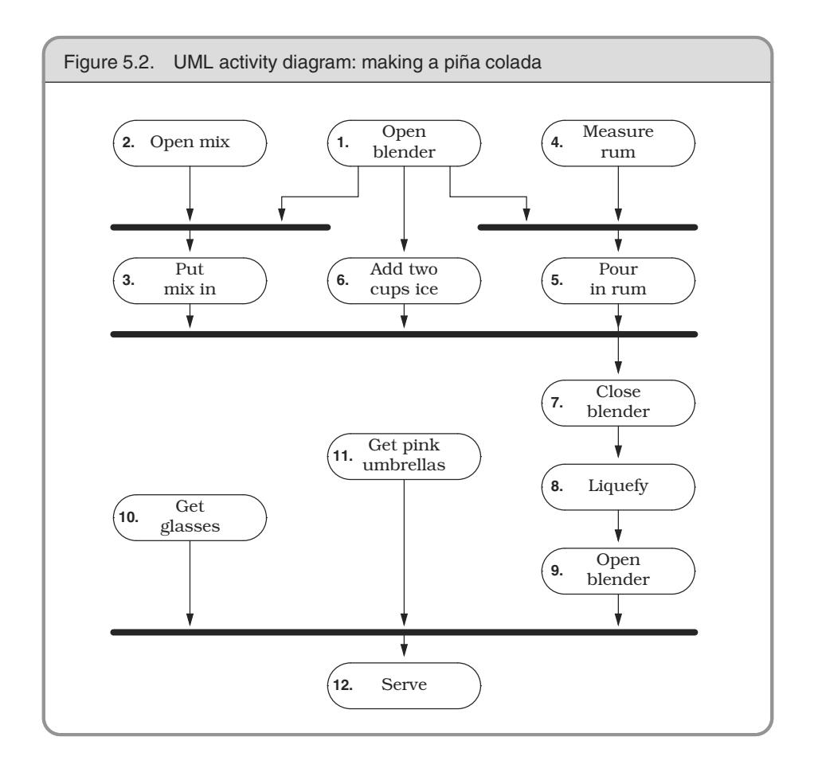
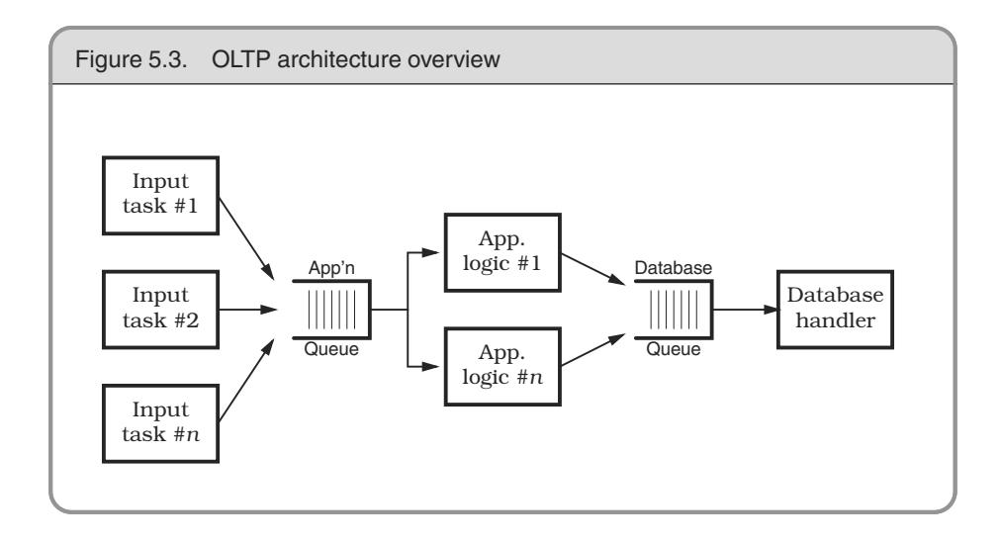
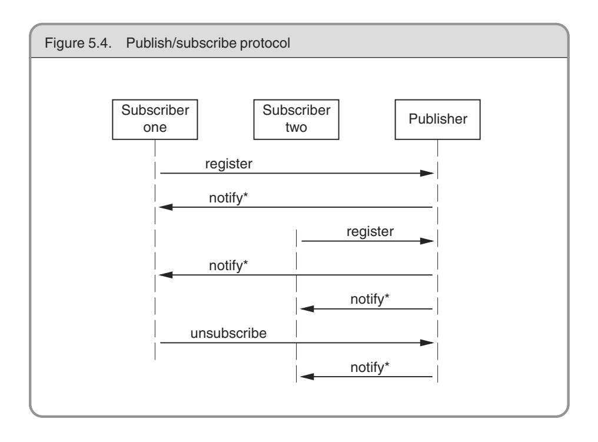
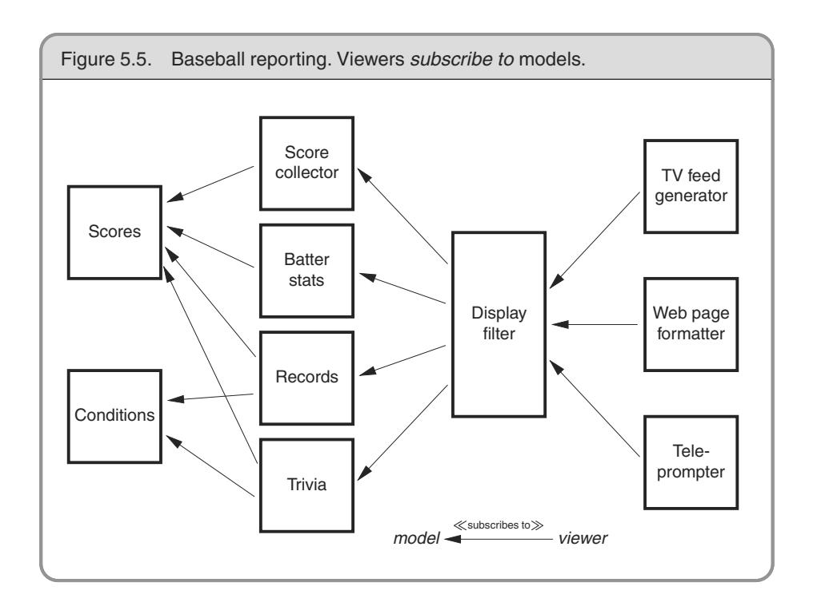
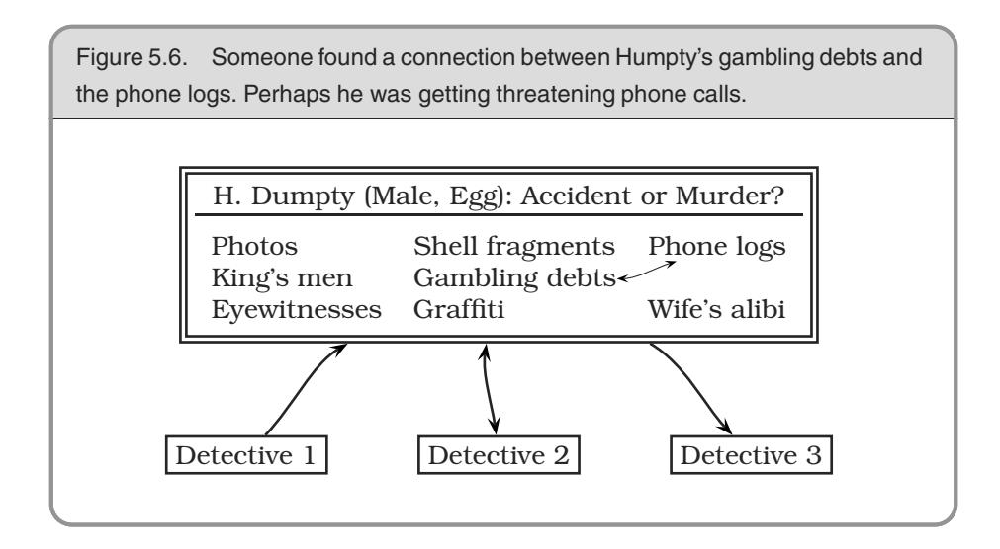

# Chapter 5: Bend, or Break


Life doesn't stand still.

Neither can the code that we write. In order to keep up with today's near-frantic pace of change, we need to make every effort to write code that's as loose—as flexible—as possible. Otherwise we may find our code quickly becoming outdated, or too brittle to fix, and may ultimately be left behind in the mad dash toward the future.

In *Reversibility*, on page 44, we talked about the perils of irreversible decisions. In this chapter, we'll tell you how to make *reversible* decisions, so your code can stay flexible and adaptable in the face of an uncertain world.

First we need to look at *coupling*—the dependencies among modules of code. In *Decoupling and the Law of Demeter* we'll show how to keep separate concepts separate, and decrease coupling.

A good way to stay flexible is to write *less* code. Changing code leaves you open to the possibility of introducing new bugs. *Metaprogramming* will explain how to move details out of the code completely, where they can be changed more safely and easily.

In *Temporal Coupling*, we'll look at two aspects of time as they relate to coupling. Do you depend on the "tick" coming before the "tock"? Not if you want to stay flexible.

A key concept in creating flexible code is the separation of a data *model* from a *view*, or presentation, of that model. We'll decouple models from views in *It's Just a View*.

Finally, there's a technique for decoupling modules even further by providing a meeting place where modules can exchange data anonymously and asynchronously. This is the topic of *Blackboards*.

Armed with these techniques, you can write code that will "roll with the punches."

## **<sup>26</sup>** Decoupling and the Law of Demeter

*Good fences make good neighbors.*

**Robert Frost, "Mending Wall"**

In *Orthogonality*, page 34, and *Design by Contract*, page 109, we suggested that writing "shy" code is beneficial. But "shy" works two ways: don't reveal yourself to others, and don't interact with too many people.

Spies, dissidents, revolutionaries, and such are often organized into small groups of people called *cells*. Although individuals in each cell may know each other, they have no knowledge of those in other cells. If one cell is discovered, no amount of truth serum will reveal the names of others outside the cell. Eliminating interactions between cells protects everyone.

We feel that this is a good principle to apply to coding as well. Organize your code into cells (modules) and limit the interaction between them. If one module then gets compromised and has to be replaced, the other modules should be able to carry on.

### Minimize Coupling

What's wrong with having modules that know about each other? Nothing in principle—we don't need to be as paranoid as spies or dissidents. However, you do need to be careful about *how many* other modules you interact with and, more importantly, *how* you came to interact with them.

Suppose you are remodeling your house, or building a house from scratch. A typical arrangement involves a "general contractor." You hire the contractor to get the work done, but the contractor may or may

not do the construction personally; the work may be offered to various subcontractors. But as the client, you are not involved in dealing with the subcontractors directly—the general contractor assumes that set of headaches on your behalf.

We'd like to follow this same model in software. When we ask an object for a particular service, we'd like the service to be performed on our behalf. We *do not* want the object to give us a third-party object that we have to deal with to get the required service.

For example, suppose you are writing a class that generates a graph of scientific recorder data. You have data recorders spread around the world; each recorder object contains a location object giving its position and time zone. You want to let your users select a recorder and plot its data, labeled with the correct time zone. You might write

```
public void plotDate(Date aDate, Selection aSelection) {
  TimeZone tz =
  aSelection.getRecorder().getLocation().getTimeZone(); ...
}
```

But now the plotting routine is unnecessarily coupled to *three* classes— Selection, Recorder, and Location. This style of coding dramatically increases the number of classes on which our class depends. Why is this a bad thing? It increases the risk that an unrelated change somewhere else in the system will affect *your* code. For instance, if Fred makes a change to Location such that it no longer directly contains a TimeZone, you have to change your code as well.

Rather than digging though a hierarchy yourself, just ask for what you need directly:

```
public void plotDate(Date aDate, TimeZone aTz) { ...
}
plotDate(someDate, someSelection.getTimeZone());
```

We added a method to Selection to get the time zone on our behalf: the plotting routine doesn't care whether the time zone comes from the Recorder directly, from some contained object within Recorder, or whether Selection makes up a different time zone entirely. The selection routine, in turn, should probably just ask the recorder for its time zone, leaving it up to the recorder to get it from its contained Location object.

Traversing relationships between objects directly can quickly lead to a combinatorial explosion<sup>1</sup> of dependency relationships. You can see symptoms of this phenomenon in a number of ways:

- 1. Large C or C++ projects where the command to link a unit test is longer than the test program itself
- 2. "Simple" changes to one module that propagate through unrelated modules in the system
- 3. Developers who are afraid to change code because they aren't sure what might be affected

Systems with many unnecessary dependencies are very hard (and expensive) to maintain, and tend to be highly unstable. In order to keep the dependencies to a minimum, we'll use the *Law of Demeter* to design our methods and functions.

### The Law of Demeter for Functions

The Law of Demeter for functions [LH89] attempts to minimize coupling between modules in any given program. It tries to prevent you from reaching into an object to gain access to a third object's methods. The law is summarized in Figure 5.1 on the next page.

By writing "shy" code that honors the Law of Demeter as much as possible, we can achieve our objective:

**TIP 36** Minimize Coupling Between Modules

### Does It Really Make a Difference?

While it sounds good in theory, does following the Law of Demeter really help to create more maintainable code?

Studies have shown [BBM96] that classes in C++ with larger *response sets* are more prone to error than classes with smaller response sets (a

<sup>1.</sup> If objects all know about each other, then a change to just one object can result in the other objects needing changes.

Figure 5.1. Law of Demeter for functions class Demeter { private: A \*a; int func(); public: //... void example(B& b); } void Demeter::example(B& b) { C c; int f = func(); b.invert(); a = new A(); a->setActive(); c.print(); } *The Law of Demeter for functions states that any method of an object should call only methods belonging to: itself any parameters that were passed in to the method any objects it created any directly held component objects*

*response set* is defined to be the number of functions directly invoked by methods of the class).

Because following the Law of Demeter reduces the size of the response set in the calling class, it follows that classes designed in this way will also tend to have fewer errors (see [URL 56] for more papers and information on the Demeter project).

Using The Law of Demeter will make your code more adaptable and robust, but at a cost: as a "general contractor," your module must delegate and manage any and all subcontractors directly, without involving clients of your module. In practice, this means that you will be writing a large number of wrapper methods that simply forward the request on to a delegate. These wrapper methods will impose both a runtime cost and a space overhead, which may be significant—even prohibitive—in some applications.

As with any technique, you must balance the pros and cons for *your* particular application. In database schema design it is common practice to "denormalize" the schema for a performance improvement: to

#### Physical Decoupling

In this section we're concerned largely with designing to keep things logically decoupled within systems. However, there is another kind of interdependence that becomes highly significant as systems grow larger. In his book Large-Scale C++ Software Design [Lak96], John Lakos addresses the issues surrounding the relationships among the files, directories, and libraries that make up a system. Large projects that ignore these physical design problems wind up with build cycles that are measured in days and unit tests that may drag in the entire system as support code, among other problems. Mr. Lakos argues convincingly that logical and physical design must proceed in tandem—that undoing the damage done to a large body of code by cyclic dependencies is extremely difficult. We recommend this book if you are involved in large-scale developments, even if C++ isn't your implementation language.

violate the rules of normalization in exchange for speed. A similar tradeoff can be made here as well. In fact, by reversing the Law of Demeter and *tightly* coupling several modules, you may realize an important performance gain. As long as it is well known and acceptable for those modules to be coupled, your design is fine.

Otherwise, you may find yourself on the road to a brittle, inflexible future. Or no future at all.

#### Related sections include:

- *Orthogonality*, page 34
- *Reversibility*, page 44
- *Design by Contract*, page 109
- *How to Balance Resources*, page 129
- *It's Just a View*, page 157
- *Pragmatic Teams*, page 224
- *Ruthless Testing*, page 237

#### Challenges

We've discussed how using delegation makes it easier to obey the Law of Demeter and hence reduce coupling. However, writing all of the methods

needed to forward calls to delegated classes is boring and error prone. What are the advantages and disadvantages of writing a preprocessor that generates these calls automatically? Should this preprocessor be run only once, or should it be used as part of the build?

#### Exercises

**24.** We discussed the concept of physical decoupling in the box on on the facing *Answer on p. 293* page. Which of the following C++ header files is more tightly coupled to the rest of the system?

```
person1.h: person2.h:
  #include "date.h"
  class Person1 {
  private:
    Date myBirthdate;
  public:
    Person1(Date &birthDate);
    // ...
                                 class Date;
                                 class Person2 {
                                 private:
                                   Date *myBirthdate;
                                 public:
                                   Person2(Date &birthDate);
                                   // ...
```

**25.** For the example below and for those in Exercises 26 and 27, determine if *Answer on p. 293* the method calls shown are allowed according to the Law of Demeter. This first one is in Java.

```
public void showBalance(BankAccount acct) {
  Money amt = acct.getBalance();
  printToScreen(amt.printFormat());
}
```

**26.** This example is also in Java. *Answer*

*on p. 294*

```
public class Colada {
  private Blender myBlender;
  private Vector myStuff;
  public Colada() {
    myBlender = new Blender();
    myStuff = new Vector();
  }
  private void doSomething() {
    myBlender.addIngredients(myStuff.elements());
  }
}
```

**27.** This example is in C++. *Answer*

*on p. 294*

```
void processTransaction(BankAccount acct, int) {
  Person *who;
  Money amt;
  amt.setValue(123.45);
  acct.setBalance(amt);
  who = acct.getOwner();
  markWorkflow(who->name(), SET_BALANCE);
}
```

## **<sup>27</sup>** Metaprogramming

*No amount of genius can overcome a preoccupation with detail.*

### Levy's Eighth Law

Details mess up our pristine code—especially if they change frequently. Every time we have to go in and change the code to accommodate some change in business logic, or in the law, or in management's personal tastes of the day, we run the risk of breaking the system—of introducing a new bug.

So we say "out with the details!" Get them out of the code. While we're at it, we can make our code highly configurable and "soft"—that is, easily adaptable to changes.

### Dynamic Configuration

First, we want to make our systems highly configurable. Not just things such as screen colors and prompt text, but deeply ingrained items such as the choice of algorithms, database products, middleware technology, and user-interface style. These items should be implemented as configuration options, not through integration or engineering.

**TIP 37** Configure, Don't Integrate

Use *metadata* to describe configuration options for an application: tuning parameters, user preferences, the installation directory, and so on.

What exactly is metadata? Strictly speaking, metadata is data about data. The most common example is probably a database schema or data dictionary. A schema contains data that describes fields (columns) in terms of names, storage lengths, and other attributes. You should be able to access and manipulate this information just as you would any other data in the database.

We use the term in its broadest sense. Metadata is any data that describes the application—how it should run, what resources it should use, and so on. Typically, metadata is accessed and used at runtime, not at compile time. You use metadata all the time—at least your programs do. Suppose you click on an option to hide the toolbar on your Web browser. The browser will store that preference, as metadata, in some sort of internal database.

This database might be in a proprietary format, or it might use a standard mechanism. Under Windows, either an initialization file (using the suffix .ini) or entries in the system Registry are typical. Under Unix, the X Window System provides similar functionality using Application Default files. Java uses Property files. In all of these environments, you specify a key to retrieve a value. Alternatively, more powerful and flexible implementations of metadata use an embedded scripting language (see *Domain Languages*, page 57, for details).

The Netscape browser has actually implemented preferences using both of these techniques. In Version 3, preferences were saved as simple key/value pairs:

```
SHOW_TOOLBAR: False
```

Later, Version 4 preferences looked more like JavaScript:

```
user_pref("custtoolbar.Browser.Navigation_Toolbar.open", false);
```

### Metadata-Driven Applications

But we want to go beyond using metadata for simple preferences. We want to configure and drive the application via metadata as much as possible. Our goal is to think declaratively (specifying *what* is to be done, not *how*) and create highly dynamic and adaptable programs. We do this by adopting a general rule: program for the general case, and put the specifics somewhere else—outside the compiled code base.

```
TIP 38
Put Abstractions in Code, Details in Metadata
```

There are several benefits to this approach:

- It forces you to decouple your design, which results in a more flexible and adaptable program.
- It forces you to create a more robust, abstract design by deferring details—deferring them all the way out of the program.

- You can customize the application without recompiling it. You can also use this level of customization to provide easy work-arounds for critical bugs in live production systems.
- Metadata can be expressed in a manner that's much closer to the problem domain than a general-purpose programming language might be (see *Domain Languages*, page 57).
- You may even be able to implement several different projects using the same application engine, but with different metadata.

We want to defer definition of most details until the last moment, and leave the details as soft—as easy to change—as we can. By crafting a solution that allows us to make changes quickly, we stand a better chance of coping with the flood of directional shifts that swamp many projects (see *Reversibility*, page 44).

### Business Logic

So you've made the choice of database engine a configuration option, and provided metadata to determine the user-interface style. Can we do more? Definitely.

Because business policy and rules are more likely to change than any other aspect of the project, it makes sense to maintain them in a very flexible format.

For example, your purchasing application may include various corporate policies. Maybe you pay small suppliers in 45 days and large ones in 90 days. Make the definitions of the supplier types, as well as the time periods themselves, configurable. Take the opportunity to generalize.

Maybe you are writing a system with horrendous workflow requirements. Actions start and stop according to complex (and changing) business rules. Consider encoding them in some kind of rule-based (or expert) system, embedded within your application. That way, you'll configure it by writing rules, not cutting code.

Less complex logic can be expressed using a mini-language, removing the need to recompile and redeploy when the environment changes. Have a look at page 58 for an example.

#### When to Configure

As mentioned in The Power of Plain Text, page 73, we recommend representing configuration metadata in plain text—it makes life that much easier.

But when should a program read this configuration? Many programs will scan such things only at startup, which is unfortunate. If you need to change the configuration, this forces you to restart the application. A more flexible approach is to write programs that can reload their configuration while they're running. This flexibility comes at a cost: it is more complex to implement.

So consider how your application will be used: if it is a long-running server process, you will want to provide some way to reread and apply metadata while the program is running. For a small client GUI application that restarts quickly, you may not need to.

This phenomenon is not limited to application code. We've all been annoyed at operating systems that force us to reboot when we install some simple application or change an innocuous parameter.

### An Example: Enterprise Java Beans

Enterprise Java Beans (EJB) is a framework for simplifying programming in a distributed, transaction-based environment. We mention it here because EJB illustrates how metadata can be used both to configure applications *and* to reduce the complexity of writing code.

Suppose you want to create some Java software that will participate in transactions across different machines, between different database vendors, and with different thread and load-balancing models.

The good news is, you don't have to worry about all that. You write a *bean*—a self-contained object that follows certain conventions—and place it in a *bean container* that manages much of the low-level detail on your behalf. You can write the code for a bean without including any transaction operations or thread management; EJB uses metadata to specify how transactions should be handled.

Thread allocation and load balancing are specified as metadata to the underlying transaction service that the container uses. This separation

allows us great flexibility to configure the environment dynamically, at runtime.

The bean's container can manage transactions on the bean's behalf in one of several different styles (including an option where you control your own commits and rollbacks). All of the parameters that affect the bean's behavior are specified in the bean's *deployment descriptor*—a serialized object that contains the metadata we need.

Distributed systems such as EJB are leading the way into a new world of configurable, dynamic systems.

#### Cooperative Configuration

We've talked about users and developers configuring dynamic applications. But what happens if you let applications configure each other software that adapts itself to its environment? Unplanned, spur-of-themoment configuration of existing software is a powerful concept.

Operating systems already configure themselves to hardware as they boot, and Web browsers update themselves with new components automatically.

Your larger applications probably already have issues with handling different versions of data and different releases of libraries and operating systems. Perhaps a more dynamic approach will help.

### Don't Write Dodo-Code

Without metadata, your code is not as adaptable or flexible as it could be. Is this a bad thing? Well, out here in the real world, species that don't adapt die.

The dodo didn't adapt to the presence of humans and their livestock on the island of Mauritius, and quickly became extinct.<sup>2</sup> It was the first documented extinction of a species at the hand of man.

Don't let your project (or your career) go the way of the dodo.

<sup>2.</sup> It didn't help that the settlers beat the placid (read *stupid*) birds to death with clubs for sport.

### Related sections include:

- *Orthogonality*, page 34
- *Reversibility*, page 44
- *Domain Languages*, page 57
- *The Power of Plain Text*, page 73

#### Challenges

For your current project, consider how much of the application might be moved out of the program itself to metadata. What would the resultant "engine" look like? Would you be able to reuse that engine in the context of a different application?

#### Exercises

**28.** Which of the following things would be better represented as code within *Answer on p. 295* a program, and which externally as metadata?

- 1. Communication port assignments
- 2. An editor's support for highlighting the syntax of various languages
- 3. An editor's support for different graphic devices
- 4. A state machine for a parser or scanner
- 5. Sample values and results for use in unit testing

## **<sup>28</sup>** Temporal Coupling

What is *temporal coupling* all about, you may ask. It's about time.

Time is an often ignored aspect of software architectures. The only time that preoccupies us is the time on the schedule, the time left until we ship—but this is not what we're talking about here. Instead, we are talking about the role of time as a design element of the software itself. There are two aspects of time that are important to us: concurrency (things happening at the same time) and ordering (the relative positions of things in time).

We don't usually approach programming with either of these aspects in mind. When people first sit down to design an architecture or write a program, things tend to be linear. That's the way most people think *do this* and then always *do that*. But thinking this way leads to *temporal coupling*: coupling in time. Method A must always be called before method B; only one report can be run at a time; you must wait for the screen to redraw before the button click is received. Tick must happen before tock.

This approach is not very flexible, and not very realistic.

We need to allow for concurrency3 and to think about decoupling any time or order dependencies. In doing so, we can gain flexibility and reduce any time-based dependencies in many areas of development: workflow analysis, architecture, design, and deployment.

### Workflow

On many projects, we need to model and analyze the users' workflows as part of requirements analysis. We'd like to find out what *can* happen at the same time, and what must happen in a strict order. One way to do this is to capture their description of workflow using a notation such as the *UML activity diagram*. 4

<sup>3.</sup> We won't go into the details of concurrent or parallel programming here; a good computer science textbook should cover the basics, including scheduling, deadlock, starvation, mutual exclusion/semaphores, and so on.

<sup>4.</sup> For more information on all of the UML diagram types, see [FS97].

An activity diagram consists of a set of actions drawn as rounded boxes. The arrow leaving an action leads to either another action (which can start once the first action completes) or to a thick line called a *synchronization bar*. Once *all* the actions leading into a synchronization bar are complete, you can then proceed along any arrows leaving the bar. An action with no arrows leading into it can be started at any time.

You can use activity diagrams to maximize parallelism by identifying activities that *could be* performed in parallel, but aren't.


For instance, in our blender project (Exercise 17, page 119), users may initially describe their current workflow as follows.

- 1. Open blender
- 2. Open piña colada mix
- 3. Put mix in blender
- 4. Measure 1/2 cup white rum
- 5. Pour in rum
- 6. Add 2 cups of ice
- 7. Close blender
- 8. Liquefy for 2 minutes
- 9. Open blender
- 10. Get glasses
- 11. Get pink umbrellas
- 12. Serve

Even though they describe these actions serially, and may even perform them serially, we notice that many of them could be performed in parallel, as we show in the activity diagram in Figure 5.2 on the next page.

It can be eye-opening to see where the dependencies really exist. In this instance, the top-level tasks (1, 2, 4, 10, and 11) can all happen concurrently, up front. Tasks 3, 5, and 6 can happen in parallel later.

If you were in a piña colada-making contest, these optimizations may make all the difference.



#### Architecture

We wrote an On-Line Transaction Processing (OLTP) system a few years ago. At its simplest, all the system had to do was read a request and process the transaction against the database. But we wrote a threetier, multiprocessing distributed application: each component was an independent entity that ran concurrently with all other components. While this sounds like more work, it wasn't: taking advantage of temporal decoupling made it easier to write. Let's take a closer look at this project.

The system takes in requests from a large number of data communication lines and processes transactions against a back-end database.

The design addresses the following constraints:



- Database operations take a relatively long time to complete.
- For each transaction, we must not block communication services while a database transaction is being processed.
- Database performance suffers with too many concurrent sessions.
- Multiple transactions are in progress concurrently on each data line.

The solution that gave us the best performance and cleanest architecture looked something like Figure 5.3.

Each box represents a separate process; processes communicate via work queues. Each input process monitors one incoming communication line, and makes requests to the application server. All requests are asynchronous: as soon as the input process makes its current request, it goes back to monitoring the line for more traffic. Similarly, the application server makes requests of the database process,5 and is notified when the individual transaction is complete.

This example also shows a way to get quick and dirty load balancing among multiple consumer processes: the *hungry consumer* model.

<sup>5.</sup> Even though we show the database as a single, monolithic entity, it is not. The database software is partitioned into several processes and client threads, but this is handled internally by the database software and isn't part of our example.

In a hungry consumer model, you replace the central scheduler with a number of independent consumer tasks and a centralized work queue. Each consumer task grabs a piece from the work queue and goes on about the business of processing it. As each task finishes its work, it goes back to the queue for some more. This way, if any particular task gets bogged down, the others can pick up the slack, and each individual component can proceed at its own pace. Each component is temporally decoupled from the others.


Instead of components, we have really created *services*—independent, concurrent objects behind well-defined, consistent interfaces.

### Design for Concurrency

The rising acceptance of Java as a platform has exposed more developers to multithreaded programming. But programming with threads imposes some design constraints—and that's a good thing. Those constraints are actually so helpful that we want to abide by them whenever we program. It will help us decouple our code and fight *programming by coincidence* (see page 172).

With linear code, it's easy to make assumptions that lead to sloppy programming. But concurrency forces you to think through things a bit more carefully—you're not alone at the party anymore. Because things can now happen at the "same time," you may suddenly see some timebased dependencies.

To begin with, any global or static variables must be protected from concurrent access. Now may be a good time to ask yourself *why* you need a global variable in the first place. In addition, you need to make sure that you present consistent state information, regardless of the order of calls. For example, when is it valid to query the state of your object? If your object is in an invalid state between certain calls, you may be relying on a coincidence that no one can call your object at that point in time.

Suppose you have a windowing subsystem where the widgets are first created and then shown on the display in two separate steps. You aren't allowed to set state in the widget until it is shown. Depending on how the code is set up, you may be relying on the fact that no other object can use the created widget until you've shown it on the screen.

But this may not be true in a concurrent system. Objects must always be in a valid state when called, and they can be called at the most awkward times. You must ensure that an object is in a valid state *any* time it could possibly be called. Often this problem shows up with classes that define separate constructor and initialization routines (where the constructor doesn't leave the object in an initialized state). Using class invariants, discussed in *Design by Contract*, page 109, will help you avoid this trap.

#### Cleaner Interfaces

Thinking about concurrency and time-ordered dependencies can lead you to design cleaner interfaces as well. Consider the C library routine strtok, which breaks a string into tokens.

The design of strtok isn't thread safe,<sup>6</sup> but that isn't the worst part: look at the time dependency. You must make the first call to strtok with the variable you want to parse, and all successive calls with a NULL instead. If you pass in a non-NULL value, it restarts the parse on that buffer instead. Without even considering threads, suppose you wanted to use strtok to parse two separate strings at the same time:

```
char buf1[BUFSIZ];
char buf2[BUFSIZ];
char *p, *q;
strcpy(buf1, "this is a test");
strcpy(buf2, "this ain't gonna work");
p = strtok(buf1, " ");
q = strtok(buf2, " ");
while (p && q) {
  printf("%s %s n", p, q);
  p = strtok(NULL, " ");
  q = strtok(NULL, " ");
}
```

<sup>6.</sup> It uses static data to maintain the current position in the buffer. The static data isn't protected against concurrent access, so it isn't thread safe. In addition, it clobbers the first argument you pass in, which can lead to some nasty surprises.

The code as shown will not work: there is implicit state retained in strtok between calls. You have to use strtok on just one buffer at a time.

Now in Java, the design of a string parser has to be different. It must be thread safe and present a consistent state.

```
StringTokenizer st1 = new StringTokenizer("this is a test");
StringTokenizer st2 = new StringTokenizer("this test will work");
while (st1.hasMoreTokens() && st2.hasMoreTokens()) {
  System.out.println(st1.nextToken());
  System.out.println(st2.nextToken());
}
```

StringTokenizer is a much cleaner, more maintainable, interface. It contains no surprises, and won't cause mysterious bugs in the future, as strtok might.

```
TIP 41
Always Design for Concurrency
```

### Deployment

Once you've designed an architecture with an element of concurrency, it becomes easier to think about handling *many* concurrent services: the model becomes pervasive.

Now you can be flexible as to how the application is deployed: standalone, client-server, or *n*-tier. By architecting your system as independent services, you can make the configuration dynamic as well. By planning for concurrency, and decoupling operations in time, you have all these options—including the stand-alone option, where you can choose *not* to be concurrent.

Going the other way (trying to add concurrency to a nonconcurrent application) is *much* harder. If we design to allow for concurrency, we can more easily meet scalability or performance requirements when the time comes—and if the time never comes, we still have the benefit of a cleaner design.

Isn't it about time?

### Related sections include:

- *Design by Contract*, page 109
- *Programming by Coincidence*, page 172

#### Challenges

How many tasks do you perform in parallel when you get ready for work in the morning? Could you express this in a UML activity diagram? Can you find some way to get ready more quickly by increasing concurrency?

## **<sup>29</sup>** It's Just a View

*Still, a man hears What he wants to hear And disregards the rest La la la. . .*

**Simon and Garfunkel, "The Boxer"**

Early on we are taught not to write a program as a single big chunk, but that we should "divide and conquer" and separate a program into modules. Each module has its own responsibilities; in fact, a good definition of a module (or class) is that it has a single, well-defined responsibility.

But once you separate a program into different modules based on responsibility, you have a new problem. At runtime, how do the objects talk to each other? How do you manage the logical dependencies between them? That is, how do you synchronize changes in state (or updates to data values) in these different objects? It needs to be done in a clean, flexible manner—we don't want them to know too much about each other. We want each module to be like the man in the song and just hear what it wants to hear.

We'll start off with the concept of an *event*. An event is simply a special message that says "something interesting just happened" (interesting, of course, lies in the eye of the beholder). We can use events to signal changes in one object that some other object may be interested in.

Using events in this way minimizes coupling between those objects the sender of the event doesn't need to have any explicit knowledge of

the receiver. In fact, there could be multiple receivers, each one focused on its own agenda (of which the sender is blissfully unaware).

We need to exercise some care in using events, however. In an early version of Java, for example, one routine received *all* the events destined for a particular application. Not exactly the road to easy maintenance or evolution.

### Publish/Subscribe

Why is it bad to push all the events through a single routine? It violates object encapsulation—that one routine now has to have intimate knowledge of the interactions among many objects. It also increases the coupling—and we're trying to *decrease* coupling. Because the objects themselves have to have knowledge of these events as well, you are probably going to violate the *DRY* principle, orthogonality, and perhaps even sections of the Geneva Convention. You may have seen this kind of code—it is usually dominated by a huge case statement or multiway if-then. We can do better.

Objects should be able to register to receive only the events they need, and should never be sent events they don't need. We don't want to spam our objects! Instead, we can use a *publish/subscribe* protocol, illustrated using the *UML sequence diagram* in Figure 5.4 on the next page.<sup>7</sup>

A sequence diagram shows the flow of messages among several objects, with objects arranged in columns. Each message is shown as a labeled arrow from the sender's column to the receiver's column. An asterisk in the label means that more than one message of this type can be sent.

If we are interested in certain events generated by a Publisher, all we have to do is register ourselves. The Publisher keeps track of all interested Subscriber objects; when the Publisher generates an event of interest, it will call each Subscriber in turn and notify them that the event has occurred.

<sup>7.</sup> See also the Observer pattern in [GHJV95] for more information.



There are several variations on this theme—mirroring other communication styles. Objects may use publish/subscribe on a peer-to-peer basis (as we saw above); they may use a "software bus" where a centralized object maintains the database of listeners and dispatches messages appropriately. You might even have a scheme where critical events get broadcast to all listeners—registered or not. One possible implementation of events in a distributed environment is illustrated by the CORBA Event Service, described in the box on the following page.

We can use this publish/subscribe mechanism to implement a very important design concept: the separation of a model from views of the model. Let's start with a GUI-based example, using the Smalltalk design in which this concept was born.

### Model-View-Controller

Suppose you have a spreadsheet application. In addition to the numbers in the spreadsheet itself, you also have a graph that displays the

#### The CORBA Event Service

The CORBA Event Service allows participating objects to send and receive event notifications via a common bus, the event channel. The event channel arbitrates event handling, and also decouples event producers from event consumers. It works in two basic ways: push and pull.

In push mode, event suppliers inform the event channel that an event has occurred. The channel then automatically distributes that event to all client objects that have registered interest.

In pull mode, clients periodically poll the event channel, which in turn polls the supplier that offers event data corresponding to the request.

Although the CORBA Event Service can be used to implement all of the event models discussed in this section, you can also view it as a different animal. CORBA facilitates communication among objects written in different programming languages running on geographically dispersed machines with different architectures. Sitting on top of CORBA, the event service gives you a decoupled way of interacting with applications around the world, written by people you've never met, using programming languages you'd rather not know about.

numbers as a bar chart and a running total dialog box that shows the sum of a column in the spreadsheet.

Obviously, we don't want to have three separate copies of the data. So we create a *model*—the data itself, with common operations to manipulate it. Then we can create separate *views* that display the data in different ways: as a spreadsheet, as a graph, or in a totals box. Each of these views may have its own *controller*. The graph view may have a controller that allows you to zoom in or out, or pan around the data, for example. None of this affects the data itself, just that view.

This is the key concept behind the Model-View-Controller (MVC) idiom: separating the model from both the GUI that represents it *and* the controls that manage the view.8

<sup>8.</sup> The view and controller are tightly coupled, and in some implementations of MVC the view and controller are a single component.

By doing so, you can take advantage of some interesting possibilities. You can support multiple views of the same data model. You can use common viewers on many different data models. You can even support multiple controllers to provide nontraditional input mechanisms.

**TIP 42** Separate Views from Models

By loosening the coupling between the model and the view/controller, you buy yourself a lot of flexibility at low cost. In fact, this technique is one of the most important ways of maintaining reversibility (see *Reversibility*, page 44).

#### Java Tree View

A good example of an MVC design can be found in the Java tree widget. The tree widget (which displays a clickable, traversable tree) is actually a set of several different classes organized in an MVC pattern.

To produce a fully functional tree widget, all you need to do is provide a data source that conforms to the TreeModel interface. Your code now becomes the model for the tree.

The view is created by the TreeCellRenderer and TreeCellEditor classes, which can be inherited from and customized to provide different colors, fonts, and icons in the widget. JTree acts as the controller for the tree widget and provides some general viewing functionality.

Because we have decoupled the model from the view, we simplify the programming a great deal. You don't have to think about programming a tree widget anymore. Instead, you just provide a data source.

Suppose the vice president comes up to you and wants a quick application that lets her navigate the company's organizational chart, which is held in a legacy database on the mainframe. Just write a wrapper that takes the mainframe data, presents it as a TreeModel, and *voilà*: you have a fully navigable tree widget.

Now you can get fancy and start using the viewer classes; you can change how nodes are rendered, and use special icons, fonts, or colors. When the VP comes back and says the new corporate standards dictate the use of a Skull and Crossbones icon for certain employees, you can make the changes to TreeCellRenderer without touching any other code.

### Beyond GUIs

While MVC is typically taught in the context of GUI development, it is really a general-purpose programming technique. The view is an interpretation of the model (perhaps a subset)—it doesn't need to be graphical. The controller is more of a coordination mechanism, and doesn't have to be related to any sort of input device.

- Model. The abstract data model representing the target object. The model has no direct knowledge of any views or controllers.
- View. A way to interpret the model. It subscribes to changes in the model and logical events from the controller.
- Controller. A way to control the view and provide the model with new data. It publishes events to both the model and the view.

Let's look at a nongraphical example.

Baseball is a unique institution. Where else can you learn such gems of trivia as "this has become the highest-scoring game played on a Tuesday, in the rain, under artificial lights, between teams whose names start with a vowel?" Suppose we were charged with developing software to support those intrepid announcers who must dutifully report on the scores, the statistics, and the trivia.

Clearly we need information on the game in progress—the teams playing, the conditions, the player at bat, the score, and so on. These facts form our models; they will be updated as new information arrives (a pitcher is changed, a player strikes out, it starts raining ).

We'll then have a number of view objects that use these models. One view might look for runs so it can update the current score. Another may receive notifications of new batters, and retrieve a brief summary of their year-to-date statistics. A third viewer may look at the data and check for new world records. We might even have a trivia viewer, responsible for coming up with those weird and useless facts that thrill the viewing public.



But we don't want to flood the poor announcer with all of these views directly. Instead, we'll have each view generate notifications of "interesting" events, and let some higher-level object schedule what gets shown.<sup>9</sup>

These viewer objects have suddenly become models for the higher-level object, which itself might then be a model for different formatting viewers. One formatting viewer might create the teleprompter script for the announcer, another might generate video captions directly on the satellite uplink, another might update the network's or team's Web pages (see Figure 5.5).

This kind of model-viewer network is a common (and valuable) design technique. Each link decouples raw data from the events that created it—each new viewer is an abstraction. And because the relationships are a network (not just a linear chain), we have a lot of flexibility. Each

<sup>9.</sup> The fact that a plane flies overhead probably isn't interesting unless it's the 100th plane to fly overhead that night.

model may have *many* viewers, and one viewer may work with multiple models.

In advanced systems such as this one, it can be handy to have *debugging views*—specialized views that show you in-depth details of the model. Adding a facility to trace individual events can be a great time saver as well.

### Still Coupled (After All These Years)

Despite the decrease in coupling we have achieved, listeners and event generators (subscribers and publishers) still have *some* knowledge of each other. In Java, for instance, they must agree on common interface definitions and calling conventions.

In the next section, we'll look at ways of reducing coupling even further by using a form of publish and subscribe where *none* of the participants need know about each other, or call each other directly.

#### Related sections include:

- *Orthogonality*, page 34
- *Reversibility*, page 44
- *Decoupling and the Law of Demeter*, page 138
- *Blackboards*, page 165
- *It's All Writing*, page 248

#### Exercises

*Answer* **29.** Suppose you have an airline reservation system that includes the concept *on p. 296* of a flight:

```
public interface Flight {
  // Return false if flight full.
  public boolean addPassenger(Passenger p);
  public void addToWaitList(Passenger p);
  public int getFlightCapacity();
  public int getNumPassengers();
}
```

If you add a passenger to the wait list, they'll be put on the flight automatically when an opening becomes available.

There's a massive reporting job that goes through looking for overbooked or full flights to suggest when additional flights might be scheduled. It works fine, but it takes hours to run.

We'd like to have a little more flexibility in processing wait-list passengers, and we've got to do something about that big report—it takes too long to run. Use the ideas from this section to redesign this interface.

## **<sup>30</sup>** Blackboards

*The writing is on the wall. . .*

You may not usually associate *elegance* with police detectives, picturing instead some sort of doughnut and coffee cliché. But consider how detectives might use a *blackboard* to coordinate and solve a murder investigation.

Suppose the chief inspector starts off by setting up a large blackboard in the conference room. On it, he writes a single question:

H. DUMPTY (MALE, EGG): ACCIDENT OR MURDER?

Did Humpty really fall, or was he pushed? Each detective may make contributions to this potential murder mystery by adding facts, statements from witnesses, any forensic evidence that might arise, and so on. As the data accumulates, a detective might notice a connection and post that observation or speculation as well. This process continues, across all shifts, with many different people and agents, until the case is closed. A sample blackboard is shown in Figure 5.6 on the next page.

Some key features of the blackboard approach are:

- None of the detectives needs to know of the existence of any other detective—they watch the board for new information, and add their findings.
- The detectives may be trained in different disciplines, may have different levels of education and expertise, and may not even work in the same precinct. They share a desire to solve the case, but that's all.



- Different detectives may come and go during the course of the process, and may work different shifts.
- There are no restrictions on what may be placed on the blackboard. It may be pictures, sentences, physical evidence, and so on.

We've worked on a number of projects that involved a workflow or distributed data gathering process. With each, designing a solution around a simple blackboard model gave us a solid metaphor to work with: all of the features listed above using detectives are just as applicable to objects and code modules.

A blackboard system lets us decouple our objects from each other completely, providing a forum where knowledge consumers and producers can exchange data anonymously and asynchronously. As you might guess, it also cuts down on the amount of code we have to write.

### Blackboard Implementations

Computer-based blackboard systems were originally invented for use in artificial intelligence applications where the problems to be solved were large and complex—speech recognition, knowledge-based reasoning systems, and so on.

Modern distributed blackboard-like systems such as JavaSpaces and T Spaces [URL 50, URL 25] are based on a model of key/value pairs first popularized in Linda [CG90], where the concept was known as *tuple space*.

With these systems, you can store active Java objects—not just data on the blackboard, and retrieve them by partial matching of fields (via templates and wildcards) or by subtypes. For example, suppose you had a type Author, which is a subtype of Person. You could search a blackboard containing Person objects by using an Author template with a lastName value of "Shakespeare." You'd get Bill Shakespeare the author, but not Fred Shakespeare the gardener.

The main operations in JavaSpaces are:

| Name   | Function                                                          |  |
|--------|-------------------------------------------------------------------|--|
| read   | Search<br>for<br>and<br>retrieve<br>data<br>from<br>the<br>space. |  |
| write  | Put<br>an<br>item<br>into<br>the<br>space.                        |  |
| take   | Similar<br>to<br>read,<br>but<br>removes<br>the<br>item<br>from   |  |
|        | the<br>space<br>as<br>well.                                       |  |
| notify | Set<br>up<br>a<br>notification<br>to<br>occur<br>whenever<br>an   |  |
|        | object<br>is<br>written<br>that<br>matches<br>the<br>template.    |  |

T Spaces supports a similar set of operations, but with different names and slightly different semantics. Both systems are built like a database product; they provide atomic operations and distributed transactions to ensure data integrity.

Since we can store objects, we can use a blackboard to design algorithms based on a *flow of objects*, not just data. It's as if our detectives could pin people to the blackboard—witnesses themselves, not just their statements. Anyone can ask a witness questions in the pursuit of the case, post the transcript, and move that witness to another area of the blackboard, where he might respond differently (if you allow the witness to read the blackboard too).

A big advantage of systems such as these is that you have a single, consistent interface to the blackboard. When building a conventional distributed application, you can spend a great deal of time crafting unique API calls for every distributed transaction and interaction in the system. With the combinatorial explosion of interfaces and interactions, the project can quickly become a nightmare.

#### Organizing Your Blackboard

When the detectives work on large cases, the blackboard may become cluttered, and it may become difficult to locate data on the board. The solution is to partition the blackboard and start to organize the data on the blackboard somehow.

Different software systems handle this partitioning in different ways; some use fairly flat zones or interest groups, while others adopt a more hierarchical treelike structure.

The blackboard style of programming removes the need for so many interfaces, making for a more elegant and consistent system.

### Application Example

Suppose we are writing a program to accept and process mortgage or loan applications. The laws that govern this area are odiously complex, with federal, state, and local governments all having their say. The lender must prove they have disclosed certain things, and must ask for certain information—but must *not* ask certain other questions, and so on, and so on.

Beyond the miasma of applicable law, we also have the following problems to contend with.

- There is no guarantee on the order in which data arrives. For instance, queries for a credit check or title search may take a substantial amount of time, while items such as name and address may be available immediately.
- Data gathering may be done by different people, distributed across different offices, in different time zones.
- Some data gathering may be done automatically by other systems. This data may arrive asynchronously as well.
- Nonetheless, certain data may still be dependent on other data. For instance, you may not be able to start the title search for a car until you get proof of ownership or insurance.

Arrival of new data may raise new questions and policies. Suppose the credit check comes back with a less than glowing report; now you need these five extra forms and perhaps a blood sample.

You can try to handle every possible combination and circumstance using a workflow system. Many such systems exist, but they can be complex and programmer intensive. As regulations change, the workflow must be reorganized: people may have to change their procedures and hard-wired code may have to be rewritten.

A blackboard, in combination with a rules engine that encapsulates the legal requirements, is an elegant solution to the difficulties found here. Order of data arrival is irrelevant: when a fact is posted it can trigger the appropriate rules. Feedback is easily handled as well: the output of any set of rules can post to the blackboard and cause the triggering of yet more applicable rules.

**TIP 43** Use Blackboards to Coordinate Workflow

We can use the blackboard to coordinate disparate facts and agents, while still maintaining independence and even isolation among participants.

You can accomplish the same results with more brute-force methods, of course, but you'll have a more brittle system. When it breaks, all the king's horses and all the king's men might not get your program working again.

#### Related sections include:

- *The Power of Plain Text*, page 73
- *It's Just a View*, page 157

#### Challenges

Do you use blackboard systems in the real world—the message board by the refrigerator, or the big whiteboard at work? What makes them effective? Are messages ever posted with a consistent format? Does it matter?

#### Exercises

- *Answer* **30.** For each of the following applications, would a blackboard system be ap*on p. 297* propriate or not? Why?
  - 1. Image processing. You'd like to have a number of parallel processes grab chunks of an image, process them, and put the completed chunk back.
  - 2. Group calendaring. You've got people scattered across the globe, in different time zones, and speaking different languages, trying to schedule a meeting.
  - 3. Network monitoring tool. The system gathers performance statistics and collects trouble reports. You'd like to implement some agents to use this information to look for trouble in the system.
