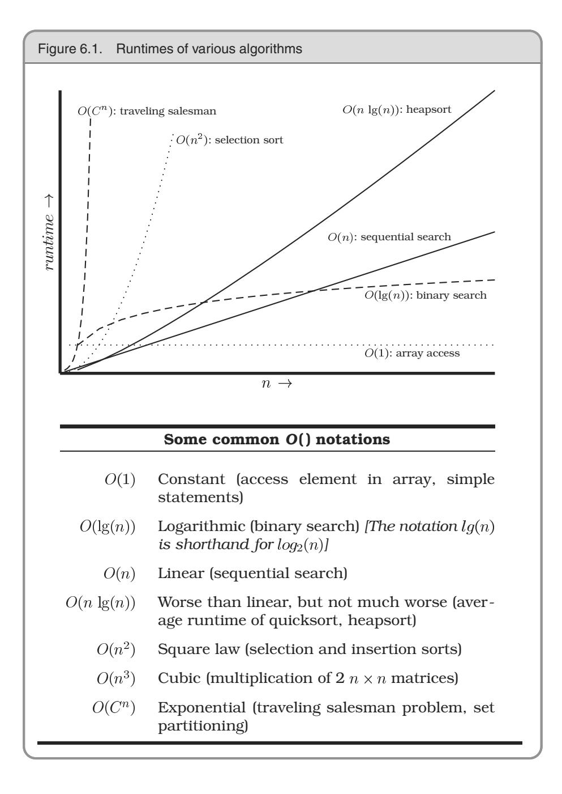

# Chapter 6: While You Are Coding


Conventional wisdom says that once a project is in the coding phase, the work is mostly mechanical, transcribing the design into executable statements. We think that this attitude is the single biggest reason that many programs are ugly, inefficient, poorly structured, unmaintainable, and just plain wrong.

Coding is not mechanical. If it were, all the CASE tools that people pinned their hopes on in the early 1980s would have replaced programmers long ago. There are decisions to be made every minute—decisions that require careful thought and judgment if the resulting program is to enjoy a long, accurate, and productive life.

Developers who don't actively think about their code are programming by coincidence—the code might work, but there's no particular reason why. In *Programming by Coincidence*, we advocate a more positive involvement with the coding process.

While most of the code we write executes quickly, we occasionally develop algorithms that have the potential to bog down even the fastest processors. In *Algorithm Speed*, we discuss ways to estimate the speed of code, and we give some tips on how to spot potential problems before they happen.

Pragmatic Programmers think critically about all code, including our own. We constantly see room for improvement in our programs and our designs. In *Refactoring*, we look at techniques that help us fix up existing code even while we're in the midst of a project.

Something that should be in the back of your mind whenever you're producing code is that you'll someday have to test it. Make code easy Finally, in *Evil Wizards*, we suggest that you should be careful of tools that write reams of code on your behalf unless you understand what they're doing.

Most of us can drive a car largely on autopilot—we don't explicitly command our foot to press a pedal, or our arm to turn the wheel—we just think "slow down and turn right." However, good, safe drivers are constantly reviewing the situation, checking for potential problems, and putting themselves into good positions in case the unexpected happens. The same is true of coding—it may be largely routine, but keeping your wits about you could well prevent a disaster.

## **<sup>31</sup>** Programming by Coincidence

Do you ever watch old black-and-white war movies? The weary soldier advances cautiously out of the brush. There's a clearing ahead: are there any land mines, or is it safe to cross? There aren't any indications that it's a minefield—no signs, barbed wire, or craters. The soldier pokes the ground ahead of him with his bayonet and winces, expecting an explosion. There isn't one. So he proceeds painstakingly through the field for a while, prodding and poking as he goes. Eventually, convinced that the field is safe, he straightens up and marches proudly forward, only to be blown to pieces.

The soldier's initial probes for mines revealed nothing, but this was merely lucky. He was led to a false conclusion—with disastrous results.

As developers, we also work in minefields. There are hundreds of traps just waiting to catch us each day. Remembering the soldier's tale, we should be wary of drawing false conclusions. We should avoid programming by coincidence—relying on luck and accidental successes in favor of *programming deliberately*.

### How to Program by Coincidence

Suppose Fred is given a programming assignment. Fred types in some code, tries it, and it seems to work. Fred types in some more code, tries it, and it still seems to work. After several weeks of coding this way, the program suddenly stops working, and after hours of trying to fix it, he still doesn't know why. Fred may well spend a significant amount of time chasing this piece of code around without ever being able to fix it. No matter what he does, it just doesn't ever seem to work right.

Fred doesn't know why the code is failing because *he didn't know why it worked in the first place*. It seemed to work, given the limited "testing" that Fred did, but that was just a coincidence. Buoyed by false confidence, Fred charged ahead into oblivion. Now, most intelligent people may know someone like Fred, but *we* know better. We don't rely on coincidences—do we?

Sometimes we might. Sometimes it can be pretty easy to confuse a happy coincidence with a purposeful plan. Let's look at a few examples.

### Accidents of Implementation

Accidents of implementation are things that happen simply because that's the way the code is currently written. You end up relying on undocumented error or boundary conditions.

Suppose you call a routine with bad data. The routine responds in a particular way, and you code based on that response. But the author didn't intend for the routine to work that way—it was never even considered. When the routine gets "fixed," your code may break. In the most extreme case, the routine you called may not even be designed to do what you want, but it *seems* to work okay. Calling things in the wrong order, or in the wrong context, is a related problem.

```
paint(g);
invalidate();
validate();
revalidate();
repaint();
paintImmediately(r);
```

Here it looks like Fred is desperately trying to get something out on the screen. But these routines were never designed to be called this way; although they seem to work, that's really just a coincidence.

To add insult to injury, when the component finally does get drawn, Fred won't try to go back and take out the spurious calls. "It works now, better leave well enough alone. . . ."

It's easy to be fooled by this line of thought. Why should you take the risk of messing with something that's working? Well, we can think of several reasons:

- It may not really be working—it might just look like it is.
- The boundary condition you rely on may be just an accident. In different circumstances (a different screen resolution, perhaps), it might behave differently.
- Undocumented behavior may change with the next release of the library.
- Additional and unnecessary calls make your code slower.
- Additional calls also increase the risk of introducing new bugs of their own.

For code you write that others will call, the basic principles of good modularization and of hiding implementation behind small, well-documented interfaces can all help. A well-specified contract (see *Design by Contract*, page 109) can help eliminate misunderstandings.

For routines you call, rely only on documented behavior. If you can't, for whatever reason, then document your assumption well.

#### Accidents of Context

You can have "accidents of context" as well. Suppose you are writing a utility module. Just because you are currently coding for a GUI environment, does the module have to rely on a GUI being present? Are you relying on English-speaking users? Literate users? What else are you relying on that isn't guaranteed?

### Implicit Assumptions

Coincidences can mislead at all levels—from generating requirements through to testing. Testing is particularly fraught with false causalities and coincidental outcomes. It's easy to assume that *X* causes *Y*, but as we said in *Debugging*, page 90: don't assume it, prove it.

At all levels, people operate with many assumptions in mind—but these assumptions are rarely documented and are often in conflict between different developers. Assumptions that aren't based on well-established facts are the bane of all projects.

**TIP 44** Don't Program by Coincidence

### How to Program Deliberately

We want to spend less time churning out code, catch and fix errors as early in the development cycle as possible, and create fewer errors to begin with. It helps if we can program deliberately:

- Always be aware of what you are doing. Fred let things get slowly out of hand, until he ended up boiled, like the frog in *Stone Soup and Boiled Frogs*, page 7.
- Don't code blindfolded. Attempting to build an application you don't fully understand, or to use a technology you aren't familiar with, is an invitation to be misled by coincidences.
- Proceed from a plan, whether that plan is in your head, on the back of a cocktail napkin, or on a wall-sized printout from a CASE tool.
- Rely only on reliable things. Don't depend on accidents or assumptions. If you can't tell the difference in particular circumstances, assume the worst.
- Document your assumptions. *Design by Contract*, page 109, can help clarify your assumptions in your own mind, as well as help communicate them to others.
- Don't just test your code, but test your assumptions as well. Don't guess; actually try it. Write an assertion to test your assumptions (see *Assertive Programming*, page 122). If your assertion is right, you have improved the documentation in your code. If you discover your assumption is wrong, then count yourself lucky.
- Prioritize your effort. Spend time on the important aspects; more than likely, these are the hard parts. If you don't have fundamen-

tals or infrastructure correct, brilliant bells and whistles will be irrelevant.

Don't be a slave to history. Don't let existing code dictate future code. All code can be replaced if it is no longer appropriate. Even within one program, don't let what you've already done constrain what you do next—be ready to refactor (see *Refactoring*, page 184). This decision may impact the project schedule. The assumption is that the impact will be less than the cost of *not* making the change.<sup>1</sup>

So next time something seems to work, but you don't know why, make sure it isn't just a coincidence.

#### Related sections include:

- *Stone Soup and Boiled Frogs*, page 7
- *Debugging*, page 90
- *Design by Contract*, page 109
- *Assertive Programming*, page 122
- *Temporal Coupling*, page 150
- *Refactoring*, page 184
- *It's All Writing*, page 248

#### Exercises

*Answer* **31.** Can you identify some coincidences in the following C code fragment? *on p. 298* Assume that this code is buried deep in a library routine.

```
fprintf(stderr,"Error, continue?");
gets(buf);
```

*Answer* **32.** This piece of C code might work some of the time, on some machines. Then *on p. 298* again, it might not. What's wrong?

```
/* Truncate string to its last maxlen chars */
void string_tail(char *string, int maxlen) {
  int len = strlen(string);
  if (len > maxlen) {
    strcpy(string, string + (len - maxlen));
  }
}
```

<sup>1.</sup> You can also go too far here. We once knew a developer who rewrote all source he was given because he had his own naming conventions.

**33.** This code comes from a general-purpose Java tracing suite. The function *Answer on p. 299* writes a string to a log file. It passes its unit test, but fails when one of the Web developers uses it. What coincidence does it rely on?

```
public static void debug(String s) throws IOException {
  FileWriter fw = new FileWriter("debug.log", true);
  fw.write(s);
  fw.flush();
  fw.close();
}
```


## **<sup>32</sup>** Algorithm Speed

In *Estimating*, page 64, we talked about estimating things such as how long it takes to walk across town, or how long a project will take to finish. However, there is another kind of estimating that Pragmatic Programmers use almost daily: estimating the resources that algorithms use—time, processor, memory, and so on.

This kind of estimating is often crucial. Given a choice between two ways of doing something, which do you pick? You know how long your program runs with 1,000 records, but how will it scale to 1,000,000? What parts of the code need optimizing?

It turns out that these questions can often be answered using common sense, some analysis, and a way of writing approximations called the "big O" notation.

### What Do We Mean by Estimating Algorithms?

Most nontrivial algorithms handle some kind of variable input—sorting strings, inverting an matrix, or decrypting a message with an -bit key. Normally, the size of this input will affect the algorithm: the larger the input, the longer the running time or the more memory used.

If the relationship were always linear (so that the time increased in direct proportion to the value of ), this section wouldn't be important. However, most significant algorithms are not linear. The good news is that many are sublinear. A binary search, for example, doesn't need to look at every candidate when finding a match. The bad news is that other algorithms are considerably worse than linear; runtimes or memory requirements increase far faster than . An algorithm that takes a minute to process ten items may take a lifetime to process 100.

We find that whenever we write anything containing loops or recursive calls, we subconsciously check the runtime and memory requirements. This is rarely a formal process, but rather a quick confirmation that what we're doing is sensible in the circumstances. However, we sometimes *do* find ourselves performing a more detailed analysis. That's when the notation comes in useful.

### The O( ) Notation

The notation is a mathematical way of dealing with approximations. When we write that a particular sort routine sorts records in time, we are simply saying that the worst-case time taken will vary as the square of . Double the number of records, and the time will increase roughly fourfold. Think of the as meaning *on the order of.* The notation puts an upper bound on the value of the thing we're measuring (time, memory, and so on). If we say a function takes time, then we know that the upper bound of the time it takes will not grow faster than . Sometimes we come up with fairly complex functions, but because the highest-order term will dominate the value as increases, the convention is to remove all low-order terms, and not to bother showing any constant multiplying factors. is the same as , which is equivalent to . This is actually a weakness of the notation—one algorithm may be 1,000 times faster than another algorithm, but you won't know it from the notation.

Figure 6.1 shows several common notations you'll come across, along with a graph comparing running times of algorithms in each category. Clearly, things quickly start getting out of hand once we get over .

For example, suppose you've got a routine that takes 1 s to process 100 records. How long will it take to process 1,000? If your code is , then it will still take 1 s. If it's , then you'll probably be waiting about 3 s. will show a linear increase to 10 s, while an will take some 33 s. If you're unlucky enough to have an routine, then sit back for 100 s while it does its stuff. And if you're using an exponential



algorithm , you might want to make a cup of coffee—your routine should finish in about years. Let us know how the universe ends.

The notation doesn't apply just to time; you can use it to represent any other resources used by an algorithm. For example, it is often useful to be able to model memory consumption (see Exercise 35 on page 183).

### Common Sense Estimation

You can estimate the order of many basic algorithms using common sense.

- Simple loops. If a simple loop runs from to , then the algorithm is likely to be —time increases linearly with . Examples include exhaustive searches, finding the maximum value in an array, and generating checksums.
- Nested loops. If you nest a loop inside another, then your algorithm becomes , where and are the two loops' limits. This commonly occurs in simple sorting algorithms, such as bubble sort, where the outer loop scans each element in the array in turn, and the inner loop works out where to place that element in the sorted result. Such sorting algorithms tend to be .
- Binary chop. If your algorithm halves the set of things it considers each time around the loop, then it is likely to be logarithmic, (see Exercise 37, page 183). A binary search of a sorted list, traversing a binary tree, and finding the first set bit in a machine word can all be .
- Divide and conquer. Algorithms that partition their input, work on the two halves independently, and then combine the result can be . The classic example is quicksort, which works by partitioning the data into two halves and recursively sorting each. Although technically , because its behavior degrades when it is fed sorted input, the average runtime of quicksort is .
- Combinatoric. Whenever algorithms start looking at the permutations of things, their running times may get out of hand. This is because permutations involve factorials (there are permutations of the digits from 1 to 5). Time a combinatoric

algorithm for five elements: it will take six times longer to run it for six, and 42 times longer for seven. Examples include algorithms for many of the acknowledged *hard* problems—the traveling salesman problem, optimally packing things into a container, partitioning a set of numbers so that each set has the same total, and so on. Often, heuristics are used to reduce the running times of these types of algorithms in particular problem domains.

### Algorithm Speed in Practice

It's unlikely that you'll spend much time during your career writing sort routines. The ones in the libraries available to you will probably outperform anything you may write without substantial effort. However, the basic kinds of algorithms we've described earlier pop up time and time again. Whenever you find yourself writing a simple loop, you know that you have an algorithm. If that loop contains an inner loop, then you're looking at . You should be asking yourself how large these values can get. If the numbers are bounded, then you'll know how long the code will take to run. If the numbers depend on external factors (such as the number of records in an overnight batch run, or the number of names in a list of people), then you might want to stop and consider the effect that large values may have on your running time or memory consumption.

**TIP 45** Estimate the Order of Your Algorithms

There are some approaches you can take to address potential problems. If you have an algorithm that is , try to find a divide and conquer approach that will take you down to .

If you're not sure how long your code will take, or how much memory it will use, try running it, varying the input record count or whatever is likely to impact the runtime. Then plot the results. You should soon get a good idea of the shape of the curve. Is it curving upward, a straight line, or flattening off as the input size increases? Three or four points should give you an idea.

Also consider just what you're doing in the code itself. A simple loop may well perform better than a complex, one for smaller values of , particularly if the algorithm has an expensive inner loop.

In the middle of all this theory, don't forget that there are practical considerations as well. Runtime may look like it increases linearly for small input sets. But feed the code millions of records and suddenly the time degrades as the system starts to thrash. If you test a sort routine with random input keys, you may be surprised the first time it encounters ordered input. Pragmatic Programmers try to cover both the theoretical and practical bases. After all this estimating, the only timing that counts is the speed of your code, running in the production environment, with real data.<sup>2</sup> This leads to our next tip.


If it's tricky getting accurate timings, use *code profilers* to count the number of times the different steps in your algorithm get executed, and plot these figures against the size of the input.

### Best Isn't Always Best

You also need to be pragmatic about choosing appropriate algorithms the fastest one is not always the best for the job. Given a small input set, a straightforward insertion sort will perform just as well as a quicksort, and will take you less time to write and debug. You also need to be careful if the algorithm you choose has a high setup cost. For small input sets, this setup may dwarf the running time and make the algorithm inappropriate.

Also be wary of *premature optimization*. It's always a good idea to make sure an algorithm really is a bottleneck before investing your precious time trying to improve it.

<sup>2.</sup> In fact, while testing the sort algorithms used as an exercise for this section on a 64MB Pentium, the authors ran out of real memory while running the radix sort with more than seven million numbers. The sort started using swap space, and times degraded dramatically.

### Related sections include:

*Estimating*, page 64

#### Challenges

- Every developer should have a feel for how algorithms are designed and analyzed. Robert Sedgewick has written a series of accessible books on the subject ([Sed83, SF96, Sed92] and others). We recommend adding one of his books to your collection, and making a point of reading it.
- For those who like more detail than Sedgewick provides, read Donald Knuth's definitive *Art of Computer Programming* books, which analyze a wide range of algorithms [Knu97a, Knu97b, Knu98].
- In Exercise 34, we look at sorting arrays of long integers. What is the impact if the keys are more complex, and the overhead of key comparison is high? Does the key structure affect the efficiency of the sort algorithms, or is the fastest sort always fastest?

#### Exercises

**34.** We have coded a set of simple sort routines, which can be downloaded *Answer on p. 299* from our Web site (www.pragmaticprogrammer.com). Run them on various machines available to you. Do your figures follow the expected curves? What can you deduce about the relative speeds of your machines? What are the effects of various compiler optimization settings? Is the radix sort indeed linear?

**35.** The routine below prints out the contents of a binary tree. Assuming the *Answer on p. 300* tree is balanced, roughly how much stack space will the routine use while printing a tree of 1,000,000 elements? (Assume that subroutine calls impose no significant stack overhead.)

```
void printTree(const Node *node) {
  char buffer[1000];
  if (node) {
    printTree(node->left);
    getNodeAsString(node, buffer);
    puts(buffer);
    printTree(node->right);
  }
}
```

- **36.** Can you see any way to reduce the stack requirements of the routine in *Answer on p. 300* Exercise 35 (apart from reducing the size of the buffer)?
- **37.** On page 180, we claimed that a binary chop is . Can you prove *Answer on p. 301* this?

## **<sup>33</sup>** Refactoring

*Change and decay in all around I see . . .*

**H. F. Lyte, "Abide With Me"**

As a program evolves, it will become necessary to rethink earlier decisions and rework portions of the code. This process is perfectly natural. Code needs to evolve; it's not a static thing.

Unfortunately, the most common metaphor for software development is building construction (Bertrand Meyer [Mey97b] uses the term "Software Construction"). But using construction as the guiding metaphor implies these steps:

- 1. An architect draws up blueprints.
- 2. Contractors dig the foundation, build the superstructure, wire and plumb, and apply finishing touches.
- 3. The tenants move in and live happily ever after, calling building maintenance to fix any problems.

Well, software doesn't quite work that way. Rather than construction, software is more like *gardening*—it is more organic than concrete. You plant many things in a garden according to an initial plan and conditions. Some thrive, others are destined to end up as compost. You may move plantings relative to each other to take advantage of the interplay of light and shadow, wind and rain. Overgrown plants get split or pruned, and colors that clash may get moved to more aesthetically pleasing locations. You pull weeds, and you fertilize plantings that are in need of some extra help. You constantly monitor the health of the garden, and make adjustments (to the soil, the plants, the layout) as needed.

Business people are comfortable with the metaphor of building construction: it is more scientific than gardening, it's repeatable, there's a rigid reporting hierarchy for management, and so on. But we're not building skyscrapers—we aren't as constrained by the boundaries of physics and the real world.

The gardening metaphor is much closer to the realities of software development. Perhaps a certain routine has grown too large, or is trying

to accomplish too much—it needs to be split into two. Things that don't work out as planned need to be weeded or pruned.

Rewriting, reworking, and re-architecting code is collectively known as *refactoring*.

### When Should You Refactor?

When you come across a stumbling block because the code doesn't quite fit anymore, or you notice two things that should really be merged, or anything else at all strikes you as being "wrong," *don't hesitate to change it*. There's no time like the present. Any number of things may cause code to qualify for refactoring:

- Duplication. You've discovered a violation of the *DRY* principle (*The Evils of Duplication*, page 26).
- Nonorthogonal design. You've discovered some code or design that could be made more orthogonal (*Orthogonality*, page 34).
- Outdated knowledge. Things change, requirements drift, and your knowledge of the problem increases. Code needs to keep up.
- Performance. You need to move functionality from one area of the system to another to improve performance.

Refactoring your code—moving functionality around and updating earlier decisions—is really an exercise in *pain management*. Let's face it, changing source code around can be pretty painful: it was almost working, and now it's *really* torn up. Many developers are reluctant to start ripping up code just because it isn't quite right.

#### Real-World Complications

So you go to your boss or client and say, "This code works, but I need another week to refactor it."

We can't print their reply.

Time pressure is often used as an excuse for not refactoring. But this excuse just doesn't hold up: fail to refactor now, and there'll be a far greater time investment to fix the problem down the road—when there are more dependencies to reckon with. Will there be more time available then? Not in our experience.

You might want to explain this principle to the boss by using a medical analogy: think of the code that needs refactoring as a "growth." Removing it requires invasive surgery. You can go in now, and take it out while it is still small. Or, you could wait while it grows and spreads—but removing it then will be both more expensive and more dangerous. Wait even longer, and you may lose the patient entirely.

**TIP 47** Refactor Early, Refactor Often

Keep track of the things that need to be refactored. If you can't refactor something immediately, make sure that it gets placed on the schedule. Make sure that users of the affected code *know* that it is scheduled to be refactored and how this might affect them.

### How Do You Refactor?

Refactoring started out in the Smalltalk community, and, along with other trends (such as design patterns), has started to gain a wider audience. But as a topic it is still fairly new; there isn't much published on it. The first major book on refactoring ([FBB 99], and also [URL 47]) is being published around the same time as this book.

At its heart, refactoring is redesign. Anything that you or others on your team designed can be redesigned in light of new facts, deeper understandings, changing requirements, and so on. But if you proceed to rip up vast quantities of code with wild abandon, you may find yourself in a worse position than when you started.

Clearly, refactoring is an activity that needs to be undertaken slowly, deliberately, and carefully. Martin Fowler offers the following simple tips on how to refactor without doing more harm than good (see the box on page 30 in [FS97]):

- 1. Don't try to refactor and add functionality at the same time.
- 2. Make sure you have good tests before you begin refactoring. Run the tests as often as possible. That way you will know quickly if your changes have broken anything.

#### Automatic Refactoring

Historically, Smalltalk users have always enjoyed a class browser as part of the IDE. Not to be confused with Web browsers, class browsers let users navigate through and examine class hierarchies and methods.

Typically, class browsers allow you to edit code, create new methods and classes, and so on. The next variation on this idea is the refactoring browser.

A refactoring browser can semiautomatically perform common refactoring operations for you: splitting up a long routine into smaller ones, automatically propagating changes to method and variable names, drag and drop to assist you in moving code, and so on.

As we write this book, this technology has yet to appear outside of the Smalltalk world, but this is likely to change at the same speed that Java changes—rapidly. In the meantime, the pioneering Smalltalk refactoring browser can be found online at [URL 20].

3. Take short, deliberate steps: move a field from one class to another, fuse two similar methods into a superclass. Refactoring often involves making many localized changes that result in a larger-scale change. If you keep your steps small, and test after each step, you will avoid prolonged debugging.

We'll talk more about testing at this level in *Code That's Easy to Test*, page 189, and larger-scale testing in *Ruthless Testing*, page 237, but Mr. Fowler's point of maintaining good regression tests is the key to refactoring with confidence.

It can also be helpful to make sure that drastic changes to a module such as altering its interface or its functionality in an incompatible manner—break the build. That is, old clients of this code should fail to compile. You can then quickly find the old clients and make the necessary changes to bring them up to date.

So next time you see a piece of code that isn't quite as it should be, fix both it and everything that depends on it. Manage the pain: if it hurts now, but is going to hurt even more later, you might as well get it over 188 CHAPTER 6 WHILE YOU ARE CODING

with. Remember the lessons of *Software Entropy*, page 4: don't live with broken windows.

#### Related sections include:

- *The Cat Ate My Source Code*, page 2
- *Software Entropy*, page 4
- *Stone Soup and Boiled Frogs*, page 7
- *The Evils of Duplication*, page 26
- *Orthogonality*, page 34
- *Programming by Coincidence*, page 172
- *Code That's Easy to Test*, page 189
- *Ruthless Testing*, page 237

#### Exercises

*Answer* **38.** The following code has obviously been updated several times over the *on p. 302* years, but the changes haven't improved its structure. Refactor it.

```
if (state == TEXAS) {
  rate = TX_RATE;
  amt = base * TX_RATE;
  calc = 2*basis(amt) + extra(amt)*1.05;
}
else if ((state == OHIO) || (state == MAINE)) {
  rate = (state == OHIO) ? OH_RATE : ME_RATE;
  amt = base * rate;
  calc = 2*basis(amt) + extra(amt)*1.05;
  if (state == OHIO)
    points = 2;
}
else {
  rate = 1;
  amt = base;
  calc = 2*basis(amt) + extra(amt)*1.05;
}
```

*Answer* **39.** The following Java class needs to support a few more shapes. Refactor the *on p. 303* class to prepare it for the additions.

```
public class Shape {
 public static final int SQUARE = 1;
 public static final int CIRCLE = 2;
 public static final int RIGHT_TRIANGLE = 3;
 private int shapeType;
 private double size;
 public Shape(int shapeType, double size) {
   this.shapeType = shapeType;
   this.size = size;
 }
 // ... other methods ...
```

```
public double area() {
    switch (shapeType) {
    case SQUARE: return size*size;
    case CIRCLE: return Math.PI*size*size/4.0;
    case RIGHT_TRIANGLE: return size*size/2.0;
    }
    return 0;
  }
}
```

**40.** This Java code is part of a framework that will be used throughout your *Answer on p. 303* project. Refactor it to be more general and easier to extend in the future.

```
public class Window {
  public Window(int width, int height) { ... }
  public void setSize(int width, int height) { ... }
  public boolean overlaps(Window w) { ... }
  public int getArea() { ... }
}
```

## **<sup>34</sup>** Code That's Easy to Test

The *Software IC* is a metaphor that people like to toss around when discussing reusability and component-based development.<sup>3</sup> The idea is that software components should be combined just as integrated circuit chips are combined. This works only if the components you are using are known to be reliable.

Chips are designed to be tested—not just at the factory, not just when they are installed, but also in the field when they are deployed. More complex chips and systems may have a full Built-In Self Test (BIST) feature that runs some base-level diagnostics internally, or a Test Access Mechanism (TAM) that provides a test harness that allows the external environment to provide stimuli and collect responses from the chip.

We can do the same thing in software. Like our hardware colleagues, we need to build testability into the software from the very beginning, and test each piece thoroughly before trying to wire them together.

<sup>3.</sup> The term "Software IC" (Integrated Circuit) seems to have been invented in 1986 by Cox and Novobilski in their Objective-C book *Object-Oriented Programming* [CN91].

### Unit Testing

Chip-level testing for hardware is roughly equivalent to *unit testing* in software—testing done on each module, in isolation, to verify its behavior. We can get a better feeling for how a module will react in the big wide world once we have tested it throughly under controlled (even contrived) conditions.

A software unit test is code that exercises a module. Typically, the unit test will establish some kind of artificial environment, then invoke routines in the module being tested. It then checks the results that are returned, either against known values or against the results from previous runs of the same test (regression testing).

Later, when we assemble our "software IC's" into a complete system, we'll have confidence that the individual parts work as expected, and then we can use the same unit test facilities to test the system as a whole. We talk about this large-scale checking of the system in *Ruthless Testing*, page 237.

Before we get that far, however, we need to decide what to test at the unit level. Typically, programmers throw a few random bits of data at the code and call it tested. We can do much better, using the ideas behind *design by contract*.

### Testing Against Contract

We like to think of unit testing as *testing against contract* (see *Design by Contract*, page 109). We want to write test cases that ensure that a given unit honors its contract. This will tell us two things: whether the code meets the contract, and whether the contract means what we think it means. We want to test that the module delivers the functionality it promises, over a wide range of test cases and boundary conditions.

What does this mean in practice? Let's look at the square root routine we first encountered on page 114. Its contract is simple:

```
require
  argument >= 0;
ensure
  ((Result * Result) - argument).abs <= epsilon*argument;
```

This tells us what to test:

- Pass in a negative argument and ensure that it is rejected.
- Pass in an argument of zero to ensure that it is accepted (this is the boundary value).
- Pass in values between zero and the maximum expressible argument and verify that the difference between the square of the result and the original argument is less than some small fraction of the argument.

Armed with this contract, and assuming that our routine does its own pre- and postcondition checking, we can write a basic test script to exercise the square root function.

```
public void testValue(double num, double expected) {
 double result = 0.0;
 try { // We may throw a
   result = mySqrt(num); // precondition exception
 }
 catch (Throwable e) {
   if (num < 0.0) // If input is < 0, then
     return; // we're expecting the
   else // exception, otherwise
     assert(false); // force a test failure
 }
 assert(Math.abs(expected-result) < epsilon*expected);
}
```

Then we can call this routine to test our square root function:

```
testValue(-4.0, 0.0);
testValue( 0.0, 0.0);
testValue( 2.0, 1.4142135624);
testValue(64.0, 8.0);
testValue(1.0e7, 3162.2776602);
```

This is a pretty simple test; in the real world, any nontrivial module is likely to be dependent on a number of other modules, so how do we go about testing the combination?

Suppose we have a module A that uses a LinkedList and a Sort. In order, we would test:

- 1. LinkedList's contract, in full
- 2. Sort's contract, in full
- 3. A's contract, which relies on the other contracts but does not directly expose them

This style of testing requires you to test subcomponents of a module first. Once the subcomponents have been verified, then the module itself can be tested.

If LinkedList and Sort's tests passed, but A's test failed, we can be pretty sure that the problem is in A, or in A's *use* of one of those subcomponents. This technique is a great way to reduce debugging effort: we can quickly concentrate on the likely source of the problem within module A, and not waste time reexamining its subcomponents.

Why do we go to all this trouble? Above all, we want to avoid creating a "time bomb"—something that sits around unnoticed and blows up at an awkward moment later in the project. By emphasizing testing against contract, we can try to avoid as many of those downstream disasters as possible.


When you design a module, or even a single routine, you should design both its contract and the code to test that contract. By designing code to pass a test and fulfill its contract, you may well consider boundary conditions and other issues that wouldn't occur to you otherwise. There's no better way to fix errors than by avoiding them in the first place. In fact, by building the tests *before* you implement the code, you get to try out the interface before you commit to it.

### Writing Unit Tests

The unit tests for a module shouldn't be shoved in some far-away corner of the source tree. They need to be conveniently located. For small projects, you can embed the unit test for a module in the module itself. For larger projects, we suggest moving each test into a subdirectory. Either way, remember that if it isn't easy to find, it won't be used.

By making the test code readily accessible, you are providing developers who may use your code with two invaluable resources:

1. Examples of how to use all the functionality of your module

2. A means to build regression tests to validate any future changes to the code

It's convenient, but not always practical, for each class or module to contain its own unit test. In Java, for example, every class can have its own main. In all but the application's main class file, the main routine can be used to run unit tests; it will be ignored when the application itself is run. This has the benefit that the code you ship still contains the tests, which can be used to diagnose problems in the field.

In C++ you can achieve the same effect (at compile time) by using #ifdef to compile unit test code selectively. For example, here's a very simple unit test in C++, embedded in our module, that checks our square root function using a testValue routine similar to the Java one defined previously:

```
#ifdef __TEST__
int main(int argc, char **argv)
{
 argc--; argv++; // skip program name
 if (argc < 2) { // do standard tests if no args
   testValue(-4.0, 0.0);
   testValue( 0.0, 0.0);
   testValue( 2.0, 1.4142135624);
   testValue(64.0, 8.0);
   testValue(1.0e7, 3162.2776602);
 }
 else { // else use args
   double num, expected;
   while (argc >= 2) {
     num = atof(argv[0]);
     expected = atof(argv[1]);
     testValue(num,expected);
     argc -= 2;
     argv += 2;
   }
 }
 return 0;
}
#endif
```

This unit test will either run a minimal set of tests or, if given arguments, allow you to pass data in from the outside world. A shell script could use this ability to run a much more complete set of tests.

What do you do if the correct response for a unit test is to exit, or abort the program? In that case, you need to be able to select the test to run, perhaps by specifying an argument on the command line. You'll

also need to pass in parameters if you need to specify different starting conditions for your tests.

But providing unit tests isn't enough. You must run them, and run them often. It also helps if the class *passes* its tests once in a while.

### Using Test Harnesses

Because we usually write *a lot* of test code, and do a lot of testing, we'll make life easier on ourselves and develop a standard testing harness for the project. The main shown in the previous section is a very simple test harness, but usually we'll need more functionality than that.

A test harness can handle common operations such as logging status, analyzing output for expected results, and selecting and running the tests. Harnesses may be GUI driven, may be written in the same target language as the rest of the project, or may be implemented as a combination of makefiles and Perl scripts. A simple test harness is shown in the answer to Exercise 41 on page 305.

In object-oriented languages and environments, you might create a base class that provides these common operations. Individual tests can subclass from that and add specific test code. You could use a standard naming convention and reflection in Java to build a list of tests dynamically. This technique is a nice way of honoring the *DRY* principle—you don't have to maintain a list of available tests. But before you go off and start writing your own harness, you may want to investigate Kent Beck and Erich Gamma's xUnit at [URL 22]. You might also want to look at our book *Pragmatic Unit Testing* [HT03] for an introduction to JUnit.

Regardless of the technology you decide to use, test harnesses should include the following capabilities:

- A standard way to specify setup and cleanup
- A method for selecting individual tests or all available tests
- A means of analyzing output for expected (or unexpected) results
- A standardized form of failure reporting

Tests should be composable; that is, a test can be composed of subtests of subcomponents to any depth. We can use this feature to test selected parts of the system or the entire system just as easily, using the same tools.

#### Ad Hoc Testing

During debugging, we may end up creating some particular tests onthe-fly. These may be as simple as a print statement, or a piece of code entered interactively in a debugger or IDE environment.

At the end of the debugging session, you need to formalize the ad hoc test. If the code broke once, it is likely to break again. Don't just throw away the test you created; add it to the existing unit test.

For example, using JUnit (the Java member of the xUnit family), we might write our square root test as follows:

```
public class JUnitExample extends TestCase {
  public JUnitExample(final String name) {
    super(name);
  }
  protected void setUp() {
    // Load up test data...
    testData.addElement(new DblPair(-4.0,0.0));
    testData.addElement(new DblPair(0.0,0.0));
    testData.addElement(new DblPair(64.0,8.0));
    testData.addElement(new DblPair(Double.MAX_VALUE,
                                    1.3407807929942597E154));
  }
  public void testMySqrt() {
    double num, expected, result = 0.0;
    Enumeration enum = testData.elements();
    while (enum.hasMoreElements()) {
      DblPair p = (DblPair)enum.nextElement();
      num = p.getNum();
      expected = p.getExpected();
      testValue(num, expected);
    }
  }
  public static Test suite() {
      TestSuite suite= new TestSuite();
      suite.addTest(new JUnitExample("testMySqrt"));
      return suite;
  }
}
```

JUnit is designed to be composable: we could add as many tests as we wanted to this suite, and each of those tests could in turn be a suite. In addition, you have your choice of a graphical or batch interface to drive the tests.

### Build a Test Window

Even the best sets of tests are unlikely to find all the bugs; there's something about the damp, warm conditions of a production environment that seems to bring them out of the woodwork.

This means you'll often need to test a piece of software once it has been deployed—with real-world data flowing though its veins. Unlike a circuit board or chip, we don't have *test pins* in software, but we *can* provide various views into the internal state of a module, without using the debugger (which may be inconvenient or impossible in a production application).

Log files containing trace messages are one such mechanism. Log messages should be in a regular, consistent format; you may want to parse them automatically to deduce processing time or logic paths that the program took. Poorly or inconsistently formatted diagnostics are just so much "spew"—they are difficult to read and impractical to parse.

Another mechanism for getting inside running code is the "hot-key" sequence. When this particular combination of keys is pressed, a diagnostic control window pops up with status messages and so on. This isn't something you normally would reveal to end users, but it can be very handy for the help desk.

For larger, more complex server code, a nifty technique for providing a view into its operation is to include a built-in Web server. Anyone can point a Web browser to the application's HTTP port (which is usually on a nonstandard number, such as 8080) and see internal status, log entries, and possibly even some sort of a debug control panel. This may sound difficult to implement, but it's not. Freely available and embeddable HTTP Web servers are available in a variety of modern languages. A good place to start looking is [URL 58].

### A Culture of Testing

All software you write *will* be tested—if not by you and your team, then by the eventual users—so you might as well plan on testing it thoroughly. A little forethought can go a long way toward minimizing maintenance costs and help-desk calls.

Despite its hacker reputation, the Perl community has a very strong commitment to unit and regression testing. The Perl standard module installation procedure supports a regression test by invoking

% make test

There's nothing magic about Perl itself in this regard. Perl makes it easier to collate and analyze test results to ensure compliance, but the big advantage is simply that it's a standard—tests go in a particular place, and have a certain expected output. *Testing is more cultural than technical;* we can instill this testing culture in a project regardless of the language being used.

**TIP 49** Test Your Software, or Your Users Will

#### Related sections include:

- *The Cat Ate My Source Code*, page 2
- *Orthogonality*, page 34
- *Design by Contract*, page 109
- *Refactoring*, page 184
- *Ruthless Testing*, page 237

#### Exercises

**41.** Design a test jig for the blender interface described in the answer to Exer- *Answer on p. 305* cise 17 on page 289. Write a shell script that will perform a regression test for the blender. You need to test basic functionality, error and boundary conditions, and any contractual obligations. What restrictions are placed on changing the speed? Are they being honored?

## **<sup>35</sup>** Evil Wizards

There's no denying it—applications are getting harder and harder to write. User interfaces in particular are becoming increasingly sophisticated. Twenty years ago, the average application would have a glass teletype interface (if it had an interface at all). Asynchronous terminals would typically provide a character interactive display, while pollable devices (such as the ubiquitous IBM 3270) would let you fill in an entire screen before hitting SEND . Now, users expect graphical user interfaces, with context-sensitive help, cut and paste, drag and drop, OLE integration, and MDI or SDI. Users are looking for Web-browser integration and thin-client support.

All the time the applications themselves are getting more complex. Most developments now use a multitier model, possibly with some middleware layer or a transaction monitor. These programs are expected to be dynamic and flexible, and to interoperate with applications written by third parties.

Oh, and did we mention that we needed it all next week?

Developers are struggling to keep up. If we were using the same kind of tools that produced the basic dumb-terminal applications 20 years ago, we'd never get anything done.

So the tool makers and infrastructure vendors have come up with a magic bullet, the *wizard*. Wizards are great. Do you need an MDI application with OLE container support? Just click a single button, answer a couple of simple questions, and the wizard will automatically generate skeleton code for you. The Microsoft Visual C++ environment creates over 1,200 lines of code for this scenario, automatically. Wizards are hard at work in other contexts, too. You can use wizards to create server components, implement Java beans, and handle network interfaces all complex areas where it's nice to have expert help.

But using a wizard designed by a guru does not automatically make Joe developer equally expert. Joe can feel pretty good—he's just produced a mass of code and a pretty spiffy-looking program. He just adds in the specific application functionality and it's ready to ship. But unless Joe actually understands the code that has been produced on his behalf, he's fooling himself. He's programming by coincidence. Wizards are a one-way street—they cut the code for you, and then move on. If the

code they produce isn't quite right, or if circumstances change and you need to adapt the code, you're on your own.

We are not against wizards. On the contrary, we dedicate an entire section (*Code Generators*, page 102) to writing your own. But if you *do* use a wizard, and you don't understand all the code that it produces, you won't be in control of your own application. You won't be able to maintain it, and you'll be struggling when it comes time to debug.

**TIP 50** Don't Use Wizard Code You Don't Understand

Some people feel that this is an extreme position. They say that developers routinely rely on things they don't fully understand—the quantum mechanics of integrated circuits, the interrupt structure of the processor, the algorithms used to schedule processes, the code in the supplied libraries, and so on. We agree. And we'd feel the same about wizards if they were simply a set of library calls or standard operating system services that developers could rely on. But they're not. Wizards generate code that becomes an integral part of Joe's application. The wizard code is not factored out behind a tidy interface—it is interwoven line by line with functionality that Joe writes.<sup>4</sup> Eventually, it stops being the wizard's code and starts being Joe's. And no one should be producing code they don't fully understand.

### Related sections include:

- *Orthogonality*, page 34
- *Code Generators*, page 102

### Challenges

If you have a GUI-building wizard available, use it to generate a skeleton application. Go through every line of code it produces. Do you understand it all? Could you have produced it yourself? Would you have produced it yourself, or is it doing things you don't need?

<sup>4.</sup> However, there are other techniques that help manage complexity. We discuss two, beans and AOP, in *Orthogonality*, page 34.


