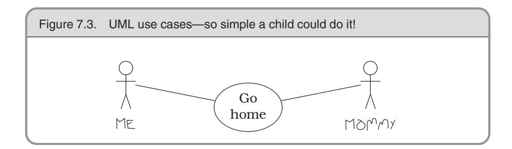

# Chapter 7: Before the Project

Do you ever get the feeling that your project is doomed, even before it starts? Sometimes it might be, unless you establish some basic ground rules first. Otherwise, you might as well suggest that it be shut down now, and save the sponsor some money.

At the very beginning of a project, you'll need to determine the requirements. Simply listening to users is not enough: read *The Requirements Pit* to find out more.

Conventional wisdom and constraint management are the topics of *Solving Impossible Puzzles*. Whether you are performing requirements, analysis, coding, or testing, difficult problems will crop up. Most of the time, they won't be as difficult as they first appear to be.

When you think you've got the problems solved, you may still not feel comfortable with jumping in and starting. Is it simple procrastination, or is it something more? *Not Until You're Ready* offers advice on when it may be prudent to listen to that cautionary voice inside your head.

Starting too soon is one problem, but waiting too long may be even worse. In *The Specification Trap*, we'll discuss the advantages of specification by example.

Finally, we'll look at some of the pitfalls of formal development processes and methodologies in *Circles and Arrows*. No matter how well thought out it is, and regardless of which "best practices" it includes, no method can replace *thinking*.

With these critical issues sorted out *before* the project gets under way, you can be better positioned to avoid "analysis paralysis" and actually begin your successful project.

## **36** The Requirements Pit

*Perfection is achieved, not when there is nothing left to add, but when there is nothing left to take away. . . .*

**Antoine de St. Exupery, Wind, Sand, and Stars, 1939**

Many books and tutorials refer to *requirements gathering* as an early phase of the project. The word "gathering" seems to imply a tribe of happy analysts, foraging for nuggets of wisdom that are lying on the ground all around them while the Pastoral Symphony plays gently in the background. "Gathering" implies that the requirements are already there—you need merely find them, place them in your basket, and be merrily on your way.

It doesn't quite work that way. Requirements rarely lie on the surface. Normally, they're buried deep beneath layers of assumptions, misconceptions, and politics.

**TIP 51** Don't Gather Requirements—Dig for Them

### Digging for Requirements

How can you recognize a true requirement while you're digging through all the surrounding dirt? The answer is both simple and complex.

The simple answer is that a requirement is a statement of something that needs to be accomplished. Good requirements might include the following:

- An employee record may be viewed only by a nominated group of people.
- The cylinder-head temperature must not exceed the critical value, which varies by engine.
- The editor will highlight keywords, which will be selected depending on the type of file being edited.

However, very few requirements are as clear-cut, and that's what makes requirements analysis complex.

The first statement in the list above may have been stated by the users as "Only an employee's supervisors and the personnel department may view that employee's records." Is this statement truly a requirement? Perhaps today, but it embeds business policy in an absolute statement. Policies change regularly, so we probably don't want to hardwire them into our requirements. Our recommendation is to document these policies separately from the requirement, and hyperlink the two. Make the requirement the general statement, and give the developers the policy information as an example of the type of thing they'll need to support in the implementation. Eventually, policy may end up as metadata in the application.

This is a relatively subtle distinction, but it's one that will have profound implications for the developers. If the requirement is stated as "Only personnel can view an employee record," the developer may end up coding an explicit test every time the application accesses these files. However, if the statement is "Only authorized users may access an employee record," the developer will probably design and implement some kind of access control system. When policy changes (and it will), only the metadata for that system will need to be updated. In fact, gathering requirements in this way naturally leads you to a system that is well factored to support metadata.

The distinctions among requirements, policy, and implementation can get very blurred when user interfaces are discussed. "The system must let you choose a loan term" is a statement of requirement. "We need a list box to select the loan term" may or may not be. If the users absolutely must have a list box, then it is a requirement. If instead they are describing the ability to choose, but are using *listbox* as an example, then it may not be. The box on page 205 discusses a project that went horribly wrong because the users' interface needs were ignored.

It's important to discover the underlying reason *why* users do a particular thing, rather than just *the way* they currently do it. At the end of the day, your development has to solve their *business problem*, not just meet their stated requirements. Documenting the reasons behind requirements will give your team invaluable information when making daily implementation decisions.

There's a simple technique for getting inside your users' requirements that isn't used often enough: become a user. Are you writing a system for the help desk? Spend a couple of days monitoring the phones with an experienced support person. Are you automating a manual stock control system? Work in the warehouse for a week.1 As well as giving you insight into how the system will *really* be used, you'd be amazed at how the request "May I sit in for a week while you do your job?" helps build trust and establishes a basis for communication with your users. Just remember not to get in the way!

**TIP 52** Work with a User to Think Like a User

The requirements mining process is also the time to start to build a rapport with your user base, learning their expectations and hopes for the system you are building. See *Great Expectations*, page 255, for more.

### Documenting Requirements

So you are sitting down with the users and prying genuine requirements from them. You come across a few likely scenarios that describe what the application needs to do. Ever the professional, you want to write these down and publish a document that everyone can use as a basis for discussions—the developers, the end users, and the project sponsors.

That's a pretty wide audience.

Ivar Jacobson [Jac94] proposed the concept of *use cases* to capture requirements. They let you describe a particular *use* of the system not in terms of user interface, but in a more abstract fashion. Unfortunately, Jacobson's book was a little vague on details, so there are now many different opinions on what a use case should be. Is it formal or informal, simple prose or a structured document (like a form)? What level of detail is appropriate (remember we have a wide audience)?

1. Does a week sound like a long time? It really isn't, particularly when you're looking at processes in which management and workers occupy different worlds. Management will give you one view of how things operate, but when you get down on the floor, you'll find a very different reality—one that will take time to assimilate.

#### Sometimes the Interface Is the System

In an article in Wired magazine (January 1999, page 176), producer and musician Brian Eno described an incredible piece of technology—the ultimate mixing board. It does anything to sound that can be done. And yet, instead of letting musicians make better music, or produce a recording faster or less expensively, it gets in the way; it disrupts the creative process.

To see why, you have to look at how recording engineers work. They balance sounds intuitively. Over the years, they develop an innate feedback loop between their ears and their fingertips—sliding faders, rotating knobs, and so on. However, the interface to the new mixer didn't leverage off those abilities. Instead, it forced its users to type on a keyboard or click a mouse. The functions it provided were comprehensive, but they were packaged in unfamiliar and exotic ways. The functions the engineers needed were sometimes hidden behind obscure names, or were achieved with nonintuitive combinations of basic facilities.

That environment has a requirement to leverage existing skill sets. While slavishly duplicating what already exists doesn't allow for progress, we must be able to provide a transition to the future.

For example, the recording engineers may have been better served by some sort of touchscreen interface—still tactile, still mounted as a traditional mixing board might be, yet allowing the software to go beyond the realm of fixed knobs and switches. Providing a comfortable transition through familiar metaphors is one way to help get buy-in.

This example also illustrates our belief that successful tools adapt to the hands that use them. In this case, it is the tools that you build for others that must be adaptable.

One way of looking at use cases is to emphasize their goal-driven nature. Alistair Cockburn has a paper that describes this approach, as well as templates that can be used (strictly or not) as a starting place ([Coc97a], also online at [URL 46]). Figure 7.1 on the following page shows an abbreviated example of his template, while Figure 7.2 shows his sample use case.

By using a formal template as an *aide-mémoire*, you can be sure that you include all the information you need in a use case: performance

#### A. CHARACTERISTIC INFORMATION

- Goal in context
- Scope
- Level
- Preconditions
- Success end condition
- Failed end condition
- Primary actor
- Trigger
- B. MAIN SUCCESS SCENARIO
- C. EXTENSIONS
- D. VARIATIONS
- E. RELATED INFORMATION
  - Priority
  - Performance target
  - Frequency
  - Superordinate use case
  - Subordinate use cases
  - Channel to primary actor
  - Secondary actors
  - Channel to secondary actors
- F. SCHEDULE
- G. OPEN ISSUES

characteristics, other involved parties, priority, frequency, and various errors and exceptions that can crop up ("nonfunctional requirements"). This is also a great place to record user comments such as "oh, except if we get a *xxx* condition, then we have to do *yyy* instead." The template also serves as a ready-made agenda for meetings with your users.

This sort of organization supports the hierarchical structuring of use cases—nesting more detailed use cases inside higher-level ones. For example, *post debit* and *post credit* both elaborate on *post transaction*.

### Use Case Diagrams

Workflow can be captured with UML activity diagrams, and conceptuallevel class diagrams can sometimes be useful for modeling the business

Figure 7.2. A sample use case

#### USE CASE 5: BUY GOODS

#### A. **CHARACTERISTIC INFORMATION**

- **Goal in context:** Buyer issues request directly to our company, expects goods shipped and to be billed.
- **Scope:** Company
- **Level:** Summary
- **Preconditions:** We know buyer, their address, etc.
- **Success end condition:** Buyer has goods, we have money for the goods.
- **Failed end condition:** We have not sent the goods, buyer has not sent the money.
- **Primary actor:** Buyer, any agent (or computer) acting for the customer
- **Trigger:** Purchase request comes in.

#### B. **MAIN SUCCESS SCENARIO**

- 1. Buyer calls in with a purchase request.
- 2. Company captures buyer's name, address, requested goods, etc.
- 3. Company gives buyer information on goods, prices, delivery dates, etc.
- 4. Buyer signs for order.
- 5. Company creates order, ships order to buyer.
- 6. Company ships invoice to buyer.
- 7. Buyer pays invoice.

#### C. **EXTENSIONS**

- 3a. Company is out of one of the ordered items: Renegotiate order.
- 4a. Buyer pays directly with credit card: Take payment by credit card (use case 44).
- 7a. Buyer returns goods: Handle returned goods (use case 105).

#### D. **VARIATIONS**

- 1. Buyer may use phone in, fax in, Web order form, electronic interchange.
- 7. Buyer may pay by cash, money order, check, or credit card.

#### E. **RELATED INFORMATION**

- **Priority:** Top
- **Performance target:** 5 minutes for order, 45 days until paid
- **Frequency:** 200/day
- **Superordinate use case:** Manage customer relationship (use case 2).
- **Subordinate use cases:** Create order (15). Take payment by credit card (44). Handle returned goods (105).
- **Channel to primary actor:** May be phone, file, or interactive
- **Secondary actors:** Credit card company, bank, shipping service

#### F. **SCHEDULE**

**Due date:** Release 1.0

#### G. **OPEN ISSUES**

- What happens if we have part of the order?
- What happens if credit card is stolen?

at hand. But true use cases are textual descriptions, with a hierarchy and cross-links. Use cases can contain hyperlinks to other use cases, and they can be nested within each other.

It seems incredible to us that anyone would seriously consider documenting information this dense using only simplistic stick people such as Figure 7.3. Don't be a slave to any notation; use whatever method best communicates the requirements with your audience.

### Overspecifying

A big danger in producing a requirements document is being too specific. Good requirements documents remain abstract. Where requirements are concerned, the simplest statement that accurately reflects the business need is best. This doesn't mean you can be vague—you must capture the underlying semantic invariants as requirements, and document the specific or current work practices as policy.

Requirements are not architecture. Requirements are not design, nor are they the user interface. Requirements are *need*.

### Seeing Further

The Year 2000 problem is often blamed on short-sighted programmers, desperate to save a few bytes in the days when mainframes had less memory than a modern TV remote control.

But it wasn't the programmers' doing, and it wasn't really a memory usage issue. If anything, it was the system analysts' and designers' fault. The Y2K problem came about from two main causes: a failure to see beyond current business practice, and a violation of the *DRY* principle.

Businesses were using the two-digit shortcut long before computers came on the scene. It was common practice. The earliest data processing applications merely automated existing business processes, and simply repeated the mistake. Even if the architecture required two-digit years for data input, reporting, and storage, there should have been an abstraction of a DATE that "knew" the two digits were an abbreviated form of the real date.

**TIP 53** Abstractions Live Longer than Details

Does "seeing further" require you to predict the future? No. It means generating statements such as

*The system makes active use of an abstraction of DATEs. The system will implement DATE services, such as formatting, storage, and math operations, consistently and universally.*

The requirements will specify only that dates are used. It may hint that some math may be done on dates. It may tell you that dates will be stored on various forms of secondary storage. These are genuine requirements for a DATE module or class.

### Just One More Wafer-Thin Mint. . .

Many projects failures are blamed on an increase in scope—also known as feature bloat, creeping featurism, or requirements creep. This is an aspect of the boiled-frog syndrome from *Stone Soup and Boiled Frogs*, page 7. What can we do to prevent requirements from creeping up on us?

In the literature, you will find descriptions of many metrics, such as bugs reported and fixed, defect density, cohesion, coupling, function points, lines of code, and so on. These metrics may be tracked by hand or with software.

Unfortunately, not many projects seem to track requirements actively. This means that they have no way to report on changes of scope who requested a feature, who approved it, total number of requests approved, and so on.

The key to managing growth of requirements is to point out each new feature's impact on the schedule to the project sponsors. When the project is a year late from initial estimates and accusations start flying, it can be helpful to have an accurate, complete picture of how, and when, requirements growth occurred.

It's easy to get sucked into the "just one more feature" maelstrom, but by tracking requirements you can get a clearer picture that "just one more feature" is really the fifteenth new feature added this month.

### Maintain a Glossary

As soon as you start discussing requirements, users and domain experts will use certain terms that have specific meaning to them. They may differentiate between a "client" and a "customer," for example. It would then be inappropriate to use either word casually in the system.

Create and maintain a *project glossary*—one place that defines all the specific terms and vocabulary used in a project. All participants in the project, from end users to support staff, should use the glossary to ensure consistency. This implies that the glossary needs to be widely accessible—a good argument for Web-based documentation (more on that in a moment).

It's very hard to succeed on a project where the users and developers refer to the same thing by different names or, even worse, refer to different things by the same name.

### Get the Word Out

In *It's All Writing*, page 248, we discuss publishing of project documents to internal Web sites for easy access by all participants. This method of distribution is particularly useful for requirements documents.

By presenting requirements as a hypertext document, we can better address the needs of a diverse audience—we can give each reader what they want. Project sponsors can cruise along at a high level of abstraction to ensure that business objectives are met. Programmers can use hyperlinks to "drill down" to increasing levels of detail (even referencing appropriate definitions or engineering specifications).

Web-based distribution also avoids the typical two-inch-thick binder entitled *Requirements Analysis* that no one ever reads and that becomes outdated the instant ink hits paper.

If it's on the Web, the programmers may even read it.

#### Related sections include:

- *Stone Soup and Boiled Frogs*, page 7
- *Good-Enough Software*, page 9
- *Circles and Arrows*, page 220
- *It's All Writing*, page 248
- *Great Expectations*, page 255

#### Challenges

- Can you use the software you are writing? Is it possible to have a good feel for requirements *without* being able to use the software yourself?
- Pick a non-computer-related problem you currently need to solve. Generate requirements for a noncomputer solution.

#### Exercises

**42.** Which of the following are probably genuine requirements? Restate those *Answer on p. 307* that are not to make them more useful (if possible).

- 1. The response time must be less than 500 ms.
- 2. Dialog boxes will have a gray background.
- 3. The application will be organized as a number of front-end processes and a back-end server.
- 4. If a user enters non-numeric characters in a numeric field, the system will beep and not accept them.
- 5. The application code and data must fit within 256kB.

## **37** Solving Impossible Puzzles

*Gordius, the King of Phrygia, once tied a knot that no one could untie. It was said that he who solved the riddle of the Gordian Knot would rule all of Asia. So along comes Alexander the Great, who chops the knot to bits with his sword. Just a little different interpretation of the requirements, that's all and he did end up ruling most of Asia.*

Every now and again, you will find yourself embroiled in the middle of a project when a really tough puzzle comes up: some piece of engineering that you just can't get a handle on, or perhaps some bit of code that is turning out to be much harder to write than you thought. Maybe it looks impossible. But is it really as hard as it seems?

Consider real-world puzzles—those devious little bits of wood, wrought iron, or plastic that seem to turn up as Christmas presents or at garage sales. All you have to do is remove the ring, or fit the T-shaped pieces in the box, or whatever.

So you pull on the ring, or try to put the T's in the box, and quickly discover that the obvious solutions just don't work. The puzzle can't be solved that way. But even though it's obvious, that doesn't stop people from trying the same thing—over and over—thinking there must be a way.

Of course, there isn't. The solution lies elsewhere. The secret to solving the puzzle is to identify the real (not imagined) constraints, and find a solution therein. Some constraints are *absolute*; others are merely *preconceived notions*. Absolute constraints *must* be honored, however distasteful or stupid they may appear to be. On the other hand, some apparent constraints may not be real constraints at all. For example, there's that old bar trick where you take a brand new, unopened champagne bottle and bet that you can drink beer out of it. The trick is to turn the bottle upside down, and pour a small quantity of beer in the hollow in the bottom of the bottle. Many software problems can be just as sneaky.

### Degrees of Freedom

The popular buzz-phrase "thinking outside the box" encourages us to recognize constraints that might not be applicable and to ignore them. But this phrase isn't entirely accurate. If the "box" is the boundary of constraints and conditions, then the trick is to *find* the box, which may be considerably larger than you think.

The key to solving puzzles is both to recognize the constraints placed on you and to recognize the degrees of freedom you *do* have, for in those you'll find your solution. This is why some puzzles are so effective; you may dismiss potential solutions too readily.

For example, can you connect all of the dots in the following puzzle and return to the starting point with just three straight lines—without lifting your pen from the paper or retracing your steps [Hol78]?

You must challenge any preconceived notions and evaluate whether or not they are real, hard-and-fast constraints.

It's not whether you think inside the box or outside the box. The problem lies in *finding* the box—identifying the real constraints.

**TIP 55** Don't Think Outside the Box—Find the Box

When faced with an intractable problem, enumerate *all* the possible avenues you have before you. Don't dismiss anything, no matter how unusable or stupid it sounds. Now go through the list and explain why a certain path cannot be taken. Are you sure? Can you *prove* it?

Consider the Trojan horse—a novel solution to an intractable problem. How do you get troops into a walled city without being discovered? You can bet that "through the front door" was initially dismissed as suicide.

Categorize and prioritize your constraints. When woodworkers begin a project, they cut the longest pieces first, then cut the smaller pieces out of the remaining wood. In the same manner, we want to identify the most restrictive constraints first, and fit the remaining constraints within them.

By the way, a solution to the Four Posts puzzle is shown on page 307.

### There Must Be an Easier Way!

Sometimes you will find yourself working on a problem that seems much harder than you thought it should be. Maybe it feels like you're going down the wrong path—that there must be an easier way than this! Perhaps you are running late on the schedule now, or even despair of ever getting the system to work because this particular problem is "impossible."

That's when you step back a pace and ask yourself these questions:

- *Is* there an easier way?
- Are you trying to solve the right problem, or have you been distracted by a peripheral technicality?
- *Why* is this thing a problem?
- What is it that's making it so hard to solve?
- Does it have to be done this way?
- Does it have to be done at all?

Many times a surprising revelation will come to you as you try to answer one of these questions. Many times a reinterpretation of the requirements can make a whole set of problems go away—just like the Gordian knot.

All you need are the real constraints, the misleading constraints, and the wisdom to know the difference.

#### Challenges

- Take a hard look at whatever difficult problem you are embroiled in today. Can you cut the Gordian knot? Ask yourself the key questions we outlined above, especially *"Does it have to be done this way?"*
- Were you handed a set of constraints when you signed on to your current project? Are they all still applicable, and is the interpretation of them still valid?

## **38** Not Until You're Ready

*He who hesitates is sometimes saved.*

**James Thurber, The Glass in the Field**

Great performers share a trait: they know when to start and when to wait. The diver stands on the high-board, waiting for the perfect moment to jump. The conductor stands before the orchestra, arms raised, until she senses that the moment is right to start the piece.

You are a great performer. You too need to listen to the voice that whispers "wait." If you sit down to start typing and there's some nagging doubt in your mind, heed it.

**TIP 56** Listen to Nagging Doubts—Start When You're Ready

There used to be a style of tennis coaching called "inner tennis." You'd spend hours hitting balls over the net, not particularly trying for accuracy, but instead verbalizing just where the ball hit relative to some target (often a chair). The idea was that the feedback would train your subconscious and reflexes, so that you improved without consciously knowing how or why.

As a developer, you've been doing the same kind of thing during your entire career. You've been trying things and seeing which worked and which didn't. You've been accumulating experience and wisdom. When you feel a nagging doubt, or experience some reluctance when faced with a task, heed it. You may not be able to put your finger on exactly what's wrong, but give it time and your doubts will probably crystallize into something more solid, something you can address. Software development is still not a science. Let your instincts contribute to your performance.

### Good Judgment or Procrastination?

Everyone fears the blank sheet of paper. Starting a new project (or even a new module in an existing project) can be an unnerving experience. Many of us would prefer to put off making the initial commitment of starting. So how can you tell when you're simply procrastinating, rather than responsibly waiting for all the pieces to fall into place?

A technique that has worked for us in these circumstances is to start prototyping. Choose an area that you feel will be difficult and begin producing some kind of proof of concept. One of two things will typically happen. Shortly after starting, you may feel that you're wasting your time. This boredom is probably a good indication that your initial reluctance was just a desire to put off the commitment to start. Give up on the prototype, and hack into the real development.

On the other hand, as the prototype progresses you may have one of those moments of revelation when you suddenly realize that some basic premise was wrong. Not only that, but you'll see clearly how you can put it right. You'll feel comfortable abandoning the prototype and launching into the project proper. Your instincts were right, and you've just saved yourself and your team a considerable amount of wasted effort.

When you make the decision to prototype as a way of investigating your unease, be sure to remember why you're doing it. The last thing you want is to find yourself several weeks into serious development before remembering that you started out writing a prototype.

Somewhat cynically, starting work on a prototype might also be more politically acceptable than simply announcing that "I don't feel right about starting" and firing up solitaire.

#### Challenges

Discuss the fear-of-starting syndrome with your colleagues. Do others experience the same thing? Do they heed it? What tricks do they use to overcome it? Can a group help overcome an individual's reluctance, or is that just peer pressure?

## **39** The Specification Trap

*The Landing Pilot is the Non-Handling Pilot until the 'decision altitude' call, when the Handling Non-Landing Pilot hands the handling to the Non-Handling Landing Pilot, unless the latter calls 'go-around,' in which case the Handling Non-Landing Pilot continues handling and the Non-Handling Landing Pilot continues non-handling until the next call of 'land' or 'go-around' as appropriate. In view of recent confusions over these rules, it was deemed necessary to restate them clearly.*

### British Airways memorandum, quoted in** *Pilot Magazine,* **December 1996

Program specification is the process of taking a requirement and reducing it down to the point where a programmer's skill can take over. It is an act of communication, explaining and clarifying the world in such a way as to remove major ambiguities. As well as talking to the developer who will be performing the initial implementation, the specification is a record for future generations of programmers who will be maintaining and enhancing the code. The specification is also an agreement with the user—a codification of their needs and an implicit contract that the final system will be in line with that requirement.

Writing a specification is quite a responsibility.

The problem is that many designers find it difficult to stop. They feel that unless every little detail is pinned down in excruciating detail they haven't earned their daily dollar.

This is a mistake for several reasons. First, it's naive to assume that a specification will ever capture every detail and nuance of a system or its requirement. In restricted problem domains, there are formal methods that can describe a system, but they still require the designer to explain the meaning of the notation to the end users—there is still a human interpretation going on to mess things up. Even without the problems inherent in this interpretation, it is very unlikely that the average user knows going in to a project exactly what they need. They may say they have an understanding of the requirement, and they may sign off on the 200-page document you produce, but you can guarantee that once they see the running system you'll be inundated with change requests.

Second, there is a problem with the expressive power of language itself. All the diagramming techniques and formal methods still rely on natural language expressions of the operations to be performed.2 And natural language is really not up to the job. Look at the wording of any contract: in an attempt to be precise, lawyers have to bend the language in the most unnatural ways.

Here's a challenge for you. Write a short description that tells someone how to tie bows in their shoelaces. Go on, try it!

If you are anything like us, you probably gave up somewhere around "now roll your thumb and forefinger so that the free end passes under and inside the left lace. . . ." It is a phenomenally difficult thing to do. And yet most of us can tie our shoes without conscious thought.

**TIP 57** Some Things Are Better Done than Described

Finally, there is the straightjacket effect. A design that leaves the coder no room for interpretation robs the programming effort of any skill and art. Some would say this is for the best, but they're wrong. Often, it is only during coding that certain options become apparent. While coding, you may think *"Look at that. Because of the particular way I coded this routine, I could add this additional functionality with almost no effort"* or *"The specification says to do this, but I could achieve an almost identical result by doing it a different way, and I could do it in half the time."* Clearly, you shouldn't just hack in and make the changes, but you wouldn't even have spotted the opportunity if you were constrained by an overly prescriptive design.

As a Pragmatic Programmer, you should tend to view requirements gathering, design, and implementation as different facets of the same process—the delivery of a quality system. Distrust environments where requirements are gathered, specifications are written, and then coding starts, all in isolation. Instead, try to adopt a seamless approach: specification and implementation are simply different aspects of the same process—an attempt to capture and codify a requirement. Each should

2. There are some formal techniques that attempt to express operations algebraically, but these techniques are rarely used in practice. They still require that the analysts explain the meaning to the end users.

flow directly into the next, with no artificial boundaries. You'll find that a healthy development process encourages feedback from implementation and testing into the specification process.

Just to be clear, we are not against generating specifications. Indeed, we recognize that there are times where incredibly detailed specifications are demanded—for contractual reasons, because of the environment where you work, or because of the nature of the product you are developing.3 Just be aware that you reach a point of diminishing, or even negative, returns as the specifications get more and more detailed. Also be careful about building specifications layered on top of specifications, without any supporting implementation or prototyping; it's all too easy to specify something that can't be built.

The longer you allow specifications to be security blankets, protecting developers from the scary world of writing code, the harder it will be to move on to hacking out code. Don't fall into this specification spiral: at some point, you need to start coding! If you find your team all wrapped up in warm, comfy specifications, break them out. Look at prototyping, or consider a tracer bullet development.

#### Related sections include:

*Tracer Bullets*, page 48

#### Challenges

The shoelace example mentioned in the text is an interesting illustration of the problems of written descriptions. Did you consider describing the process using diagrams rather than words? Photographs? Some formal notation from topology? Models with wire laces? How would you teach a toddler?

Sometimes a picture is worth more than any number of words. Sometimes it is worthless. If you find yourself overspecifying, would pictures or special notations help? How detailed do they have to be? When is a drawing tool better than a whiteboard?

3. Detailed specifications are clearly appropriate for life-critical systems. We feel they should also be produced for interfaces and libraries used by others. When your entire output is seen as a set of routine calls, you'd better make sure those calls are well specified.

## **40** Circles and Arrows

*[photographs] with circles and arrows and a paragraph on the back of each one explaining what each one was, to be used as evidence against us. . .*

**Arlo Guthrie, "Alice's Restaurant"**

From structured programming, through chief programmer teams, CASE tools, waterfall development, the spiral model, Jackson, ER diagrams, Booch clouds, OMT, Objectory, and Coad/Yourdon, to today's UML, computing has never been short of methods intended to make programming more like engineering. Each method gathers its disciples, and each enjoys a period of popularity. Then each is replaced by the next. Of all of them, perhaps only the first—structured programming has enjoyed a long life.

Yet some developers, adrift in a sea of sinking projects, keep clinging to the latest fad just as shipwreck victims latch onto passing driftwood. As each new piece floats by they painfully swim over, hoping it will be better. At the end of the day, though, it doesn't matter how good the flotsam is, the developers are still aimlessly adrift.

Don't get us wrong. We like (some) formal techniques and methods. But we believe that blindly adopting any technique without putting it into the context of your development practices and capabilities is a recipe for disappointment.

**TIP 58** Don't Be a Slave to Formal Methods

Formal methods have some serious shortcomings.

Most formal methods capture requirements using a combination of diagrams and some supporting words. These pictures represent the designers' understanding of the requirements. However in many cases these diagrams are meaningless to the end users, so the designers have to interpret them. Therefore, there is no real formal checking of the requirements by the actual user of the system everything is based on the designers' explanations, just as in oldfashioned written requirements. We see some benefit in capturing requirements this way, but we prefer, where possible, to show the user a prototype and let them play with it.

- Formal methods seem to encourage specialization. One group of people works on a data model, another looks at the architecture, while requirements gatherers collect use cases (or their equivalent). We've seen this lead to poor communication and wasted effort. There is also a tendency to fall back into the *us versus them* mentality of designers against coders. We prefer to understand the whole of the system we're working on. It may not be possible to have an in-depth grasp of every aspect of a system, but you should know how the components interact, where the data lives, and what the requirements are.
- We like to write adaptable, dynamic systems, using metadata to allow us to change the character of applications at runtime. Most current formal methods combine a static object or data model with some kind of event- or activity-charting mechanism. We haven't yet come across one that allows us to illustrate the kind of dynamism we feel systems should exhibit. In fact, most formal methods will lead you astray, encouraging you to set up static relationships between objects that really should be knitted together dynamically.

### Do Methods Pay Off?

In a 1999 CACM article [Gla99b], Robert Glass reviews the research into the productivity and quality improvements gained using seven different software development technologies (4GLs, structured techniques, CASE tools, formal methods, clean room methodology, process models, and object orientation). He reports that the initial hype surrounding all of these methods was overblown. Although there is an indication that some methods have benefits, these benefits start to manifest themselves only after a significant productivity and quality drop while the technique is adopted and its users train themselves. Never underestimate the cost of adopting new tools and methods. Be prepared to treat the first projects using these techniques as a learning experience.

### Should We Use Formal Methods?

Absolutely. But always remember that formal development methods are just one more tool in the toolbox. If, after careful analysis, you feel you need to use a formal method, then embrace it—but remember who is in charge. Never become a slave to a methodology: circles and arrows make poor masters. Pragmatic Programmers look at methodologies critically, then extract the best from each and meld them into a set of working practices that gets better each month. This is crucial. You should work constantly to refine and improve your processes. Never accept the rigid confines of a methodology as the limits of your world.

Don't give in to the false authority of a method. People may walk into meetings with an acre of class diagrams and 150 use cases, but all that paper is still just their fallible interpretation of requirements and design. Try not to think about how much a tool cost when you look at its output.

**TIP 59** Expensive Tools Do Not Produce Better Designs

Formal methods certainly have their place in development. However, if you come across a project where the philosophy is "the class diagram *is* the application, the rest is mechanical coding," you know you're looking at a waterlogged project team and a long paddle home.

#### Related sections include:

*The Requirements Pit*, page 202

#### Challenges

- Use case diagrams are part of the UML process for gathering requirements (see *The Requirements Pit*, page 202). Are they an effective way of communicating with your users? If not, why are you using them?
- How can you tell if a formal method is bringing your team benefits? What can you measure? What constitutes an improvement? Can you distinguish between benefits of the tool and increased experience on the part of team members?
- Where is the break-even point for introducing new methods to your team? How do you evaluate the trade-off between future benefits and current losses of productivity as the tool is introduced?
- Are tools that work for large projects good for small ones? How about the other way around?
