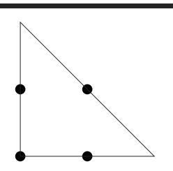

# Appendix B

## Answers to Exercises

### **Exercise 1:** from Orthogonality on page 43

You are writing a class called Split, which splits input lines into fields. Which of the following two Java class signatures is the more orthogonal design?

```
class Split1 {
  public Split1(InputStreamReader rdr) { ...
  public void readNextLine() throws IOException { ...
  public int numFields() { ...
  public String getField(int fieldNo) { ...
}
class Split2 {
  public Split2(String line) { ...
  public int numFields() { ...
  public String getField(int fieldNo) { ...
}
```

**Answer 1:** To our way of thinking, class Split2 is more orthogonal. It concentrates on its own task, splitting lines, and ignores details such as where the lines are coming from. Not only does this make the code easier to develop, but it also makes it more flexible. Split2 can split lines read from a file, generated by another routine, or passed in via the environment.

#### **Exercise 2:** from Orthogonality on page 43

Which will lead to a more orthogonal design: modeless or modal dialog boxes?

**Answer 2:** If done correctly, probably modeless. A system that uses modeless dialog boxes will be less concerned with what is going on at any particular moment in time. It will likely have a better intermodule communications infrastructure than a modal system, which may have built-in assumptions about the state of the system—assumptions that lead to increased coupling and decreased orthogonality.

#### **Exercise 3:** from Orthogonality on page 43

How about procedural languages versus object technology? Which results in a more orthogonal system?

**Answer 3:** This is a little tricky. Object technology *can* provide a more orthogonal system, but because it has more features to abuse, it is actually easier to create a *nonorthogonal* system using objects than it is using a procedural language. Features such as multiple inheritance, exceptions, operator overloading, and parent-method overriding (via subclassing) provide ample opportunity to increase coupling in nonobvious ways.

With object technology and a little extra effort, you can achieve a much more orthogonal system. But while you can always write "spaghetti code" in a procedural language, object-oriented languages used poorly can add meatballs to your spaghetti.

#### **Exercise 4:** from Prototypes and Post-it Notes on page 56

Marketing would like to sit down and brainstorm a few Web-page designs with you. They are thinking of clickable image maps to take you to other pages, and so on. But they can't decide on a model for the image—maybe it's a car, or a phone, or a house. You have a list of target pages and content; they'd like to see a few prototypes. Oh, by the way, you have 15 minutes. What tools might you use?

**Answer 4:** Low-tech to the rescue! Draw a few cartoons with markers on a whiteboard—a car, a phone, and a house. It doesn't have to be great art; stickfigure outlines are fine. Put Post-it notes that describe the contents of target pages on the clickable areas. As the meeting progresses, you can refine the drawings and placements of the Post-it notes.

#### **Exercise 5:** from Domain Languages on page 63

We want to implement a mini-language to control a simple drawing package (perhaps a turtle-graphics system). The language consists of single-letter commands. Some commands are followed by a single number. For example, the following input would draw a rectangle.

```
P 2 # select pen 2
D # pen down
W 2 # draw west 2cm
N 1 # then north 1
E 2 # then east 2
S 1 # then back south
U # pen up
```

Implement the code that parses this language. It should be designed so that it is simple to add new commands.

**Answer 5:** Because we want to make the language extendable, we'll make the parser table driven. Each entry in the table contains the command letter, a flag to say whether an argument is required, and the name of the routine to call to handle that particular command.

```
typedef struct {
 char cmd; /* the command letter */
 int hasArg; /* does it take an argument */
 void (*func)(int, int); /* routine to call */
} Command;
static Command cmds[] = {
 { 'P', ARG, doSelectPen },
 { 'U', NO_ARG, doPenUp },
 { 'D', NO_ARG, doPenDown },
 { 'N', ARG, doPenDir },
 { 'E', ARG, doPenDir },
 { 'S', ARG, doPenDir },
 { 'W', ARG, doPenDir }
};
```

The main program is pretty simple: read a line, look up the command, get the argument if required, then call the handler function.

```
while (fgets(buff, sizeof(buff), stdin)) {
  Command *cmd = findCommand(*buff);
  if (cmd) {
    int arg = 0;
    if (cmd->hasArg && !getArg(buff+1, &arg)) {
      fprintf(stderr, "'%c' needs an argument n", *buff);
      continue;
    }
    cmd->func(*buff, arg);
  }
}
```

The function that looks up a command performs a linear search of the table, returning either the matching entry or NULL.

```
Command *findCommand(int cmd) {
  int i;
  for (i = 0; i < ARRAY_SIZE(cmds); i++) {
    if (cmds[i].cmd == cmd)
      return cmds + i;
  }
  fprintf(stderr, "Unknown command '%c' n", cmd);
  return 0;
}
```

Finally, reading the numeric argument is pretty simple using sscanf.

```
int getArg(const char *buff, int *result) {
  return sscanf(buff, "%d", result) == 1;
}
```

#### **Exercise 6:** from Domain Languages on page 63

Design a BNF grammar to parse a time specification. All of the following examples should be accepted.

```
4pm, 7:38pm, 23:42, 3:16, 3:16am
```

#### **Answer 6:** Using BNF, a time specification could be

```
time hour ampm
         hour : minute ampm
         hour : minute
ampm am pm
hour digit
         digit digit
minute digit digit
digit 0 1 2 3 4 5 6 7 8 9
```

#### **Exercise 7:** from Domain Languages on page 63

Implement a parser for the BNF grammar in Exercise 6 using yacc, bison, or a similar parser-generator.

**Answer 7:** We coded our example using bison, the GNU version of yacc. For clarity, we're just showing the body of the parser here. Look at the source on our Web site for the full implementation.

```
time: spec END_TOKEN
          { if ($1 >= 24*60) yyerror("Time is too large");
            printf("%d minutes past midnight n", $1);
            exit(0);
          }
        ;
spec: hour ':' minute
          { $$ = $1 + $3;
          }
        | hour ':' minute ampm
          { if ($1 > 11*60) yyerror("Hour out of range");
            $$ = $1 + $3 + $4;
          }
        | hour ampm
          { if ($1 > 11*60) yyerror("Hour out of range");
            $$ = $1 + $2;
          }
        ;
hour: hour_num
          { if ($1 > 23) yyerror("Hour out of range");
            $$ = $1 * 60;
          };
```

```
minute: DIGIT DIGIT
       { $$ = $1*10 + $2;
         if ($$ > 59) yyerror("minute out of range");
       };
ampm: AM { $$ = AM_MINS; }
      | PM { $$ = PM_MINS; }
      ;
hour_num: DIGIT { $$ = $1; }
      | DIGIT DIGIT { $$ = $1*10 + $2; }
      ;
```

#### **Exercise 8:** from Domain Languages on page 63

Implement the time parser using Perl. [*Hint:* Regular expressions make good parsers.]

#### Answer 8:

```
$_ = shift;
/^( d d?)(am|pm)$/ && doTime($1, 0, $2, 12);
/^( d d?):( d d)(am|pm)$/ && doTime($1, $2, $3, 12);
/^( d d?):( d d)$/ && doTime($1, $2, 0, 24);
die "Invalid time $_ n";
#
# doTime(hour, min, ampm, maxHour)
#
sub doTime($$$$) {
 my ($hour, $min, $offset, $maxHour) = @_;
 die "Invalid hour: $hour" if ($hour >= $maxHour);
 $hour += 12 if ($offset eq "pm");
 print $hour*60 + $min, " minutes past midnight n";
 exit(0);
}
```

#### **Exercise 9:** from Estimating on page 69

You are asked "Which has a higher bandwidth: a 1Mbps communications line or a person walking between two computers with a full 4GB tape in their pocket?" What constraints will you put on your answer to ensure that the scope of your response is correct? (For example, you might say that the time taken to access the tape is ignored.)

#### **Answer 9:** Our answer must be couched in several assumptions:

- The tape contains the information we need to be transferred.
- We know the speed at which the person walks.
- We know the distance between the machines.
- We are not accounting for the time it takes to transfer information to and from the tape.

The overhead of storing data on a tape is roughly equal to the overhead of sending it over a communications line.

#### **Exercise 10:** from Estimating on page 69 So, which has the higher bandwidth?

**Answer 10:** Subject to the caveats in Answer 9: A 4GB tape contains bits, so a 1Mbps line would have to pump data for about seconds, or roughly hours, to transfer the equivalent amount of information. If the person is walking at a constant mph, then our two machines would need to be at least miles apart for the communications line to outperform our courier. Otherwise, the person wins.

#### **Exercise 11:** from Text Manipulation on page 102

Your C program uses an enumerated type to represent one of 100 states. You'd like to be able to print out the state as a string (as opposed to a number) for debugging purposes. Write a script that reads from standard input a file containing

```
name
state_a
state_b
 : :
```

Produce the file *name.h*, which contains

```
extern const char* NAME_names[];
typedef enum {
   state_a,
   state_b,
    : :
 } NAME;
```

and the file *name.c*, which contains

```
const char* NAME_names[] = {
   "state_a",
   "state_b",
     : :
 };
```

#### **Answer 11:** We implemented our answer using Perl.

```
my @consts;
my $name = <>;
die "Invalid format - missing name" unless defined($name);
chomp $name;
# Read in the rest of the file
while (<>) {
  chomp;
  s/^ s*//; s/ s*$//;
  die "Invalid line: $_" unless /^( w+)$/;
  push @consts, $_;
}
# Now generate the file
open(HDR, ">$name.h") or die "Can't open $name.h: $!";
open(SRC, ">$name.c") or die "Can't open $name.c: $!";
my $uc_name = uc($name);
my $array_name = $uc_name . "_names";
print HDR "/* File generated automatically - do not edit */ n";
print HDR "extern const char *$ {array_name}[];";
print HDR "typedef enum { n ";
print HDR join ", n ", @consts;
print HDR " n} $uc_name; n n";
print SRC "/* File generated automatically - do not edit */ n";
print SRC "const char *$ {array_name}[] = { n "";
print SRC join " ", n "", @consts;
print SRC " " n}; n";
close(SRC);
close(HDR);
```

Using the *DRY* principle, we won't cut and paste this new file into our code. Instead, we'll #include it—the flat file is the master source of these constants. This means that we'll need a makefile to regenerate the header when the file changes. The following extract is from the test bed in our source tree (available on the Web site).

```
etest.c etest.h: etest.inc enumerated.pl
                  perl enumerated.pl etest.inc
```

#### **Exercise 12:** from Text Manipulation on page 102

Halfway through writing this book, we realized that we hadn't put the use strict directive into many of our Perl examples. Write a script that goes through the .pl files in a directory and adds a use strict at the end of the initial comment block to all files that don't already have one. Remember to keep a backup of all files you change.

#### **Answer 12:** Here's our answer, written in Perl.

```
my $dir = shift or die "Missing directory";
for my $file (glob("$dir/*.pl")) {
  open(IP, "$file") or die "Opening $file: $!";
  undef $/; # Turn off input record separator --
  my $content = <IP>; # read whole file as one string.
  close(IP);
  if ($content !~ /^use strict/m) {
    rename $file, "$file.bak" or die "Renaming $file: $!";
    open(OP, ">$file") or die "Creating $file: $!";
    # Put 'use strict' on first line that
    # doesn't start '#'
    $content =~ s/^(?!#)/ nuse strict; n n/m;
    print OP $content;
    close(OP);
    print "Updated $file n";
  }
  else {
    print "$file already strict n";
  }
}
```

#### **Exercise 13:** from Code Generators on page 106

Write a code generator that takes the input file in Figure 3.4, page 106, and generates output in two languages of your choice. Try to make it easy to add new languages.

**Answer 13:** We use Perl to implement our solution. It dynamically loads a module to generate the requested language, so adding new languages is easy. The main routine loads the back end (based on a command-line parameter), then reads its input and calls code generation routines based on the content of each line. We're not particularly fussy about error handling—we'll get to know pretty quickly if things go wrong.

```
my $lang = shift or die "Missing language";
$lang .= "_cg.pm";
require "$lang" or die "Couldn't load $lang";
# Read and parse the file
my $name;
while (<>) {
 chomp;
 if (/^ s*$/) { CG::blankLine(); }
 elsif (/^ #(.*)/) { CG::comment($1); }
 elsif (/^M s*(.+)/) { CG::startMsg($1); $name = $1; }
 elsif (/^E/) { CG::endMsg($name); }
 elsif (/^F s*( w+) s+( w+)$/)
                     { CG::simpleType($1,$2); }
```

```
elsif (/^F s*( w+) s+( w+) [( d+) ]$/)
                       { CG::arrayType($1,$2,$3); }
  else {
    die "Invalid line: $_";
  }
}
```

Writing a language back end is simple: provide a module that implements the required six entry points. Here's the C generator:

```
#!/usr/bin/perl -w
package CG;
use strict;
# Code generator for 'C' (see cg_base.pl)
sub blankLine() { print " n"; }
sub comment() { print "/*$_[0] */ n"; }
sub startMsg() { print "typedef struct { n"; }
sub endMsg() { print "} $_[0]; n n"; }
sub arrayType() {
  my ($name, $type, $size) = @_;
  print " $type $name [$size]; n";
}
sub simpleType() {
  my ($name, $type) = @_;
  print " $type $name; n";
}
1;
```

And here's the one for Pascal:

```
#!/usr/bin/perl -w
package CG;
use strict;
# Code generator for 'Pascal' (see cg_base.pl)
sub blankLine() { print " n"; }
sub comment() { print "{$_[0] } n"; }
sub startMsg() { print "$_[0] = packed record n"; }
sub endMsg() { print "end; n n"; }
sub arrayType() {
  my ($name, $type, $size) = @_;
  $size--;
  print " $name: array[0..$size] of $type; n";
}
sub simpleType() {
  my ($name, $type) = @_;
  print " $name: $type; n";
}
1;
```

#### **Exercise 14:** from Design by Contract on page 118

What makes a good contract? Anyone can add preconditions and postconditions, but will they do you any good? Worse yet, will they actually do more harm than good? For the example below and for those in Exercises 15 and 16, decide whether the specified contract is good, bad, or ugly, and explain why.

First, let's look at an Eiffel example. Here we have a routine for adding a STRING to a doubly linked, circular list (remember that preconditions are labeled with require, and postconditions with ensure).

```
-- Add a unique item to a doubly linked list,
-- and return the newly created NODE.
add_item (item : STRING) : NODE is
  require
     item /= Void -- '/=' is 'not equal'.
     find_item(item) = Void -- Must be unique
  deferred -- Abstract base class. ensure
     result.next.previous = result -- Check the newly
     result.previous.next = result -- added node's links.
     find_item(item) = result -- Should find it.
  end
```

**Answer 14:** This Eiffel example is *good*. We require non-null data to be passed in, and we guarantee that the semantics of a circular, doubly linked list are honored. It also helps to be able to find the string we stored. Because this is a deferred class, the actual class that implements it is free to use whatever underlying mechanism it wants to. It may choose to use pointers, or an array, or whatever; as long as it honors the contract, we don't care.

#### **Exercise 15:** from Design by Contract on page 119

Next, let's try an example in Java—somewhat similar to the example in Exercise 14. insertNumber inserts an integer into an ordered list. Pre- and postconditions are labeled as in iContract (see [URL 17]).

```
private int data[];
/**
  * @post data[index-1] < data[index] &&
  * data[index] == aValue
  */
public Node insertNumber (final int aValue)
{
  int index = findPlaceToInsert(aValue); ...
```

**Answer 15:** This is *bad*. The math in the index clause (index-1) won't work on boundary conditions such as the first entry. The postcondition assumes a particular implementation: we want contracts to be more abstract than that.

#### **Exercise 16:** from Design by Contract on page 119

Here's a fragment from a stack class in Java. Is this a good contract?

```
/**
 * @pre anItem != null // Require real data
 * @post pop() == anItem // Verify that it's
 * // on the stack
 */
public void push(final String anItem)
```

**Answer 16:** It's a good contract, but a bad implementation. Here, the infamous "Heisenbug" [URL 52] rears its *ugly* head. The programmer probably just made a simple typo—pop instead of top. While this is a simple and contrived example, side effects in assertions (or in any unexpected place in the code) can be very difficult to diagnose.

#### **Exercise 17:** from Design by Contract on page 119

The classic examples of DBC (as in Exercises 14 –16) show an implementation of an ADT (Abstract Data Type)—typically a stack or queue. But not many people really write these kinds of low-level classes.

So, for this exercise, design an interface to a kitchen blender. It will eventually be a Web-based, Internet-enabled, CORBA-fied blender, but for now we just need the interface to control it. It has ten speed settings (0 means off). You can't operate it empty, and you can change the speed only one unit at a time (that is, from 0 to 1, and from 1 to 2, not from 0 to 2).

Here are the methods. Add appropriate pre- and postconditions and an invariant.

```
int getSpeed()
void setSpeed(int x)
boolean isFull()
void fill()
void empty()
```

**Answer 17:** We'll show the function signatures in Java, with the pre- and postconditions labeled as in iContract.

First, the invariant for the class:

```
/**
 * @invariant getSpeed() > 0
 * implies isFull() // Don't run empty
 * @invariant getSpeed() >= 0 &&
 * getSpeed() < 10 // Range check
 */
```

Next, the pre- and postconditions:

```
/**
 * @pre Math.abs(getSpeed() - x) <= 1 // Only change by one
 * @pre x >= 0 && x < 10 // Range check
 * @post getSpeed() == x // Honor requested speed
 */
public void setSpeed(final int x)
/**
 * @pre !isFull() // Don't fill it twice
 * @post isFull() // Ensure it was done
 */
void fill()
/**
 * @pre isFull() // Don't empty it twice
 * @post !isFull() // Ensure it was done
 */
void empty()
```

**Exercise 18:** from Design by Contract on page 119 How many numbers are in the series ?

**Answer 18:** There are 21 terms in the series. If you said 20, you just experienced a fencepost error.

**Exercise 19:** from Assertive Programming on page 125 A quick reality check. Which of these "impossible" things can happen?

- 1. A month with fewer than 28 days
- 2. stat(".",&sb) == -1 (that is, can't access the current directory)
- 3. In C++: a = 2; b = 3; **if** (a + b != 5) exit(1);
- 4. A triangle with an interior angle sum
- 5. A minute that doesn't have 60 seconds
- 6. In Java: (a + 1) <= a

#### Answer 19:

- 1. September, 1752 had only 19 days. This was done to synchronize calendars as part of the Gregorian Reformation.
- 2. The directory could have been removed by another process, you might not have permission to read it, &sb might be invalid—you get the picture.
- 3. We sneakily didn't specify the types of a and b. Operator overloading might have defined +, =, or != to have unexpected behavior. Also, a and b may be aliases for the same variable, so the second assignment will overwrite the value stored in the first.
- 4. In non-Euclidean geometry, the sum of the angles of a triangle will not add up to . Think of a triangle mapped on the surface of a sphere.

- 5. Leap minutes may have 61 or 62 seconds.
- 6. Overflow may leave the result of a+1 negative (this can also happen in C and C++).

**Exercise 20:** from Assertive Programming on page 125 Develop a simple assertion checking class for Java.

**Answer 20:** We chose to implement a very simple class with a single static method, TEST, that prints a message and a stack trace if the passed condition parameter is false.

```
package com.pragprog.util;
import java.lang.System; // for exit()
import java.lang.Thread; // for dumpStack()
public class Assert {
  /** Write a message, print a stack trace and exit if
    * our parameter is false.
    */
  public static void TEST(boolean condition) {
    if (!condition) {
      System.out.println("==== Assertion Failed ====");
      Thread.dumpStack();
      System.exit(1);
    }
  }
  // Testbed. If our argument is 'okay', try an assertion that
  // succeeds, if 'fail' try one that fails
  public static final void main(String args[]) {
    if (args[0].compareTo("okay") == 0) {
      TEST(1 == 1);
    }
    else if (args[0].compareTo("fail") == 0) {
      TEST(1 == 2);
    }
    else {
      throw new RuntimeException("Bad argument");
    }
  }
}
```

#### **Exercise 21:** from When to Use Exceptions on page 128

While designing a new container class, you identify the following possible error conditions:

- 1. No memory available for a new element in the add routine
- 2. Requested entry not found in the fetch routine
- 3. null pointer passed to the add routine

How should each be handled? Should an error be generated, should an exception be raised, or should the condition be ignored?

**Answer 21:** Running out of memory is an exceptional condition, so we feel that case (1) should raise an exception.

Failure to find an entry is probably quite a normal occurrence. The application that calls our collection class may well write code that checks to see if an entry is present before adding a potential duplicate. We feel that case (2) should just return an error.

Case (3) is more problematic—if the value null is significant to the application, then it may be justifiably added to the container. If, however, it makes no sense to store null values, an exception should probably be thrown.

**Exercise 22:** from How to Balance Resources on page 136 Some C and C++ developers make a point of setting a pointer to NULL after they deallocate the memory it references. Why is this a good idea?

**Answer 22:** In most C and C++ implementations, there is no way of checking that a pointer actually points to valid memory. A common mistake is to deallocate a block of memory and reference that memory later in the program. By then, the memory pointed to may well have been reallocated to some other purpose. By setting the pointer to NULL, the programmers hope to prevent these rogue references—in most cases, dereferencing a NULL pointer will generate a runtime error.

**Exercise 23:** from How to Balance Resources on page 136 Some Java developers make a point of setting an object variable to NULL after they have finished using the object. Why is this a good idea?

**Answer 23:** By setting the reference to NULL, you reduce the number of pointers to the referenced object by one. Once this count reaches zero, the object is eligible for garbage collection. Setting the references to NULL can be significant for long-running programs, where the programmers need to ensure that memory utilization doesn't increase over time.

**Exercise 24:** from Decoupling and the Law of Demeter on page 143 We discussed the concept of physical decoupling in the box on page 142. Which of the following C++ header files is more tightly coupled to the rest of the system?

```
person1.h: person2.h:
  #include "date.h"
  class Person1 {
  private:
    Date myBirthdate;
  public:
    Person1(Date &birthDate);
    // ...
                                 class Date;
                                 class Person2 {
                                 private:
                                   Date *myBirthdate;
                                 public:
                                   Person2(Date &birthDate);
                                   // ...
```

**Answer 24:** A header file is supposed to define the interface between the corresponding implementation and the rest of the world. The header file itself has no need to know about the internals of the Date class—it merely needs to tell the compiler that the constructor takes a Date as a parameter. So, unless the header file uses Dates in inline functions, the second snippet will work fine.

What's wrong with the first snippet? On a small project, nothing, except that you are unnecessarily making everything that uses a Person1 class also include the header file for Date. Once this kind of usage gets common in a project, you soon find that including one header file ends up including most of the rest of the system—a serious drag on compilation times.

**Exercise 25:** from Decoupling and the Law of Demeter on page 143 For the example below and for those in Exercises 26 and 27, determine if the method calls shown are allowed according to the Law of Demeter. This first one is in Java.

```
public void showBalance(BankAccount acct) {
  Money amt = acct.getBalance();
  printToScreen(amt.printFormat());
}
```

**Answer 25:** The variable acct is passed in as a parameter, so the getBalance call is allowed. Calling amt.printFormat(), however, is not. We don't "own" amt and it wasn't passed to us. We could eliminate showBalance's coupling to Money with something like this:

```
void showBalance(BankAccount b) {
  b.printBalance();
}
```

**Exercise 26:** from Decoupling and the Law of Demeter on page 143 This example is also in Java.

```
public class Colada {
  private Blender myBlender;
  private Vector myStuff;
  public Colada() {
    myBlender = new Blender();
    myStuff = new Vector();
  }
  private void doSomething() {
    myBlender.addIngredients(myStuff.elements());
  }
}
```

**Answer 26:** Since Colada creates and owns both myBlender and myStuff, the calls to addIngredients and elements are allowed.

**Exercise 27:** from Decoupling and the Law of Demeter on page 143 This example is in C++.

```
void processTransaction(BankAccount acct, int) {
  Person *who;
  Money amt;
  amt.setValue(123.45);
  acct.setBalance(amt);
  who = acct.getOwner();
  markWorkflow(who->name(), SET_BALANCE);
}
```

**Answer 27:** In this case, processTransaction owns amt—it is created on the stack. acct is passed in, so both setValue and setBalance are allowed. But processTransaction does not own who, so the call who->name() is in violation. The Law of Demeter suggests replacing this line with

```
markWorkflow(acct.name(), SET_BALANCE);
```

The code in processTransaction should not have to know which subobject within a BankAccount holds the name—this structural knowledge should not show through BankAccount's contract. Instead, we ask the BankAccount for the name on the account. It knows where it keeps the name (maybe in a Person, in a Business, or in a polymorphic Customer object).

#### **Exercise 28:** from Metaprogramming on page 149

Which of the following things would be better represented as code within a program, and which externally as metadata?

- 1. Communication port assignments
- 2. An editor's support for highlighting the syntax of various languages
- 3. An editor's support for different graphic devices
- 4. A state machine for a parser or scanner
- 5. Sample values and results for use in unit testing

**Answer 28:** There are no definitive answers here—the questions were intended primarily to give you food for thought. However, this is what we think:

- 1. Communication port assignments. Clearly, this information should be stored as metadata. But to what level of detail? Some Windows communications programs let you select only baud rate and port (say COM1 to COM4). But perhaps you need to specify word size, parity, stop bits, and the duplex setting as well. Try to allow the finest level of detail where practical.
- 2. An editor's support for highlighting the syntax of various languages. This should be implemented as metadata. You wouldn't want to have to hack code just because the latest version of Java introduced a new keyword.
- 3. An editor's support for different graphic devices. This would probably be difficult to implement strictly as metadata. You would not want to burden your application with multiple device drivers only to select one at runtime. You could, however, use metadata to specify the name of the driver and dynamically load the code. This is another good argument for keeping the metadata in a human-readable format; if you use the program to set up a dysfunctional video driver, you may not be able to use the program to set it back.
- 4. A state machine for a parser or scanner. This depends on what you are parsing or scanning. If you are parsing some data that is rigidly defined by a standards body and is unlikely to change without an act of Congress, then hard coding it is fine. But if you are faced with a more volatile situation, it may be beneficial to define the state tables externally.
- 5. Sample values and results for use in unit testing. Most applications define these values inline in the testing harness, but you can get better flexibility by moving the test data—and the definition of the acceptable results—out of the code itself.

## **Exercise 29:** from It's Just <sup>a</sup> View on page 164

Suppose you have an airline reservation system that includes the concept of a flight:

```
public interface Flight {
  // Return false if flight full.
  public boolean addPassenger(Passenger p);
  public void addToWaitList(Passenger p);
  public int getFlightCapacity();
  public int getNumPassengers();
}
```

If you add a passenger to the wait list, they'll be put on the flight automatically when an opening becomes available.

There's a massive reporting job that goes through looking for overbooked or full flights to suggest when additional flights might be scheduled. It works fine, but it takes hours to run.

We'd like to have a little more flexibility in processing wait-list passengers, and we've got to do something about that big report—it takes too long to run. Use the ideas from this section to redesign this interface.

**Answer 29:** We'll take Flight and add some additional methods for maintaining two lists of listeners: one for wait-list notification, and the other for full-flight notification.

```
public interface Passenger {
  public void waitListAvailable();
}
public interface Flight { ...
  public void addWaitListListener(Passenger p);
  public void removeWaitListListener(Passenger p);
  public void addFullListener(FullListener b);
  public void removeFullListener(FullListener b); ...
}
public interface BigReport extends FullListener {
  public void FlightFullAlert(Flight f);
}
```

If we try to add a Passenger and fail because the flight is full, we can, optionally, put the Passenger on the wait list. When a spot opens up, waitList-Available will be called. This method can then choose to add the Passenger automatically, or have a service representative call the customer to ask if they are still interested, or whatever. We now have the flexibility to perform different behaviors on a per-customer basis.

Next, we want to avoid having the BigReport troll through tons of records looking for full flights. By having BigReport registered as a listener on Flights, each individual Flight can report when it is full—or nearly full, if we want. Now users can get live, up-to-the-minute reports from BigReport instantly, without waiting hours for it to run as it did previously.

### **Exercise 30:** from Blackboards on page 170

For each of the following applications, would a blackboard system be appropriate or not? Why?

- 1. Image processing. You'd like to have a number of parallel processes grab chunks of an image, process them, and put the completed chunk back.
- 2. Group calendaring. You've got people scattered across the globe, in different time zones, and speaking different languages, trying to schedule a meeting.
- 3. Network monitoring tool. The system gathers performance statistics and collects trouble reports. You'd like to implement some agents to use this information to look for trouble in the system.

#### Answer 30:

- 1. Image processing. For simple scheduling of a workload among the parallel processes, a shared work queue may be more than adequate. You might want to consider a blackboard system if there is feedback involved—that is, if the results of one processed chunk affect other chunks, as in machine vision applications, or complex 3D image-warp transforms.
- 2. Group calendaring. This might be a good fit. You can post scheduled meetings and availability to the blackboard. You have entities functioning autonomously, feedback from decisions is important, and participants may come and go.
  - You might want to consider partitioning this kind of blackboard system depending on who is searching: junior staff may care about only the immediate office, human resources may want only English-speaking offices worldwide, and the CEO may want the whole enchilada.
  - There is also some flexibility on data formats: we are free to ignore formats or languages we don't understand. We have to understand different formats only for those offices that have meetings with each other, and we do not need to expose all participants to a full transitive closure of all possible formats. This reduces coupling to where it is necessary, and does not constrain us artificially.
- 3. Network monitoring tool. This is very similar to the mortgage/loan application program described on page 168. You've got trouble reports sent in by users and statistics reported automatically, all posting to the blackboard. A human or software agent can analyze the blackboard to diagnose

network failures: two errors on a line might just be cosmic rays, but 20,000 errors and you've got a hardware problem. Just as the detectives solve the murder mystery, you can have multiple entities analyzing and contributing ideas to solve the network problems.

#### **Exercise 31:** from Programming by Coincidence on page 176

Can you identify some coincidences in the following C code fragment? Assume that this code is buried deep in a library routine.

```
fprintf(stderr,"Error, continue?");
gets(buf);
```

**Answer 31:** There are several potential problems with this code. First, it assumes a tty environment. That may be fine if the assumption is true, but what if this code is called from a GUI environment where neither stderr nor stdin is open?

Second, there is the problematic gets, which will write as many characters as it receives into the buffer passed in. Malicious users have used this failing to create *buffer overrun* security holes in many different systems. Never use gets().

Third, the code assumes the user understands English.

Finally, no one in their right mind would ever bury user interaction such as this in a library routine.

#### **Exercise 32:** from Programming by Coincidence on page 176

This piece of C code might work some of the time, on some machines. Then again, it might not. What's wrong?

```
/* Truncate string to its last maxlen chars */
void string_tail(char *string, int maxlen) {
  int len = strlen(string);
  if (len > maxlen) {
    strcpy(string, string + (len - maxlen));
  }
}
```

**Answer 32:** POSIX strcpy isn't guaranteed to work for overlapping strings. It might happen to work on some architectures, but only by coincidence.

#### **Exercise 33:** from Programming by Coincidence on page <sup>177</sup>

This code comes from a general-purpose Java tracing suite. The function writes a string to a log file. It passes its unit test, but fails when one of the Web developers uses it. What coincidence does it rely on?

```
public static void debug(String s) throws IOException {
  FileWriter fw = new FileWriter("debug.log", true);
  fw.write(s);
  fw.flush();
  fw.close();
}
```

**Answer 33:** It won't work in an applet context with security restrictions against writing to the local disk. Again, when you have a choice of running in GUI contexts or not, you may want to check dynamically to see what the current environment is like. In this case, you may want to put a log file somewhere other than the local disk if it isn't accessible.

#### **Exercise 34:** from Algorithm Speed on page 183

We have coded a set of simple sort routines, which can be downloaded from our Web site (www.pragmaticprogrammer.com). Run them on various machines available to you. Do your figures follow the expected curves? What can you deduce about the relative speeds of your machines? What are the effects of various compiler optimization settings? Is the radix sort indeed linear?

**Answer 34:** Clearly, we can't give any absolute answers to this exercise. However, we can give you a couple of pointers.

If you find that your results don't follow a smooth curve, you might want to check to see if some other activity is using some of your processor's power. You probably won't get good figures on a multiuser system, and even if you are the only user you may find that background processes periodically take cycles away from your programs. You might also want to check memory: if the application starts using swap space, performance will nose dive.

It is interesting to experiment with different compilers and different optimization settings. We found some that pretty startling speed-ups were possible by enabling aggressive optimization. We also found that on the wider RISC architectures the manufacturer's compilers often outperformed the more portable GCC. Presumably, the manufacturer is privy to the secrets of efficient code generation on these machines.

#### **Exercise 35:** from Algorithm Speed on page 183

The routine below prints out the contents of a binary tree. Assuming the tree is balanced, roughly how much stack space will the routine use while printing a tree of 1,000,000 elements? (Assume that subroutine calls impose no significant stack overhead.)

```
void printTree(const Node *node) {
  char buffer[1000];
  if (node) {
    printTree(node->left);
    getNodeAsString(node, buffer);
    puts(buffer);
    printTree(node->right);
  }
}
```

**Answer 35:** The printTree routine uses about 1,000 bytes of stack space for the buffer variable. It calls itself recursively to descend through the tree, and each nested call adds another 1,000 bytes to the stack. It also calls itself when it gets to the leaf nodes, but exits immediately when it discovers that the pointer passed in is NULL. If the depth of the tree is , the maximum stack requirement is therefore roughly .

A balanced binary tree holds twice as many elements at each level. A tree of depth holds , or , elements. Our million-element tree will therefore need , or 20 levels.

We'd therefore expect our routine to use roughly 21,000 bytes of stack.

#### **Exercise 36:** from Algorithm Speed on page 183

Can you see any way to reduce the stack requirements of the routine in Exercise 35 (apart from reducing the size of the buffer)?

**Answer 36:** A couple of optimizations come to mind. First, the printTree routine calls itself on leaf nodes, only to exit because there are no children. That call increases the maximum stack depth by about 1,000 bytes. We can also eliminate the tail recursion (the second recursive call), although this won't affect the worst-case stack usage.

```
while (node) {
  if (node->left) printTree(node->left);
  getNodeAsString(node, buffer);
  puts(buffer);
  node = node->right;
}
```

The biggest gain, however, comes from allocating just a single buffer, shared by all invocations of printTree. Pass this buffer as a parameter to the recursive calls, and only 1,000 bytes will be allocated, regardless of the depth of recursion.

```
void printTreePrivate(const Node *node, char *buffer) {
  if (node) {
    printTreePrivate(node->left, buffer);
    getNodeAsString(node, buffer);
    puts(buffer);
    printTreePrivate(node->right, buffer);
  }
}
void newPrintTree(const Node *node) {
  char buffer[1000];
  printTreePrivate(node, buffer);
}
```

#### **Exercise 37:** from Algorithm Speed on page 183

On page 180, we claimed that a binary chop is . Can you prove this?

**Answer 37:** There are a couple of ways of getting there. One is to turn the problem on its head. If the array has just one element, we don't iterate around the loop. Each additional iteration doubles the size of the array we can search. The general formula for the array size is therefore , where is the number of iterations. If you take logs to the base 2 of each side, you get , which by the definition of logs becomes .

#### **Exercise 38:** from Refactoring on page 188

The following code has obviously been updated several times over the years, but the changes haven't improved its structure. Refactor it.

```
if (state == TEXAS) {
  rate = TX_RATE;
  amt = base * TX_RATE;
  calc = 2*basis(amt) + extra(amt)*1.05;
}
else if ((state == OHIO) || (state == MAINE)) {
  rate = (state == OHIO) ? OH_RATE : ME_RATE;
  amt = base * rate;
  calc = 2*basis(amt) + extra(amt)*1.05;
  if (state == OHIO)
    points = 2;
}
else {
  rate = 1;
  amt = base;
  calc = 2*basis(amt) + extra(amt)*1.05;
}
```

**Answer 38:** We might suggest a fairly mild restructuring here: make sure that every test is performed just once, and make all the calculations common. If the expression 2\*basis(...)\*1.05 appears in other places in the program, we should probably make it a function. We haven't bothered here.

We've added a rate\_lookup array, initialized so that entries other than Texas, Ohio, and Maine have a value of 1. This approach makes it easy to add values for other states in the future. Depending on the expected usage pattern, we might want to make the points field an array lookup as well.

```
rate = rate_lookup[state];
amt = base * rate;
calc = 2*basis(amt) + extra(amt)*1.05;
if (state == OHIO)
  points = 2;
```

#### **Exercise 39:** from Refactoring on page 188

The following Java class needs to support a few more shapes. Refactor the class to prepare it for the additions.

```
public class Shape {
 public static final int SQUARE = 1;
 public static final int CIRCLE = 2;
 public static final int RIGHT_TRIANGLE = 3;
 private int shapeType;
 private double size;
 public Shape(int shapeType, double size) {
    this.shapeType = shapeType;
    this.size = size;
 }
 // ... other methods ...
 public double area() {
    switch (shapeType) {
    case SQUARE: return size*size;
    case CIRCLE: return Math.PI*size*size/4.0;
    case RIGHT_TRIANGLE: return size*size/2.0;
    }
    return 0;
 }
}
```

**Answer 39:** When you see someone using enumerated types (or their equivalent in Java) to distinguish between variants of a type, you can often improve the code by subclassing:

```
public class Shape {
  private double size;
  public Shape(double size) {
    this.size = size;
  }
  public double getSize() { return size; }
}
public class Square extends Shape {
  public Square(double size) {
    super(size);
  }
  public double area() {
    double size = getSize();
    return size*size;
  }
}
public class Circle extends Shape {
  public Circle(double size) {
    super(size);
  }
  public double area() {
    double size = getSize();
    return Math.PI*size*size/4.0;
  }
}
// etc...
```

#### **Exercise 40:** from Refactoring on page 189

This Java code is part of a framework that will be used throughout your project. Refactor it to be more general and easier to extend in the future.

```
public class Window {
  public Window(int width, int height) { ... }
  public void setSize(int width, int height) { ... }
  public boolean overlaps(Window w) { ... }
  public int getArea() { ... }
}
```

**Answer 40:** This case is interesting. At first sight, it seems reasonable that a window should have a width and a height. However, consider the future. Let's imagine that we want to support arbitrarily shaped windows (which will be difficult if the Window class knows all about rectangles and their properties).

We'd suggest abstracting the shape of the window out of the Window class itself.

```
public abstract class Shape {
  // ...
  public abstract boolean overlaps(Shape s);
  public abstract int getArea();
}
public class Window {
  private Shape shape;
  public Window(Shape shape) {
    this.shape = shape; ...
  }
  public void setShape(Shape shape) {
    this.shape = shape; ...
  }
  public boolean overlaps(Window w) {
    return shape.overlaps(w.shape);
  }
  public int getArea() {
    return shape.getArea();
  }
}
```

Note that in this approach we've used delegation rather than subclassing: a window is not a "kind-of" shape—a window "has-a" shape. It uses a shape to do its job. You'll often find delegation useful when refactoring.

We could also have extended this example by introducing a Java interface that specified the methods a class must support to support the shape functions. This is a good idea. It means that when you extend the concept of a shape, the compiler will warn you about classes that you have affected. We recommend using interfaces this way when you delegate all the functions of some other class.

#### **Exercise 41:** from Code That's Easy to Test on page 197

Design a test jig for the blender interface described in the answer to Exercise 17 on page 289. Write a shell script that will perform a regression test for the blender. You need to test basic functionality, error and boundary conditions, and any contractual obligations. What restrictions are placed on changing the speed? Are they being honored?

**Answer 41:** First, we'll add a main to act as a unit test driver. It will accept a very small, simple language as an argument: "E" to empty the blender, "F" to fill it, digits 0-9 to set the speed, and so on.

```
public static void main(String args[]) {
  // Create the blender to test
  dbc_ex blender = new dbc_ex();
  // And test it according to the string on standard input
  try {
    int a;
    char c;
    while ((a = System.in.read()) != -1) {
      c=(char)a;
      if (Character.isWhitespace(c)) {
        continue;
      }
      if (Character.isDigit(c)) {
        blender.setSpeed(Character.digit(c, 10));
      }
      else {
        switch (c) {
          case 'F': blender.fill();
                    break;
          case 'E': blender.empty();
                    break;
          case 's': System.out.println("SPEED: " +
                                        blender.getSpeed());
                    break;
          case 'f': System.out.println("FULL " +
                                        blender.isFull());
                    break;
          default: throw new RuntimeException(
                    "Unknown Test directive");
        }
      }
    }
  }
  catch (java.io.IOException e) {
    System.err.println("Test jig failed: " + e.getMessage());
  }
  System.err.println("Completed blending n");
  System.exit(0);
}
```

Next comes the shell script to drive the tests.

```
#!/bin/sh
CMD="java dbc.dbc_ex"
failcount=0
expect_okay() {
    if echo "$*" | $CMD #>/dev/null 2>&1
    then:
    else
      echo "FAILED! $*"
      failcount='expr $failcount + 1'
    fi
}
expect_fail() {
    if echo "$*" | $CMD >/dev/null 2>&1
    then
      echo "FAILED! (Should have failed): $*"
      failcount='expr $failcount + 1'
    fi
}
report() {
  if [ $failcount -gt 0 ]
  then
    echo -e " n n*** FAILED $failcount TESTS n"
    exit 1 # In case we are part of something larger
  else
    exit 0 # In case we are part of something larger
  fi
}
#
# Start the tests
#
expect_okay F123456789876543210E # Should run thru
expect_fail F5 # Fails, speed too high
expect_fail 1 # Fails, empty
expect_fail F10E1 # Fails, empty
expect_fail F1238 # Fails, skips
expect_okay FE # Never turn on
expect_fail F1E # Emptying while running
expect_okay F10E # Should be ok
report # Report results
```

The tests check to see if illegal speed changes are detected, if you try to empty the blender while running, and so on. We put this in the makefile so we can compile and run the regression test by simply typing

```
% make
% make test
```

Note that we have the test exit with 0 or 1 so we can use this as part of a larger test as well.

There was nothing in the requirements that spoke of driving this component via a script, or even using a language. End users will never see it. But we have a powerful tool that we can use to test our code, quickly and exhaustively.

#### **Exercise 42:** from The Requirements Pit on page <sup>211</sup>

Which of the following are probably genuine requirements? Restate those that are not to make them more useful (if possible).

- 1. The response time must be less than 500 ms.
- 2. Dialog boxes will have a gray background.
- 3. The application will be organized as a number of front-end processes and a back-end server.
- 4. If a user enters non-numeric characters in a numeric field, the system will beep and not accept them.
- 5. The application code and data must fit within 256kB.

#### Answer 42:

- 1. This statement sounds like a real requirement: there may be constraints placed on the application by its environment.
- 2. Even though this may be a corporate standard, it isn't a requirement. It would be better stated as "The dialog background must be configurable by the end user. As shipped, the color will be gray." Even better would be the broader statement "All visual elements of the application (colors, fonts, and languages) must be configurable by the end user."
- 3. This statement is not a requirement, it's architecture. When faced with something like this, you have to dig deep to find out what the user is thinking.
- 4. The underlying requirement is probably something closer to "The system will prevent the user from making invalid entries in fields, and will warn the user when these entries are made."
- 5. This statement is probably a hard requirement.

A solution to the Four Posts puzzle posed on page 213.




