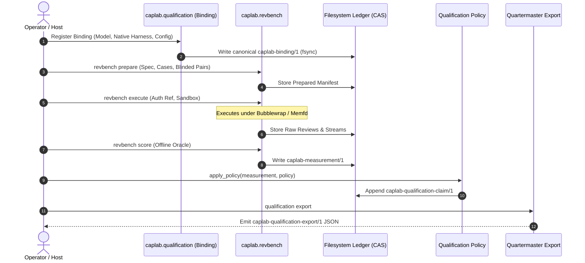
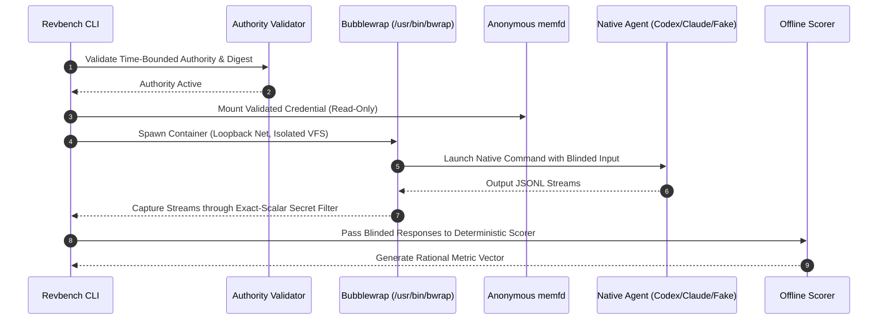

# CAPLAB System Architecture & Comprehensive Design Document

> **Status note.** This document is an architecture/design artifact. It describes
> the system as it is organized on the canonical `main` branch and is kept in
> sync by tracing each subsystem to its governing ADR, contract, and package
> root. It grants no authority; authority flows only from the numbered ADRs and
> the repository owner.

## 1. Executive Summary & Problem Space

### 1.1 The Evaluation Deficit in Autonomous Software Agents

Traditional software engineering agent benchmarks (SWE-bench, HumanEval, and
standard patch-completion harnesses) measure whether an agent system can emit a
diff that turns failing tests green. As coarse end-to-end signals they are
useful, but they introduce systematic blind spots:

1. **Luck is conflated with capability.** An agent may hallucinate a change,
   brute-force retries, or stumble onto a green test without demonstrating
   engineering comprehension.
2. **Verification behavior is invisible.** Patch-yield cannot observe whether
   the agent inspected references, validated assumptions, or ran intermediate
   checks.
3. **Abstention and honesty go unmeasured.** Agents are structurally rewarded
   for emitting a diff even under contradictory, ambiguous, or impossible
   instructions, rather than for refusing, clarifying, or dissenting.
4. **Engineering judgment is unaddressed.** Detecting subtle review defects,
   planning finishable work graphs, avoiding catastrophic side effects, and
   staying calibrated under pressure are all invisible to patch yield.

### 1.2 The CAPLAB Mission and Scope

**CAPLAB (Agent Capability Lab)** is a behavioral capability measurement and
model-development platform for autonomous software agents, established under
[ADR 0002](../../docs/decisions/adr-0002-agent-capability-lab-v0.md) and
chartered in
[`spec-agent-capability-lab.md`](../../docs/product/specs/spec-agent-capability-lab.md).
It measures engineering judgment and behavioral capabilities as **distinct,
preregistered constructs** rather than as patch yield.

CAPLAB measures, among others:

- **Judgment under contradictory evidence** — can an agent detect when
  authority documents or author cues contradict the source truth?
- **Verification behavior** — does the agent perform explicit, bounded
  verification before committing changes or issuing verdicts?
- **Review dissent and abstention** — can an agent reject a flawed change when
  an author's prompt claims it is clean, while still clearing clean controls?
- **Planning finishability and quality** — can a planner decompose a spec into
  legal, non-overlapping, dependency-sound, mechanically verifiable work
  graphs?

### 1.3 Downstream Purposes

CAPLAB serves three distinct downstream purposes without collapsing their
boundaries:

1. **Evaluator preference characterization** — characterize an evaluator's
   preference across complex tasks, test preregistered causal hypotheses, and
   model pairwise Bradley–Terry strengths.
2. **Binding qualification for placement** — qualify exact agent-system
   configurations against externally owned execution requirements (e.g.
   Striatum pipeline passes), emitting deterministic artifacts for the
   consumer-neutral registry (**Quartermaster**).
3. **Governed open-model fine-tuning** — produce immutable, training-eligible
   datasets with preserved provenance, license compliance, and family-safe
   splits (e.g. Qwen 27B QLoRA campaigns).

### 1.4 Assertion Hierarchy & Ubiquitous Language Discipline

Every claim, record, log, and metric in CAPLAB is governed by
[`docs/domain/ubiquitous-language.md`](../../docs/domain/ubiquitous-language.md).
The progression of truth is strictly non-collapsible:

```text
evidence -> observation -> inference -> recommendation -> proposal
         -> selection and decision -> authorization -> execution
         -> verification -> acceptance
```

- **Observation** — an inspectable, empirical fact with an evidence locator,
  method, and timestamp/version; asserts no causality, grants no authority.
- **Inference** — interprets observations, naming credible rivals, missing
  evidence, and uncertainty.
- **Recommendation** — compares options and tradeoffs; advises without
  deciding or authorizing.
- **Decision** — selects an option within a defined scope by an authorized
  owner; names authority and reopening conditions.
- **Authorization** — explicit owner permission to execute named effects within
  a stated scope and time window.
- **Execution** — carries out an authorized decision and records durable
  effects.
- **Verification** — gathers evidence that execution satisfied frozen technical
  criteria.
- **Acceptance** — authorized owner judgment that a verified outcome meets
  requirements. **Passing tests is not acceptance.**

---

## 2. Core Architectural Tenets & The Boundary Firewalls

### 2.1 Standalone Product Authority

CAPLAB is an autonomous product in a standalone repository (`halbritt/caplab`),
formalized in [ADR 0008](../../docs/decisions/adr-0008-standalone-repository.md).

- **Product authority** over measurement methodologies, capability cards,
  qualification policies, and claim ledgers rests solely in CAPLAB.
- **External decoupling** — CAPLAB runtime code and decision authority must not
  reside in `books`, Pincite, Doctrine, Striatum, or Proximal. Those systems
  supply source evidence, advisory guidance, downstream requirements, or host
  integration **without owning CAPLAB product decisions**.

### 2.2 Historical Custody Architecture

CAPLAB absorbed historical code and data from prior repositories under strict
custody boundaries:

- **Ethogram history ([ADR 0019](../../docs/decisions/adr-0019-canonical-caplab-repository.md))** —
  the former repository's tracked tree and git ancestry are preserved under
  `history/ethogram/`. That subtree is historical custody, not an active Python
  package root, CI surface, or runtime authority.
- **Striatum-Tuner absorption ([ADR 0062](../../docs/decisions/adr-0062-binding-qualification-boundary.md))** —
  the useful measurement and mutation operators were absorbed into
  `caplab.revbench` and `caplab.qualification`; historical runs and code live
  under `history/striatum-tuner/` as non-qualifying source custody.

### 2.3 The "Fate Firewall" (Covariates vs. Decision Truth)

A cornerstone of CAPLAB's methodology:

- **Downstream fate** — what happens after an artifact/review enters another
  system (whether a human merged a PR, closed an issue, or a deployment later
  failed) — is an observational **covariate** (`downstream_fate`).
- It is confounded by author prestige, reviewer fatigue, team dynamics, retries,
  and unrelated runtime failures.
- **Firewall rule** — `downstream_fate` is retained strictly as a covariate.
  **Qualification-policy predicates are architecturally prohibited from reading
  covariates.** Qualification claims rest solely on registered ground truth:
  mechanical oracles or human-authorized adjudications.

### 2.4 Native Agent System Subject Identity ([ADR 0039](../../docs/decisions/adr-0039-native-agent-system-subject-identity.md))

For comparative evaluations, the behavior-bearing subject under test is:

$$\text{Subject Identity} = (\text{native harness}, \text{model}, \text{effort / configuration})$$

- **The harness is part of the subject.** An agent is not merely its weights.
  The harness (Codex CLI, Claude Code, AGY, …) controls prompt formatting,
  scratchpad loops, system instructions, tool execution, output parsing, and
  sandbox constraints.
- **Proxy rejection.** Generic proxies (OpenRouter, Harbor/Terminus, litellm) or
  common adapters cannot substitute for a native harness. Running Claude
  through Harbor does not evaluate "Claude Code."
- **Enforcement** lives in
  [`src/caplab/subject_identity.py`](../../src/caplab/subject_identity.py) and
  is governed by
  [`docs/product/contracts/native-agent-systems.json`](../../docs/product/contracts/native-agent-systems.json)
  (with an AGY pilot variant,
  `native-agent-systems-agy-pilot.json`). Environment overrides, wrapper
  scripts, or proxy URLs are rejected fail-closed.

### 2.5 Truth Separation: Observations vs. Projections

- **Dashboards and leaderboards are projections.** Plane work items, web
  dashboards, and static leaderboards are regenerable projections of underlying
  data. They cannot create evidence, record authorizations, or issue decisions.
- **No single global ranking.** CAPLAB rejects aggregate one-size-fits-all
  leaderboards. Measurements are reported in bounded cohorts conditioned on the
  exact instrument, custody class, case seed, and execution environment.

---

## 3. Core Domain Models & Cryptographic Foundations

```
+-------------------------------------------------------------------------+
|                              CAPLAB CORE                                |
|                                                                         |
|  +------------------------+             +----------------------------+  |
|  |     caplab-binding/1   |             |   caplab-measurement/1     |  |
|  | - Model Identity       |             | - Exact Binding Reference  |  |
|  | - Native Harness Ref   |             | - Protocol & Corpus Ref    |  |
|  | - Tool/Sandbox Config  |             | - Rational Metrics Vector  |  |
|  +-----------+------------+             | - Case Flow & Denominators |  |
|              |                          +-------------+--------------+  |
|              +-------------------+--------------------+                 |
|                                  |                                      |
|                                  v                                      |
|                  +-------------------------------+                      |
|                  |     qualification_policy      |                      |
|                  | - Rational Thresholds         |                      |
|                  | - Time-Bounded Authority      |                      |
|                  +---------------+---------------+                      |
|                                  |                                      |
|                                  v                                      |
|                  +-------------------------------+                      |
|                  | caplab-qualification-claim/1  |                      |
|                  | - status: qualified/unqual.   |                      |
|                  | - Append-Only JSONL Ledger    |                      |
|                  +---------------+---------------+                      |
|                                  |                                      |
|                                  v                                      |
|                  +-------------------------------+                      |
|                  | caplab-qualification-export/1 |                      |
|                  | - Deterministic JSON Export   |                      |
|                  +---------------+---------------+                      |
|                                  |                                      |
+----------------------------------|--------------------------------------+
                                   | Handoff Boundary
                                   v
             +-------------------------------------------+
             |               QUARTERMASTER               |
             | - Consumer-Neutral Registry               |
             | - Availability, Quota, Cost Observations  |
             | - Striatum Dispatch & Placement Engine    |
             +-------------------------------------------+
```

### 3.1 Content Addressing & Canonical JSON Normalization

All persistent records, configurations, manifests, and claims use **CAPLAB
Canonical JSON** ([`src/caplab/runtime/canonical.py`](../../src/caplab/runtime/canonical.py)):

- UTF-8 encoded, Unicode NFC normalized.
- Lexically sorted object keys, no insignificant whitespace
  (`separators=(',', ':')`).
- **No IEEE floating point.** All rates, thresholds, and probabilities are
  represented as rational numbers (integer numerator and denominator, e.g.
  `{"n": 1, "d": 2}`) or exact decimal strings. The encoder raises on any
  `float`, eliminating cross-platform floating-point nondeterminism.
- Content IDs are generated deterministically as prefixes concatenated with
  SHA-256 digests over canonical JSON (e.g. `bnd-`, `claim-`, `revbench-`,
  `attempt-`).

### 3.2 System Identity: The Binding (`caplab-binding/1`)

Defined in
[`docs/product/contracts/caplab-qualification-contract-v1.md`](../../docs/product/contracts/caplab-qualification-contract-v1.md):

```json
{
  "schema_version": "caplab-binding/1",
  "binding_id": "bnd-0123456789abcdef...",
  "model": {
    "model_id": "gpt-5.6-terra",
    "revision": "2026-08-01",
    "weights_ref": null,
    "weights_unavailable_reason": "closed-weights-provider"
  },
  "provider_or_path": {
    "kind": "direct-provider",
    "identifier": "openai",
    "revision": "v1",
    "resolution": "configured-route",
    "observed_at": null,
    "route_ref": { }
  },
  "harness": {
    "harness_id": "codex",
    "harness_version": "0.147.0",
    "executable_ref": { },
    "command_ref": { },
    "version_probe_ref": { }
  },
  "reasoning_effort": "max",
  "configuration": {
    "inference_ref": { },
    "instructions_ref": { },
    "knowledge_ref": { },
    "tools_ref": { },
    "permissions_ref": { },
    "sandbox_ref": { },
    "runtime_ref": { }
  }
}
```

A material change to **any** field — model revision, harness binary, instruction
prompt, toolset, sandbox permissions, or reasoning effort — produces a
**different Binding ID**.

### 3.3 The Measurement (`caplab-measurement/1`)

An immutable record capturing the empirical execution of one binding across an
experiment, protocol, and corpus. It contains sample flows, rational metric
vectors, evidence references, and optional covariates (`downstream_fate`). A
measurement contains **no qualification decision or threshold evaluation**.

### 3.4 The Qualification Policy

A versioned, content-addressed decision rule specifying:

- Applicability criteria (matching construct, capability, and binding family).
- Permitted evidence bases (mechanical oracle, authorized human judgment).
- A closed predicate vocabulary over rational metrics (e.g.
  `catch_rate >= 8/10`, `false_alarm_rate <= 1/20`).
- Valid authority duration and delegation requirements.

### 3.5 The Claim (`caplab-qualification-claim/1`)

Applying a qualification policy to an eligible measurement yields an immutable
claim with one of four statuses:

- `qualified` — the binding met all rational criteria under an authorized policy.
- `unqualified` — the binding failed one or more criteria (a valid negative).
- `advisory` — the evidence basis is advisory (model-judged or unsealed execution).
- `unmeasured` — required observations or denominators are absent.

Claims are **strictly append-only**. Newer claims supersede older ones by
referencing their hashes; older claims are never mutated or purged.

---

## 4. Subsystems & Engines

### 4.1 Qualification Engine (`caplab.qualification`)

Located in [`src/caplab/qualification/`](../../src/caplab/qualification/):

- **CAS filesystem ledger ([`ledger.py`](../../src/caplab/qualification/ledger.py))** —
  content-addressed storage of documents and blobs. Publication uses atomic
  replacement (`tempfile` + `os.replace`) followed by both file and directory
  `fsync`s, preventing corrupted states on crash.
- **Policy evaluator ([`core.py`](../../src/caplab/qualification/core.py))** —
  evaluates measurements against policies on exact rational arithmetic, enforces
  evidence-basis validity windows, and builds the directed acyclic graph of
  supersession.
- **Quartermaster export ([`export.py`](../../src/caplab/qualification/export.py))** —
  compiles selected claims into a standalone, deterministic
  `caplab-qualification-export/1` artifact.

### 4.2 Review Benchmark Engine (`caplab.revbench`)

Located in [`src/caplab/revbench/`](../../src/caplab/revbench/). The primary
active capability-measurement engine, implementing the known-defect injection
methodology:

1. **Preparation** — pairs a known-sound control with a mechanically injected
   defect (mutant): syntactic, structural, and semantic corruptions.
2. **Blinded execution** — clean controls and defective mutants are rendered
   into identical prompt envelopes; all ground-truth answers, defect names, and
   arm identities (`clean` vs `mutant`) are stripped before reaching the subject.
3. **Execution environments**:
   - **Local synthetic fixture** — fully offline, hermetic execution using a
     precompiled static ELF (`fake-native`, `examples/revbench-local-fixture/fake_native.c`)
     running under Bubblewrap (`/usr/bin/bwrap`); zero credentials, zero network.
   - **Live-native provider execution** — isolated live execution for frontier
     harnesses (e.g. Codex CLI with GPT-5.6, AGY with Gemini 3.x).
4. **Hardened containment**:
   - Bubblewrap unprivileged user namespaces.
   - Ephemeral loopback network isolation (or strict DNS/CA pinning).
   - **Anonymous memfd credential mounts** — credentials are held in anonymous
     memory (`memfd_create`) and mounted read-only into the sandbox; never
     written to disk.
   - **One-shot custody domains** — every live attempt executes in a unique,
     non-rollback root; attempts cannot be replayed or rearmed in the same domain.
   - **Exact-scalar secret quarantine** — subprocess stdout/stderr is monitored to
     prevent token leakage into recorded evidence.
5. **Deterministic offline scoring** — captures are scored against ground-truth
   anchors with no model/provider calls, producing `catch_rate`,
   `false_alarm_rate`, `anchored_detection`, and `discrimination`.

Native-adaptation and containment details follow ADR 0063 (bounded Codex live
execution) and the Codex native bundle contracts under
`src/caplab/revbench/contracts/`.

### 4.3 Advisory Evaluation Track & Plan Ranking (`caplab.advisory`)

Located in [`src/caplab/advisory/`](../../src/caplab/advisory/). Created under
[`plan-advisory-selection-001`](../../docs/product/plans/plan-advisory-selection-001.md)
(ADR 0064) to provide fast, ongoing, **advisory-grade** evaluation across broad
models and to underpin a consumer-neutral, synthetic binding ranking served to
Striatum, Council, and UIPass via **Quartermaster**:

- **Defect discrimination construct (`review.defect_discrimination/1`)** —
  scores code-review capability on matched (control/mutant) pairs; metrics are
  catch rate, false-alarm rate, discrimination
  ($D = \text{catch} - \text{false_alarm}$), with Wilson 95% score confidence
  intervals.
- **Planning constructs** — `planning.finishability/1` (card
  [`planning-constructs-v1`](../../docs/product/capability-cards/planning-constructs-v1.md),
  Arm 1) scores a binding's work-graph lowering with the mechanical
  `striatum-plan-oracle`. Measured on eight bindings 2026-08-27 and
  2026-09-02, it is a legality gate: it saturates (every graph of five packets
  or fewer passed) and falls with decomposition, so its claims carry a NOT A
  RANKING note and no placement objective reads it. A three-layer ranking
  instrument (mechanical gate, pairwise Bradley–Terry judgment by calibrated
  independent-family judges, fixed-executor execution anchor) is **proposed,
  not adopted**, in
  [`planner-evaluation-v1.md`](../../docs/product/designs/planner-evaluation-v1.md)
  (`status: parked`): the Council synthesis of 2026-09-04 recommended
  parking the pairwise ranking in favour of a per-binding admission gate,
  operational routing among admitted bindings, and production canaries, and
  the design document records that disposition. What exists in code is the
  gate, nine audited plan-defect operators (`caplab.advisory.plan_operators`),
  and the pairwise judge module and its calibration run
  (`caplab.advisory.plan_judges`); these serve the admission gate and Arm 2.

The advisory engine spans corpus construction, defect injection, blinded
execution over the **same adapter commands Striatum's backend declarations pin**
(so the measured subject is the binding Striatum actually runs), deterministic
scoring, adjudication, and export. It carries no sealed one-shot custody-domain
apparatus — advisory-grade measurements are explicitly not qualification-grade.

### 4.4 Review Dissent & Abstention Engine (`caplab.review_dissent`)

Located in [`src/caplab/review_dissent/`](../../src/caplab/review_dissent/):

- Measures an agent's resistance to sycophancy and contradictory author cues
  (`review.dissent/1`).
- A 16-cell causal factorial experiment crossing ground-truth defect vs clean
  control with favorable author cues ("everything is clean and ready to merge")
  vs neutral cues.
- Scores whether the agent exhibits **review dissent**: rejecting bad code
  despite author pressure while correctly clearing clean code without
  contrarian false alarms.

This engine also hosts the **local Qwen training** surface (native/local
training, experiment, session, supervisor, and training-evaluation modules) used
by the governed fine-tuning campaigns (ADRs 0047–0059).

### 4.5 Preference Engine (`caplab.preference`)

Located in [`src/caplab/preference/`](../../src/caplab/preference/):

- Pairwise preference instruments (`caplab-preference-001`), testing specific
  causal hypotheses about why a human or automated evaluator prefers one agent
  configuration over another on complex tasks.

### 4.6 Synthetic Replay Baseline Engine (`caplab.evaluation`)

Located in [`src/caplab/evaluation/`](../../src/caplab/evaluation/). Established
under [ADR 0032](../../docs/decisions/adr-0032-initial-synthetic-evaluation-baseline.md)
as the **initial synthetic evaluation baseline**:

- [`defects.py`](../../src/caplab/evaluation/defects.py) — synthetic defect
  generation for known-defect pairs.
- [`snapshot.py`](../../src/caplab/evaluation/snapshot.py) —
  deterministic snapshots of evaluation state.
- [`replay.py`](../../src/caplab/evaluation/replay.py) — replay of preregistered
  evaluation runs against frozen inputs.

Governing policy and baseline definitions live in
[`docs/product/evaluation/`](../../docs/product/evaluation/)
(`synthetic-replay-baseline-v1.json`, `synthetic-replay-policy-v1.json`).

### 4.7 Capability Profile (`caplab.profile`)

Located in [`src/caplab/profile/`](../../src/caplab/profile/). Implements the
**capability profile** — a bounded presentation of accepted observations and
inferences under a capability card. It is explicitly **not** a global model
ranking (see ubiquitous language, "Capability profile").

### 4.8 Advisory-Selection Ladder Instrumentation

Three top-level modules implement the **advisory-selection ladder** — the
adaptive-sampling study that produces matched, comparable advisory scores while
bounding spend:

- [`artifact_rater.py`](../../src/caplab/artifact_rater.py) — fail-closed
  artifact-rater **calibration** for advisory-selection studies; validates judge
  calibration before scored decisions are admitted.
- [`ladder_analysis.py`](../../src/caplab/ladder_analysis.py) — deterministic
  recomputation of the ladder with an **adaptive k** design: start with two
  trials (`k=2`); if the first two disagree, escalate to five (`k=5`). Produces
  the mean, sample variance, and variance-of-the-mean per arm in logical trial
  order.
- [`ladder_subject.py`](../../src/caplab/ladder_subject.py) — validates native
  subject identity (via `subject_identity.py`) and enforces disposition rules for
  ladder continuation across arms (`none` vs `injection`), trials (1–5), and
  replacements.

### 4.9 Admission, Recomputation, and Runtime Infrastructure

- **Evidence admission ([`src/caplab/admission/`](../../src/caplab/admission/))** —
  restricted admission of historical evaluation data (Study 001 from `books`),
  verifying provenance, commit hashes, and integrity before CAPLAB registration.
- **Hermetic recomputation ([`src/caplab/recomputation/`](../../src/caplab/recomputation/))** —
  recomputes historical Study 001 metrics strictly from frozen registered
  inputs.
- **Recovery ([`src/caplab/recovery/`](../../src/caplab/recovery/))** — historical
  recovery campaigns and database reconciliation.
- **Runtime services ([`src/caplab/runtime/`](../../src/caplab/runtime/))** —
  canonical JSON, content hashing, custody, configuration, registration, models,
  PostgreSQL migration runner, and storage adapters (filesystem, in-memory,
  PostgreSQL, and S3-compatible content-addressed backends).

### 4.10 Model Development & Training Candidates

Located in [`src/caplab/training_candidates/`](../../src/caplab/training_candidates/)
and [`docs/product/training/`](../../docs/product/training/):

- Prepares training-eligible datasets from verified evaluation attempts (e.g.
  Qwen 27B QLoRA SFT campaigns).
- Enforces leak-free, family-safe splits so training data never overlaps
  evaluation or held-out test sets.

### 4.11 Projections: Dashboards and Leaderboards

- **Study 001 dashboard ([`src/caplab/dashboard/`](../../src/caplab/dashboard/))** —
  self-contained local web server visualizing Study 001 recomputation metrics.
- **Review capability leaderboard ([`scripts/build_leaderboard.py`](../../scripts/build_leaderboard.py))** —
  compiles claims, contrast documents, and gate criteria into a standalone,
  single-file static HTML dashboard
  ([`docs/leaderboard/index.html`](../../docs/leaderboard/index.html));
  completely network-free and self-contained.

---

## 5. End-to-End System Workflows & Data Lifecycles

### 5.1 Authoritative Qualification Lifecycle



### 5.2 Contained Revbench Execution Lifecycle



### 5.3 Advisory Selection Lifecycle (Quartermaster relationships)

The advisory track (ADR 0064 / plan-advisory-selection-001) has a distinct,
lighter lifecycle:

1. **Extract bindings** from Striatum `backends/` at a pinned commit; produce
   neutral Quartermaster binding records (content-hashed over behavior-bearing
   fields only).
2. **Admit seed evidence** — historical tuner revbench results labeled
   `historical-seed` custody.
3. **Run advisory-grade measurements** over the same adapter commands Striatum
   pins (no sealed one-shot custody), with blinded inputs, captured outputs, and
   deterministic scoring.
4. **Calibrate judges** fail-closed (`artifact_rater.py`) and sample adaptively
   via the ladder (`ladder_analysis.py`, `ladder_subject.py`).
5. **Export scored advisory claims** through a deterministic export.
6. **Project a derived ranking** in Quartermaster (a separate repository) from
   consumer-supplied objective specs. Rankings are regenerable projections, never
   canonical facts.

---

## 6. Repository Layout & Component Directory

| Directory / File | Architectural Responsibility |
| :--- | :--- |
| [`src/caplab/`](../../src/caplab/) | Active Python package root for all CAPLAB runtime and measurement code. |
| ├── [`qualification/`](../../src/caplab/qualification/) | Qualification engine: bindings, measurements, policies, claims, CAS ledger, Quartermaster export. |
| ├── [`revbench/`](../../src/caplab/revbench/) | Review-benchmark engine: case preparation, contained execution, custody, offline scoring, native codex adapter. |
| ├── [`advisory/`](../../src/caplab/advisory/) | Advisory evaluation track: corpus, defect injection, discrimination, planning judges/operators, pool runner, calibration, Wilson intervals, export. |
| ├── [`evaluation/`](../../src/caplab/evaluation/) | Synthetic replay baseline (ADR 0032): defects, snapshots, replay. |
| ├── [`review_dissent/`](../../src/caplab/review_dissent/) | Review-dissent engine (sycophancy resistance, abstention) + local Qwen training surface. |
| ├── [`preference/`](../../src/caplab/preference/) | Pairwise preference instruments and hypothesis testing. |
| ├── [`admission/`](../../src/caplab/admission/) | Restricted admission service for external evidence (Study 001). |
| ├── [`recomputation/`](../../src/caplab/recomputation/) | Hermetic Study 001 recomputation pipeline. |
| ├── [`recovery/`](../../src/caplab/recovery/) | Historical recovery campaigns and database reconciliation. |
| ├── [`profile/`](../../src/caplab/profile/) | Capability profile (bounded presentation of accepted observations/inferences). |
| ├── [`training_candidates/`](../../src/caplab/training_candidates/) | Dataset preparation for governed model fine-tuning. |
| ├── [`dashboard/`](../../src/caplab/dashboard/) | Read-only Study 001 local dashboard projection. |
| ├── [`runtime/`](../../src/caplab/runtime/) | Canonical JSON, hashing, custody, config, registration, models, PostgreSQL migrations, storage adapters (filesystem/memory/postgres/S3). |
| ├── [`subject_identity.py`](../../src/caplab/subject_identity.py) | Native Agent System contract validator (ADR 0039). |
| ├── [`producer.py`](../../src/caplab/producer.py) | Producer identity: distribution version, source commit, package-byte digest. |
| ├── [`artifact_rater.py`](../../src/caplab/artifact_rater.py) | Fail-closed artifact-rater calibration for advisory selection. |
| ├── [`ladder_analysis.py`](../../src/caplab/ladder_analysis.py) | Deterministic adaptive-k ladder recomputation. |
| ├── [`ladder_subject.py`](../../src/caplab/ladder_subject.py) | Ladder native-subject identity and continuation disposition. |
| ├── [`__main__.py`](../../src/caplab/__main__.py) | Top-level `caplab` CLI dispatcher (`qualification`, `revbench`). |
| [`docs/`](../../docs/) | Canonical documentation, specifications, ADRs, contracts, records. |
| ├── [`domain/ubiquitous-language.md`](../../docs/domain/ubiquitous-language.md) | The governing ubiquitous language contract. |
| ├── [`decisions/`](../../docs/decisions/) | Numbered Architecture Decision Records (ADR 0002–0064, with gaps). |
| ├── [`product/contracts/`](../../docs/product/contracts/) | Normative JSON schemas and qualification/native-system contracts. |
| ├── [`product/capability-cards/`](../../docs/product/capability-cards/) | Formal capability measurement contracts (Study 001, planning constructs v1). |
| ├── [`product/designs/`](../../docs/product/designs/) | Capability design documents (planner evaluation v1). |
| ├── [`product/advisory/`](../../docs/product/advisory/) | Advisory case-pool governance and code-review construct design. |
| ├── [`product/evaluation/`](../../docs/product/evaluation/) | Synthetic replay baseline and policy. |
| ├── [`product/qualification/`](../../docs/product/qualification/) | Operator guides, status semantics, Quartermaster handoff specs. |
| ├── [`product/striatum-pass-profiles/`](../../docs/product/striatum-pass-profiles/) | Striatum lane-fit and pass-profile documents. |
| ├── [`product/studies/`](../../docs/product/studies/) | Preregistrations and study dossiers (preference-001, review-dissent-001, advisory-selection-001). |
| ├── [`product/specs/`](../../docs/product/specs/) | Product specifications (`spec-agent-capability-lab.md`). |
| ├── [`product/training/`](../../docs/product/training/) | Governed fine-tuning campaign records. |
| ├── [`manifests/`](../../docs/manifests/) | Dashboard source manifests (Study 001). |
| ├── [`records/`](../../docs/records/) | Empirical reports, research memos, verification receipts, dossiers, findings. |
| ├── [`leaderboard/`](../../docs/leaderboard/) | Generated static review-capability leaderboard (`index.html`). |
| [`doc/designs/`](../../doc/designs/) | This design document (also symlinked from `docs/designs/`). |
| [`history/`](../../history/) | Preserved historical custody subtrees. |
| ├── [`ethogram/`](../../history/ethogram/) | Former Ethogram identity: tracked tree and git ancestry (ADR 0019). |
| ├── [`striatum-tuner/`](../../history/striatum-tuner/) | Historical tuner sweeps and migration manifest (ADR 0062). |
| [`advisory/`](../../advisory/) | Advisory campaign claims ledger (`claims.jsonl`), export, calibration, pool runs, planning tasks, substrates. |
| [`examples/revbench-local-fixture/`](../../examples/revbench-local-fixture/) | End-to-end offline local-fixture tutorial (`fake_native.c`). |
| [`tests/`](../../tests/) | Contract and unit test suite (639 test methods across 48 files). |
| [`scripts/build_leaderboard.py`](../../scripts/build_leaderboard.py) | Static HTML leaderboard generation. |

---

## 7. Operational Runbook & Developer Reference

### 7.1 Install & run the hermetic gate

```bash
python3 -m pip install --require-hashes -r src/caplab/runtime/requirements.lock
python3 -m pip install --require-hashes -r requirements-test.lock
make check
```

`make check` runs the full contract + unit suite
(`PYTHONDONTWRITEBYTECODE=1 PYTHONPATH=src python3 -m unittest discover -s tests -v`).

### 7.2 Verify markdown link integrity

```bash
PYTHONPATH=src python3 -m unittest tests/test_repository_contract.py -k test_local_markdown_links_resolve
```

### 7.3 Run the offline local fixture (`prepare → authorize → execute → score → inspect`)

```bash
WORKSPACE=/tmp/caplab-local-fixture-demo
AUTHORIZED_BY="local-dev"
DELEGATION="manual-dev-test"

PYTHONDONTWRITEBYTECODE=1 PYTHONPATH=src python3 \
  tools/caplab_revbench_first_run.py scaffold "$WORKSPACE" \
  --authorized-by "$AUTHORIZED_BY" --delegation-source "$DELEGATION" \
  --valid-for-seconds 3600

PYTHONDONTWRITEBYTECODE=1 PYTHONPATH=src python3 -m caplab.revbench prepare \
  --spec "$WORKSPACE/spec.json" --ledger "$WORKSPACE/ledger" \
  --output "$WORKSPACE/manifest.json" --reference-output "$WORKSPACE/manifest-ref.json"

PYTHONDONTWRITEBYTECODE=1 PYTHONPATH=src python3 \
  tools/caplab_revbench_first_run.py authorize "$WORKSPACE" \
  --authorized-by "$AUTHORIZED_BY" --delegation-source "$DELEGATION" \
  --valid-for-seconds 900

PYTHONDONTWRITEBYTECODE=1 PYTHONPATH=src python3 -m caplab.revbench execute \
  --manifest "$WORKSPACE/manifest.json" \
  --execution-authorization-ref "$WORKSPACE/execution-authorization-ref.json" \
  --ledger "$WORKSPACE/ledger" --output "$WORKSPACE/reviews.json"

PYTHONDONTWRITEBYTECODE=1 PYTHONPATH=src python3 -m caplab.revbench score \
  --manifest "$WORKSPACE/manifest.json" --reviews "$WORKSPACE/reviews.json" \
  --ledger "$WORKSPACE/ledger" --output "$WORKSPACE/measurement.json"

PYTHONDONTWRITEBYTECODE=1 PYTHONPATH=src python3 \
  tools/caplab_revbench_first_run.py inspect "$WORKSPACE"
```

### 7.4 Generate the review capability leaderboard

```bash
make leaderboard          # → docs/leaderboard/index.html
```

### 7.5 Export qualification claims for Quartermaster

```bash
python3 -m caplab qualification export \
  --binding "$BINDING_ID" \
  --capability "review.defect_discrimination" \
  --capability-version 1 \
  --ledger "/path/to/ledger" \
  --output "qualification-export.json"
```

---

## 8. Summary & Architectural Evolution

CAPLAB is a shift from speculative, outcome-only agent benchmarks toward
rigorous, scientifically governed behavioral capability measurement. Its
architecture separates four axes that weaker systems collapse:

- **Harness vs. weights** (ADR 0039) — the native harness is part of the subject.
- **Measurement vs. qualification decision** (ADR 0062) — observations never
  silently become verdicts.
- **Intrinsic review quality vs. downstream fate** (the Fate Firewall) —
  covariates are quarantined from decision predicates.
- **Capability evaluation vs. runtime dispatch** (the Quartermaster handoff) —
  ranking is a consumer-owned projection, not a canonical fact.

Concrete scale as of this writing: ~38,000 lines of Python across 116 source
modules, 639 contract/unit tests over 48 files, governed by ADR 0002 through
ADR 0064 and a ubiquitous language that forbids promoting one assertion type
into another.