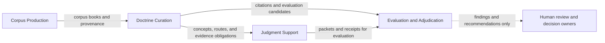

# Context map

Status interpretation: this map records candidate boundaries for investigation.
It does not declare a bounded context or select an integration relationship.

## Candidate boundaries

| Candidate | Present responsibilities | Evidence | Status |
|---|---|---|---|
| Corpus Production | Preserve source books; convert, normalize, validate, and index corpus books | `sources/`, `scripts/convert-books`, `books/`, `docs/adding-books.md` | candidate |
| Doctrine Curation | Register doctrine sources; curate concepts and conflicts; maintain traceability, routing, and graph projections | `doctrine/sources.yaml`, `doctrine/concepts/`, `doctrine/conflicts.yaml`, `doctrine/graph/` | candidate |
| Judgment Support | Assemble evidence packets and decision receipts from doctrine plus repository evidence | `doctrine/cmd/assemble-packet/`, `doctrine/tools/assemble_packet.py`, `doctrine/runtime/`, `doctrine/routing-index.yaml` | candidate |
| Evaluation and Adjudication | Screen claims, conduct model pre-review, preserve human audits and dispositions, and evaluate agent behavior | `doctrine/evaluations/`, `doctrine/tools/adjudication_server.py`, `docs/agent-judgment/` | candidate |

The table records visible responsibility clusters. It does not establish that
each cluster has a distinct model, language, owner, or release boundary.

## Observed information flow

Evaluation findings and recommendations may cause a human to propose a
doctrine or boundary change. They do not update either one automatically.

## Boundary-selection evidence

Promote a candidate to a decided bounded context only when an ADR records:

- scenarios in which its terms and decisions differ from adjacent candidates;
- owned policies, identities, lifecycle rules, or invariants;
- the owner and source of decision authority;
- the integration contract and semantic translation, if any;
- compatibility and failure consequences;
- evidence that a separate model is preferable to one shared model;
- conditions that would merge, split, or otherwise reopen the boundary.

## Unselected relationships

No Customer/Supplier, Conformist, Shared Kernel, Partnership, Published
Language, Open Host Service, or Anticorruption Layer relationship is selected
by this map. Those patterns require evidence about control, semantic distance,
and integration cost.
