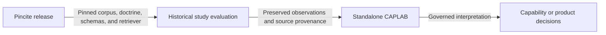

# Context map

## Decided boundaries

| Context | Owned responsibilities | Evidence |
|---|---|---|
| Pincite | Source corpus, doctrine curation, provenance graph, retrieval index, packet assembly, and release identity | `pincite-dependency.json`; Pincite ADRs 0004 and 0005 |
| This historical study repository | Source-study evidence custody, preserved evaluation instruments and records, mechanical grading, and reproducible historical projections | `docs/agent-judgment/`, `doctrine/evaluations/`, `caplab/` |
| Standalone Agent Capability Lab | Current CAPLAB product decisions, runtime, governed research state, and future product development | `/home/halbritt/git/caplab`; its ADR 0008 |

## Integration relationship

This repository consumes a versioned Pincite release. It validates the exact
commit plus corpus and doctrine identities before using Pincite inputs. It
does not write Pincite doctrine, and evaluation output cannot silently update
the Pincite release.

Historical experiments may embed a Pincite projection and old repository
mount paths. Those sealed bytes remain experiment evidence. New experiments
owned by standalone CAPLAB must use its current contracts and an explicitly
pinned Pincite surface.

## Reopening conditions

Reopen the boundary if Pincite begins owning behavioral-study custody, the
dependency cannot be versioned independently, standalone CAPLAB needs to move
historical evidence under an authorized admission decision, or a shared schema
requires a separately governed contract repository.
