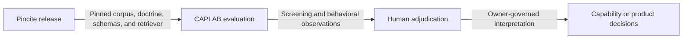

# Context map

## Decided boundaries

| Context | Owned responsibilities | Evidence |
|---|---|---|
| Pincite | Source corpus, doctrine curation, provenance graph, retrieval index, packet assembly, and release identity | `pincite-dependency.json`; Pincite ADRs 0004 and 0005 |
| Agent Capability Lab | Study design, behavioral evaluation, experiment custody, mechanical grading, adjudication, capability-card projection, and reviewer-facing results | `docs/product/`, `docs/agent-judgment/`, `doctrine/evaluations/`, `caplab/` |

## Integration relationship

CAPLAB is a consumer of a versioned Pincite release. It validates the exact
commit plus corpus and doctrine identities before using Pincite inputs. CAPLAB
does not write Pincite doctrine, and evaluation output cannot silently update
the Pincite release.

Historical experiments may embed a Pincite projection and old repository
mount paths. Those sealed bytes remain experiment evidence. New experiments
use the current CAPLAB mount and an explicitly pinned Pincite surface.

## Reopening conditions

Reopen the boundary if CAPLAB needs to author doctrine as part of an evaluation,
Pincite begins owning behavioral-study custody, the dependency cannot be
versioned independently, or a shared schema requires a separately governed
contract repository.
